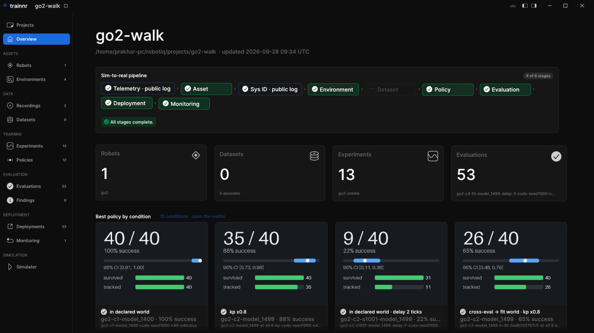

# trainnr

**The end-to-end robotics platform, run from your coding agent: real-to-sim,
train, sim-to-real, and back.** Identify your robot's dynamics from its own
telemetry into a simulation model, generate training datasets, train
policies by reinforcement learning (MuJoCo, mjlab) or imitation learning
(LeRobot), evaluate them with exact confidence intervals, gate and deploy
them on the robot's runtime, and watch the deployment telemetry for drift,
which starts the next turn. One MCP server, a desktop app, a Claude Code
plugin; every step is a tool call and every result is a record the next
step cites. For developers with one robot and companies with a fleet.

## The loop

| Step | What happens | The tools | What it leaves |
|---|---|---|---|
| 1. Capture | telemetry from the robot or a public log, a phone video of the space | `start_capture`, `ingest_recording`, `ingest_public_log`, `capture_scene` | recordings with their rate, dropouts and licence state; scenes |
| 2. Real-to-sim | hardware proximity, measured: the robot's own telemetry fitted into the model it trains on, every parameter with an interval and a pinned / NOT PINNED verdict; the captured space with its see-versus-touch gap measured | `onboard_robot`, `identify_system`, `import_scene` | the robot bundle `name@hash`, the fit record, the scene record |
| 3. Build data | demonstrations generated under recorded randomization, kept by the task's success criterion, exported as LeRobot v3 with a datasheet | `generate_kitting_demos`, `generate_walk_demos`, `multiply_demos` | datasets with provenance |
| 4. Train | reinforcement learning on mjlab or imitation through LeRobot, on the identified model with a measured randomization span | `train_walk`, `run_chain` | experiments and policies |
| 5. Evaluate | a clip cannot tell 10 % from 99 %; an evaluation here is paired, seed-matched trials with an exact confidence interval and a milestone funnel, and the gate reads the lower bound | `evaluate_walk`, `evals`, `eval_detail` | evaluations that gate on the lower bound |
| 6. Sim-to-real | the deployment is the last evaluation: the export, a gate on two runtimes (ours and the vendor's) against the same rows at a declared tolerance, a failed gate attributed to its cause (latency first), pre-flight before the first tick | `export_deployment`, `gate_deployment`, `attribute_deployment`, `preflight_deployment` | deployments with their gate and pre-flight |
| 7. Deploy and watch | the policy on the vendor's runtime; its telemetry back into turn 1; the robot re-identified against its fitted intervals | `stage_deployment`, `check_drift` | drift records |
| 8. Query and learn | every record above, from the agent or the desktop app: which policy, on which model, under which conditions, with what interval | `describe_project`, `runs`, `friction_curve`, `list_ledger_findings` | the next turn's question |

Everything in this table has run end to end on a Unitree Go2, in simulation,
through the tools alone. The hardware step is the vendor's own runtime; no
result in this repository claims a real deployment yet.

The measurements behind the method are the paper:
[*How Wide a Span, and What Does Identification Buy?*](docs/paper/manuscript.md)
(draft v3; every number in it resolves to a record under
[`docs/findings/`](docs/findings/)). Every claim in this file rests on a
record under [`docs/findings/`](docs/findings/) or a dated read of a primary
source under [`docs/e2e-research/`](docs/e2e-research/).

## One turn, on a Unitree Go2, in one conversation

With the plugin installed, this is the loop an agent walks through the MCP
tools, as a first-time user's agent did on 2026-09-28, end to end in one
session:

| Stage | Tool | What it leaves behind |
|---|---|---|
| Project | `create_project_dir` | a project directory with its index |
| Asset | `onboard_robot` (Unitree's `go2.xml`) | the robot bundle `go2@<hash>` |
| Telemetry | `ingest_public_log` or `ingest_recording` | a recording with its rate, dropouts and licence state |
| System identification | `identify_system` | the fit: each parameter with an interval and a pinned / NOT PINNED verdict |
| Environment | `create_task` (`trainnr/go2-walk`) | the declared task, accepted or refused |
| Policy | `train_walk(fit=…)` | an mjlab experiment on the identified model, with its randomization span |
| Evaluation | `evaluate_walk` | paired trials, exact intervals, the funnel |
| Deployment | `export_deployment`, `gate_deployment` | the ONNX export and a sim-to-sim gate at the trained command envelope |
| Pre-flight | `preflight_deployment` | the checks before the first tick on a robot, soft stop measured |
| Monitoring | `check_drift` | the robot re-identified from a new recording against its fitted intervals |

The desktop app shows each stage as it lands: the Overview's pipeline strip,
the robot and its fit, the experiment's curves, the evaluation's intervals,
the deployment gate, and the simulator with the policy driving the robot.



## Install

**Claude Code** (the plugin: the MCP server, seven agents, two skills):

```sh
claude plugin marketplace add Trainnr-AI/trainnr
claude plugin install trainnr@trainnr
```

The tools then appear as `mcp__trainnr_trainnr__<tool>`; ask the agent to
"create a project and onboard the Go2" and it starts at the top of the table.

**Any MCP client**, from a checkout (the server is `trainnr mcp`, served over
stdio; `uvx trainnr mcp` once the package is on PyPI):

```sh
git clone https://github.com/Trainnr-AI/trainnr && cd trainnr
claude mcp add trainnr -- uv run --directory "$PWD/trainnr" --extra sim --extra mcp trainnr mcp
```

Cursor, in `.cursor/mcp.json`; Codex, in `~/.codex/config.toml`:

```json
{ "mcpServers": { "trainnr": { "command": "uv",
  "args": ["run", "--directory", "/path/to/trainnr/trainnr", "--extra", "sim", "--extra", "mcp", "trainnr", "mcp"] } } }
```

```toml
[mcp_servers.trainnr]
command = "uv"
args = ["run", "--directory", "/path/to/trainnr/trainnr", "--extra", "sim", "--extra", "mcp", "trainnr", "mcp"]
```

**The desktop app** (Rust; the embedded Rerun viewer and the MuJoCo simulator):

```sh
cd crates/trainnr-desktop && cargo build --release && cd ../..
uv run --directory trainnr trainnr desktop        # or the launch_studio tool
```

**Training** needs the mjlab trainer and a CUDA GPU:
`cd trainnr-mjlab && uv sync --extra viz`. Everything else, including every
test, runs on a laptop without a GPU.

## What is in the box

| Directory | Layer | What it is |
|---|---|---|
| [`trainnr/`](trainnr/README.md) | L0, Python package `trainnr` | bundles and their hash identity, system identification over `mujoco.sysid`, exact small-n statistics, the evaluation protocol, the deployment gate, drift, scenes, the project index, the MCP server and the `trainnr` command |
| [`trainnr-mjlab/`](trainnr-mjlab/README.md) | L1, Python package `trainnr_mjlab` | the mjlab trainer: identified actuator physics as an mjlab actuator, the randomization events, the linter that turns silent no-ops into errors, the walk tasks |
| [`crates/trainnr-desktop/`](crates/trainnr-desktop/) | L2, Rust | the desktop app; talks to L0 through the project's files and processes only |
| [`robots/`](robots/) | data | the actuator library (BAM's fits, each with provenance) and the nominal robot bundles |
| [`tools/`](tools/) | scripts | the gates (`verify.sh`, `check-docs.py`, `check-numbers.py`, `check-layers.py`), the paper build, the cloud runbook |
| [`docs/`](docs/) | the record | dated research against primary sources, numbered decisions, the progress log, the findings and the paper |
| [`.claude/`](.claude/), [`.claude-plugin/`](.claude-plugin/) | the plugin | the agents, the skills and the manifest that make this repository a Claude Code marketplace |

The layers never import upward (`tools/check-layers.py`). Robot and dataset
identity is `name@hash` everywhere; nothing is nameable without its hash.

## Why the verdicts can be trusted

The instrument was tested on itself and the misses are on the record
([`docs/68-findings.md`](docs/68-findings.md)): a fit that converged to twice the
truth with a tight interval until its anchor was audited, which is why a fit
record without an anchor statement is refused; a timestamp convention that
biased a fit, caught three more times afterwards, which is why truth
recovery on synthetic data gates every new excitation harness; a
randomization study whose arms were identical because the event never
fired, which is why the mjlab linter exists. Evaluations gate on the lower
confidence bound, never on the point estimate.

## Contributing, security, citing

[`CONTRIBUTING.md`](CONTRIBUTING.md) (Developer Certificate of Origin
sign-off, the gates, where decisions are written),
[`SECURITY.md`](SECURITY.md), [`CODE_OF_CONDUCT.md`](CODE_OF_CONDUCT.md),
[`GOVERNANCE.md`](GOVERNANCE.md), [`CITATION.cff`](CITATION.cff). The 2025–26
rig that this toolchain grew up on lives in its own archive,
[`Trainnr-AI/rig`](https://github.com/Trainnr-AI/rig).

[FSL-1.1-ALv2](LICENSE): any use other than a competing product or service, and each version under Apache-2.0 two years after it is made available. Third-party material is listed in [`NOTICE`](NOTICE).
"Robotiq" in `robots/robotiq-2f85-isaac` is Robotiq Inc.'s gripper; trainnr
is not affiliated with Robotiq.
