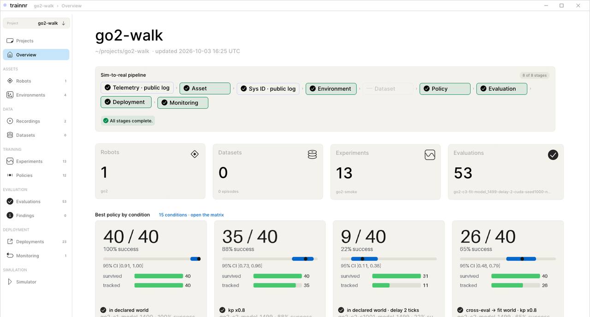
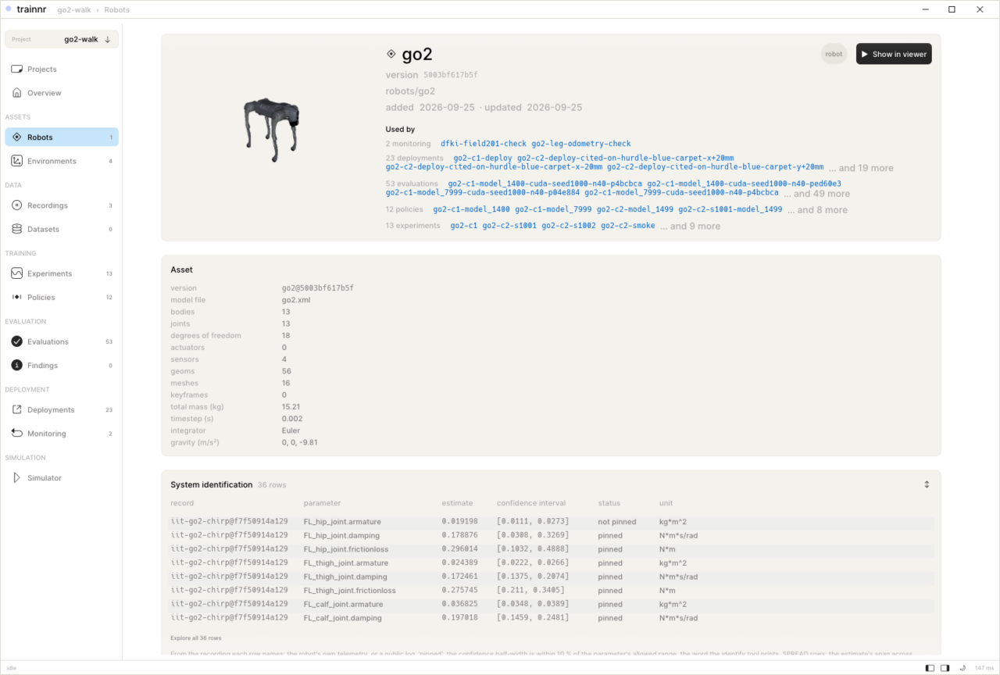
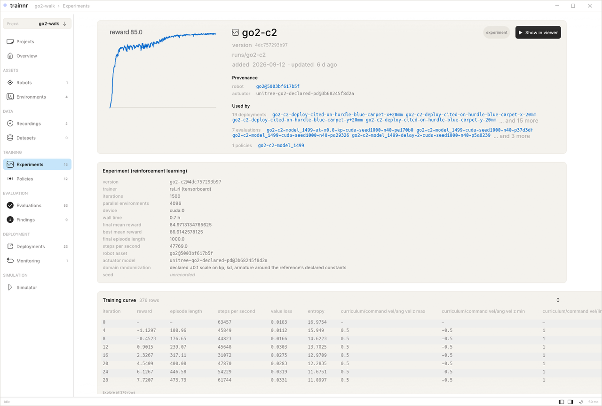
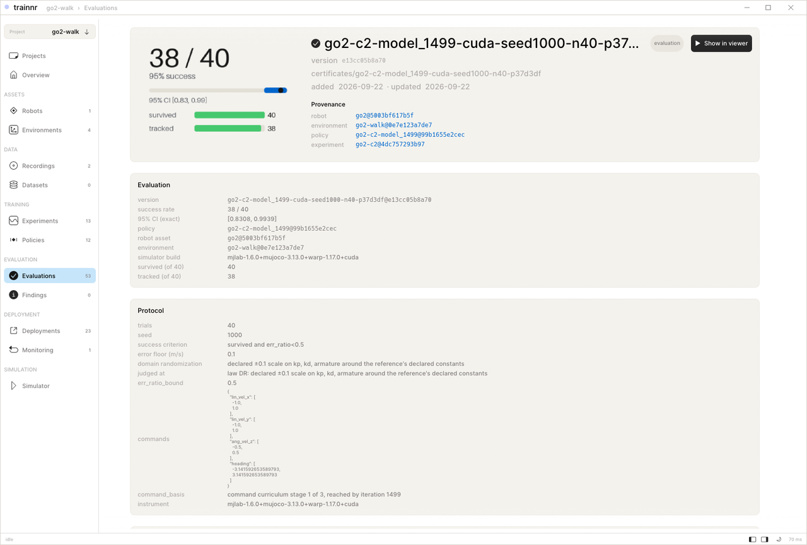
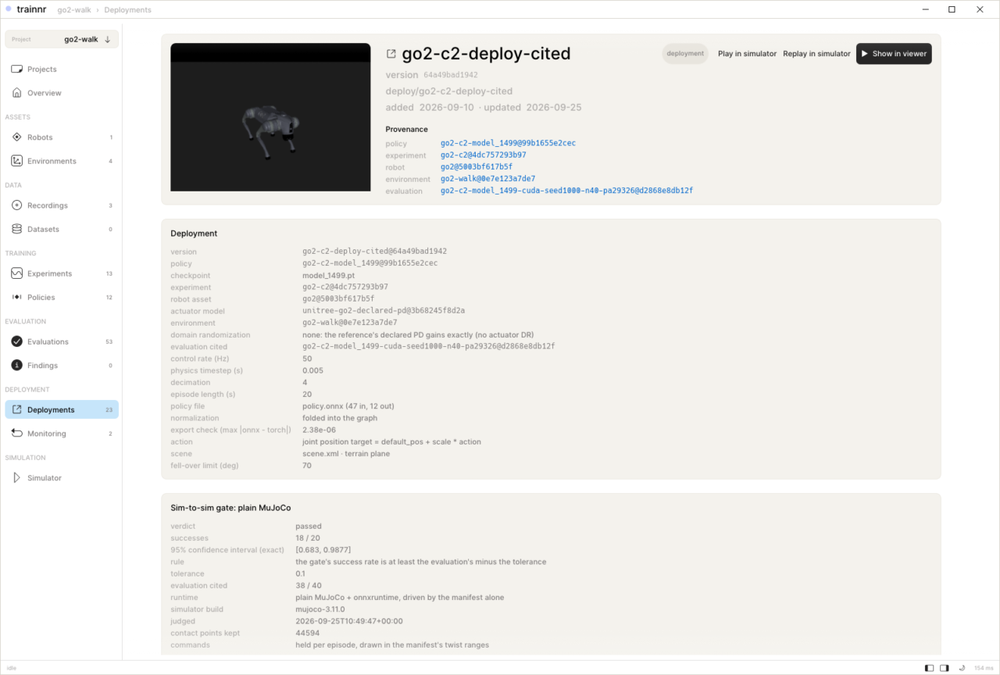
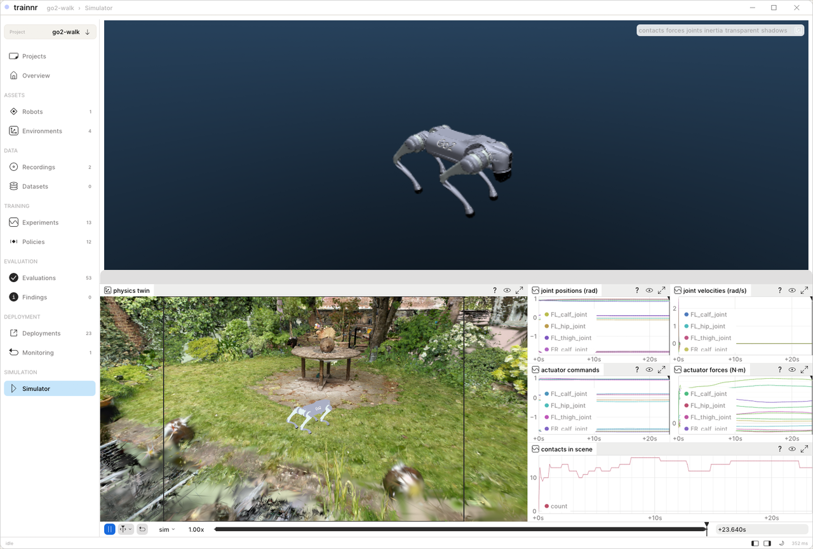
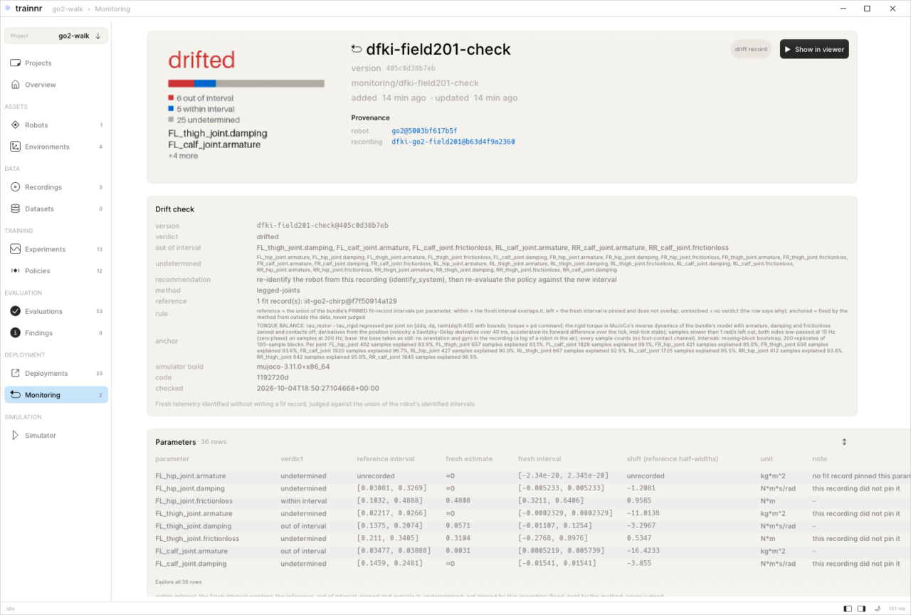
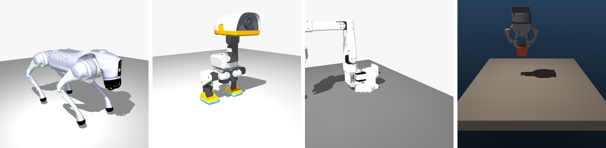

<p align="center">
  
</p>

<h1 align="center">trainnr</h1>

<p align="center">
  <b>The physical AI platform for robot learning, run from your coding agent.</b><br>
  Simulation, reinforcement learning, deployment, and a data flywheel from<br>
  the robot's telemetry back into training.
</p>

<p align="center">
  <a href="https://github.com/Trainnr-AI/trainnr/actions/workflows/gates.yml"></a>
  <a href="https://github.com/Trainnr-AI/trainnr/actions/workflows/gates.yml"></a>
  <a href="#licence"></a>
  <a href="trainnr/pyproject.toml"></a>
  <a href="#quickstart"></a>
  <a href="#quickstart"></a>
  <a href="CONTRIBUTING.md"></a>
  <!-- After the repository is public and the scorecard workflow has run once:
  <a href="https://scorecard.dev/viewer/?uri=github.com/Trainnr-AI/trainnr"></a>
  -->
</p>

<p align="center">
  <a href="#status">Status</a> ·
  <a href="#whats-inside">What's inside</a> ·
  <a href="#quickstart">Quickstart</a> ·
  <a href="#platforms">Platforms</a> ·
  <a href="#what-it-does">What it does</a> ·
  <a href="docs/README.md">Docs</a> ·
  <a href="CONTRIBUTING.md">Contributing</a>
</p>



trainnr is a platform for **physical AI**: robot learning
from the robot's own data, end to end. It identifies a robot's dynamics
from its telemetry into a **simulation** model (real-to-sim), creates
training data on that model, trains policies with **reinforcement learning
for robotics** (MuJoCo, mjlab) or imitation learning (LeRobot), evaluates
them with exact confidence intervals, and gates the **deployment** against
the robot's own runtime in simulation, the last step before
**sim-to-real**. New **telemetry** from the robot comes back as data: it is
checked for drift against the fitted model, re-identified, and fed **back
into training**. That cycle is the **data flywheel**, and every turn of it
is on the record.

Every step is a tool of one **MCP server**, so your coding agent runs the
loop by conversation. Every result is a **record** the next step cites,
stamped `name@hash` (its name and a hash of its content). The **Studio**, a
desktop app, shows each stage as it lands.

## Status

**Alpha, with one maintainer.** Read this before the rest:

- **Everything is in simulation.** No policy trained here has run on a
  real robot yet. The deployment step ends at a sim-to-sim gate: the
  exported policy driven by plain MuJoCo and by Unitree's own simulator
  and controller over DDS. All results are in simulation, and nothing
  here claims a real deployment.
- **The paved path is the Unitree Go2:** identify it from a public log,
  train a walk, evaluate it, export it, and gate the export in MuJoCo and
  (on Linux) in Unitree's simulator over DDS.
- **Your own robot:** onboard it from MJCF, URDF or USD, identify its
  joints from telemetry (positions, velocities, and torques or PD
  commands) and simulate it today. Training it needs a task module: walks
  are registered for the Unitree Go1 and Go2 and the microduck biped, arm
  tasks for the SO-101, ALOHA 2 and the Robotiq 2F-85 gripper
  (`list_task_families`). A package of your own can register more through
  the `trainnr.tasks` entry point.
- **trainnr does not replace MuJoCo, mjlab, rsl_rl or LeRobot.** It drives
  them, and keeps the record of what each run used and produced.

## What's inside

| Area | What trainnr does |
|---|---|
| **Physical AI, end to end** | Robot learning from the robot's own data: real-to-sim, synthetic data, training, evaluation, deployment gated in simulation, and the data flywheel back, driven by an AI agent over MCP |
| **Data collection** | Robot telemetry from ROS 2 bags (rosbag2), MCAP, Unitree's DDS (`rt/lowstate`, `rt/lowcmd`), LeRobot datasets, motion capture (marker CSV, BVH) and registered public robot logs, each with its rate, dropouts, licence and provenance |
| **Real-to-sim** | System identification of joints and actuators with confidence intervals (MuJoCo's `sysid`, BAM actuator models), an identified digital twin stamped `name@hash`, robots onboarded from MJCF, URDF or Isaac Sim USD (through Newton), captured scenes from a phone video as Gaussian splats with a collision proxy |
| **Simulation** | MuJoCo on CPU, MuJoCo Warp and MJX on the GPU, mjlab for massively parallel training, the Studio's interactive simulator with the Rerun viewer |
| **Synthetic data creation** | Scripted and motion-planned demonstrations under recorded domain randomization, kept by the task's success criterion, multiplied across seeds, exported as LeRobot v3 datasets with a datasheet |
| **Reinforcement learning for robotics** | PPO on mjlab (rsl_rl) for legged locomotion, domain randomization drawn from the identified intervals, latency randomization, teacher-student distillation, DAgger, a linter that refuses randomization that silently does nothing |
| **Imitation learning and VLAs** | ACT through LeRobot, a Gymnasium environment and a LeRobot evaluation plugin, and openpi (π0, π0.5) policies evaluated through the same protocol |
| **Evaluation** | Paired, seed-matched trials, exact Clopper-Pearson intervals, milestone funnels, sensitivity tables, mismatch matrices across the sim-to-real gap |
| **Deployment, up to sim-to-real** | ONNX export with a manifest, a sim-to-sim gate on MuJoCo and on Unitree's own simulator over DDS, failure attribution (latency first), pre-flight checks, soft stops: everything before the first tick on a real robot |
| **Telemetry and monitoring** | A robot's new telemetry re-identified against its fitted intervals: drift named per parameter, re-identification recommended, and the new fit available to the next training run |
| **Agents and tools** | One MCP server with 75 tools, a Claude Code plugin with seven agents and two skills, and the same server for Cursor, Codex and any MCP client; cloud GPUs (RunPod) for long training runs |

## Quickstart

**Prerequisites.**

- [Claude Code](https://claude.com/claude-code), or
  another MCP client (below).
- [uv](https://docs.astral.sh/uv/getting-started/installation/) (it brings
  Python 3.12 if you don't have it) and git.
- Disk: the plugin clones this repository (about 216 MB); the server's
  environment is about 0.6 GB; the Studio is about 72 MB once a release is
  published, and building it from source takes about 3.5 GB until then
  ([The Studio](#the-studio)); the first training job downloads the
  trainer's environment, about 6 GB.
- Training needs an NVIDIA GPU with CUDA. Everything else runs on a laptop
  CPU.

Install the plugin. It brings the MCP server (75 tools), seven agents and
two skills. In a terminal:

```sh
claude plugin marketplace add Trainnr-AI/trainnr
claude plugin install trainnr@trainnr
```

or, inside a Claude Code session, `/plugin marketplace add Trainnr-AI/trainnr`
then `/plugin install trainnr@trainnr`. The next Claude Code session
prepares the server's environment in the background and tries to download
the Studio (`TRAINNR_NO_PREFETCH=1` turns that off). Projects live in
`~/trainnr/projects`, and the tools act only inside the open project.

Fetch the robot model the example uses, Unitree's own Go2:

```sh
git clone --depth 1 https://github.com/unitreerobotics/unitree_rl_mjlab ~/unitree_rl_mjlab
# onboard_robot takes: ~/unitree_rl_mjlab/src/assets/robots/unitree_go2/xmls/go2.xml
```

### On a laptop, in minutes (CPU)

Ask for the first half of the loop in plain words:

```text
you    Create a project called go2, onboard Unitree's Go2 from
       ~/unitree_rl_mjlab/src/assets/robots/unitree_go2/xmls/go2.xml,
       and identify it from the IIT chirp log.
agent  create_project("go2")                        → ~/trainnr/projects/go2, now open
       onboard_robot(".../go2.xml", "go2")          → go2@e5aa641994fc, shape checked
       ingest_public_log("iit-go2-chirp")           → job ingest-public-log-…, started
       describe_job(job_id, wait_s=60)              → done · 24 s · 200 Hz · 6 channels · public log
       identify_system("go2", "iit-go2-chirp")      → 31 of 36 parameters pinned at 95 %
```

An ingest is a job (a public log is tens to hundreds of megabytes), so
the agent waits on it before the next step; asked too early,
`identify_system` names the job that is still writing the recording.

A parameter is **pinned** when its 95 % confidence interval is narrow
enough to use (within a tenth of its allowed range), and **not pinned**
when the data cannot constrain it; the reply prints `pinned` or
`NOT PINNED` for each.

### With a GPU

```text
you    Train a walk on that fit, evaluate it, and gate the export.
agent  create_task("trainnr/go2-walk", "go2-walk"), check_task("go2-walk")
                                                    → accepted: learnability check
       train_walk(recipe="full", fit="fit@…", iterations=150)
                                                    → experiment go2-walk-<date-time>
       describe_job(job_id, wait_s=300)             → done
       evaluate_walk(checkpoint="<experiment>", trials=8)
                                                    → survived 8/8, tracked 0/8, CP95 [0.00, 0.37]
       export_deployment, gate_deployment           → ONNX + manifest, sim-to-sim gate passed
       preflight_deployment                         → 7/7 checks
```

What the words and numbers mean:

- `fit@…` is the fit record's own stamp, which `describe_identification`
  gives. The **learnability check** (`check_task`) runs the trainer for two
  iterations on two environments, proving the task builds and trains
  before hours are spent on it.
- `recipe="smoke"` checks the stack in minutes and saves nothing.
  `recipe="full"` trains 8000 iterations unless `iterations=` says
  otherwise (hours on a GPU) and saves an experiment, named by `name=` or
  `<robot>-walk-<date-time>`; the reply names it, an existing name is
  refused, and `evaluate_walk(checkpoint=<experiment>)` judges its newest
  checkpoint. The first training job downloads the trainer's environment
  (about 6 GB) before it starts.
- An episode **survived** when the robot did not fall, and **tracked** when
  it also followed its commanded velocity; tracked is success. **CP95** is
  the exact (Clopper-Pearson) 95 % confidence interval on the success
  rate; gates read its low end.
- **150 iterations do not learn to walk.** The policy tracked 0 of 8 in
  the 2026-10-04 and 2026-10-05 runs
  ([`quickstart-150-iterations`](docs/68-findings.md#quickstart-150-iterations-2026-10-05));
  the session uses so few
  iterations only so it ends in minutes. The full recipe at 1500
  iterations (41 minutes on an RTX 3090 Ti) is the Go2 walker below that
  tracks 38 of 40.
- **The gate checks the export, not the policy.** It drives the exported
  policy through its manifest alone, outside the training stack, and
  passes when its success rate is at least its evaluation's minus a
  tolerance (0.1 by default). A policy that tracks 0 of 8 passes when its
  export also tracks 0. How good the policy is, the evaluation says; the
  Studio's deployment card leads with it ("evaluated N% success").
- **Drift needs a second recording.** `check_drift` refuses the recording
  the fit came from, since it can only say "within". Bring fresh
  telemetry: record the robot, or ingest another public log, for example
  `ingest_public_log("go2-leg-odometry", accept_unlicensed=True)` (a real
  Go2 walking indoors for 12 minutes; the bag states no licence of its
  own, so check your use is allowed), then
  `check_drift("go2", "go2-leg-odometry")`.

Both halves are condensed from real sessions on a fresh clone (2026-10-03
and 2026-10-04). The rest of the project's words (`name@hash`, world,
gate) are in the [glossary](docs/GLOSSARY.md).

### The Studio

The Studio is the desktop app: the embedded Rerun viewer, the MuJoCo
simulator, and a page for every record in the project. `launch_studio`
opens it on the current project.

**Prebuilt.** The release workflow builds the Studio for Linux (x86_64),
macOS (Apple Silicon) and Windows (x86_64), about 72 MB, and the plugin
downloads the one for your platform. **No release has been published
yet**, so for now the download fails (`the Studio release … is not
published yet`) and you build the Studio from source.

**From source.** You need git and [rustup](https://rustup.rs). The
toolchain is pinned in `crates/trainnr-studio/rust-toolchain.toml` (Rust
1.97.1 with rustfmt and clippy), and rustup installs it on the first
`cargo` command in that folder. On macOS, Xcode's command-line tools
provide the linker. On Linux, install the system libraries CI installs
(a C compiler and `pkg-config` are assumed):

```sh
sudo apt-get install -y libxcb-render0-dev libxcb-shape0-dev libxcb-xfixes0-dev \
    libxkbcommon-dev libssl-dev libgtk-3-dev libudev-dev
```

Then build it, about 3.5 GB of disk and 4 to 6 minutes on a cold build:

```sh
git clone https://github.com/Trainnr-AI/trainnr && cd trainnr/crates/trainnr-studio
cargo build --release   # → target/release/trainnr-studio
```

A server running from that checkout finds the binary there. **With the
plugin**, the server runs from the plugin's own copy of the repository, so
point it at your build: set
`TRAINNR_STUDIO=<your clone>/crates/trainnr-studio/target/release/trainnr-studio`
in the environment you start Claude Code from.

<details>
<summary><b>Environment variables</b> you may set</summary>

| Variable | What it does |
|---|---|
| `TRAINNR_HOME` | Where your data lives (projects, download caches); default `~/trainnr` |
| `TRAINNR_PROJECTS` | Where projects are created; default `$TRAINNR_HOME/projects` |
| `TRAINNR_PROJECT` | The project directory one process works on, instead of the one last created or chosen |
| `TRAINNR_STUDIO` | The Studio binary to launch, instead of the checkout's own build or the downloaded one |
| `TRAINNR_STUDIO_RELEASE` | The release tag to download the Studio from, instead of `v<version>` |
| `TRAINNR_NO_PREFETCH` | `1`: the plugin's session hook prepares nothing in the background |
| `TRAINNR_PUBLIC_LOGS_DIR` | Where downloaded public logs are cached |
| `TRAINNR_NO_ROBOT_FETCH` | `1`: a robot's files that are fetched on first use (the microduck's meshes) are refused, with the command that fetches them |
| `TRAINNR_VIEWER_BIND` | The address the Studio's viewer server binds; default `127.0.0.1:9876` (this machine only); `0.0.0.0:9876` opens it to a trusted network |
| `TRAINNR_BRUSH` | Where Brush, the Gaussian-splat trainer, is, when it is not on `PATH` as `brush_app` |
| `TRAINNR_UNITREE_REFERENCE` | The `unitree_rl_mjlab` checkout the DDS gate runs Unitree's simulator from, instead of `~/.cache/trainnr/unitree_rl_mjlab` |
| `TRAINNR_X11` | WSL only: `1` makes the Studio use X11 instead of Wayland |
| `TRAINNR_VSYNC` | WSL only: `1` turns the Studio's vsync back on |

</details>

<details>
<summary><b>Any other MCP client</b> (Cursor, Codex, a checkout)</summary>

**Any MCP client**, from a checkout (the server is `trainnr mcp`, served over
stdio). The server runs from a checkout today; a PyPI package is planned.

```sh
git clone https://github.com/Trainnr-AI/trainnr && cd trainnr
claude mcp add trainnr -- uv run --directory "$PWD/trainnr" --extra sim --extra mcp trainnr mcp
```

Cursor, in `.cursor/mcp.json`; Codex, in `~/.codex/config.toml`:

```json
{ "mcpServers": { "trainnr": { "command": "uv",
  "args": ["run", "--directory", "/path/to/trainnr/trainnr", "--extra", "sim", "--extra", "mcp", "trainnr", "mcp"] } } }
```

```toml
[mcp_servers.trainnr]
command = "uv"
args = ["run", "--directory", "/path/to/trainnr/trainnr", "--extra", "sim", "--extra", "mcp", "trainnr", "mcp"]
```

From a checkout, `uv run --directory trainnr trainnr studio` opens the
Studio on the current project. The trainer's environment is prepared by
the first training job, or ahead of it with
`cd trainnr-mjlab && uv sync --extra viz`.

</details>

## Platforms

trainnr's simulator is MuJoCo, which runs natively on Apple Silicon, so
most of the loop runs on a Mac. Training does not, and neither do the two
steps that use Unitree's DDS stack.

| | macOS (Apple Silicon) | Linux (x86_64) | Windows (x86_64) |
|---|---|---|---|
| MCP server, data from files and public logs, identification, simulation, pre-flight, drift | yes | yes | through WSL2 |
| Evaluation of a trained walk | yes, on the CPU (slow) | yes, CUDA or CPU | through WSL2 |
| The sim-to-sim gate on plain MuJoCo | yes | yes | through WSL2 |
| The gate on Unitree's simulator over DDS, live capture from Unitree's DDS bus | no | yes | through WSL2 |
| Training (`train_walk`, mjlab on MuJoCo Warp) and `preview_rewards` | no; rent a GPU (`tools/cloud-gpu.py`) | NVIDIA GPU with CUDA | NVIDIA GPU through WSL2 |
| Captured scenes (COLMAP, Gaussian splats) | yes, on Metal | yes, CUDA | through WSL2 |
| The Studio | builds from source; run on an M1 Pro | builds from source | compiles in CI; native Windows untested, WSL2 tested |

On Windows, WSL2 is the tested path; nothing has been run on native
Windows. `preview_rewards` needs CUDA today. Isaac Sim and Isaac Lab need
Linux or Windows with an NVIDIA RTX GPU and do not run on macOS; Isaac Sim
USD assets still come in through Newton's importer, without Isaac Sim.
The Mac rows were measured on an Apple M1 Pro
([`docs/76`](docs/76-the-loop.md), [`docs/78`](docs/78-the-scene-loop.md),
[`docs/68`](docs/68-findings.md)); the Linux rows on an RTX 3090 Ti under
WSL2.

## What it does

### Real-to-sim: telemetry into a simulation model

The robot's own telemetry, fitted into the model it trains on. Every
parameter carries a 95 % interval and a verdict: pinned when the data
constrains it, not pinned when it does not. A public log works too, with
its provenance shown as such.



`onboard_robot` · `ingest_recording` · `ingest_public_log` · `start_capture` · `identify_system`

### Data creation and RL for robotics

Reinforcement learning on [mjlab](https://github.com/mujocolab/mjlab), or
imitation learning through [LeRobot](https://github.com/huggingface/lerobot),
on the fitted model with a randomization span that comes from the fit's
intervals instead of a guess. Demonstrations are generated under recorded
randomization and kept by the task's success criterion, with a datasheet.



`create_task` · `check_task` · `train_walk` · `generate_walk_demos` · `multiply_demos` · `run_chain`

### Evaluation with an interval, not a clip

A clip cannot tell 10 % from 99 %. An evaluation here is paired,
seed-matched trials with an exact (Clopper-Pearson) confidence interval and
a funnel of how far each episode got; gates read the lower bound.



`evaluate_walk` · `describe_evaluation` · `list_evaluations` · `describe_friction`

### Deployment through a gate, before sim-to-real

The export is ONNX with normalization folded in, plus a manifest read from
the built environment. The gate drives it through the manifest alone on two
runtimes, plain MuJoCo and Unitree's own simulator over DDS, and passes it
when its success rate is at least its evaluation's minus a declared
tolerance: it checks the export, while the evaluation says how good the
policy is. A failed gate is attributed to its cause, latency first.
Pre-flight checks joint order, gains, ranges, torques and compute before
the first tick, and measures the stops, in simulation.



`export_deployment` · `gate_deployment` · `attribute_deployment` · `preflight_deployment` · `stage_deployment`

### Simulation in a captured scene

MuJoCo inside the Studio, with the embedded [Rerun](https://rerun.io)
viewer beside it. The scene pipeline turns a phone video into a scene:
Gaussian splats for what the camera sees, a collision proxy for what the
feet touch, and the gap between the two measured. The image shows the
public Mip-NeRF 360 "garden" capture run through that pipeline, with an
exported Go2 policy walking in it.



<sub>Scene: Mip-NeRF 360 "garden" (Barron et al., CVPR 2022), reconstructed by trainnr's scene pipeline.</sub>

`capture_scene` · `import_scene` · `run_simulation` · `control_simulator` · `screenshot_studio`

### Telemetry back to training: the data flywheel

New telemetry from the robot is identified again and judged against its
fitted intervals. What left its interval is named, re-identification is
recommended, and the new fit can be the model the next policy trains on
(`train_walk(fit=…)`). Each turn adds recordings, fits, datasets, policies
and evaluations, all stamped and queryable, so the next turn starts from
more data than the last. No deployed robot has sent telemetry back yet.
The check shown judges a second Go2's field log (DFKI) against the fit
from the first (IIT): six parameters left their intervals, five held,
and 25 the walking log does not excite enough to judge. The two logs were
recorded differently (a robot held in the air under chirps, torque from
the commands; a robot walking outdoors, torque from motor current), so
part of the gap can be the recording rather than the robot. A drift
check on the fit's own recording is refused: it can only say "within".



`check_drift` · `describe_project` · `list_experiments` · `list_findings`

## Robots



| Robot | What ran, in simulation | From |
|---|---|---|
| Unitree Go2 | the whole loop: identify from public logs, train, evaluate, two gates, pre-flight, drift, a captured scene | Unitree's `unitree_rl_mjlab` model |
| microduck (biped) | walk training across fifteen randomization spans | Pollen Robotics' model, BAM actuator fits; its meshes (CC BY-NC-SA) are fetched from Pollen Robotics on first use |
| SO-101 arm | the lift study and generated demonstrations | TheRobotStudio's model |
| Robotiq 2F-85 | imported from Isaac Sim USD through Newton, audited equal to the source | NVIDIA's Isaac Sim asset |

Your own robot enters by its MJCF, URDF or USD file (`onboard_robot`); the
reply says whether it is in the shape a task needs before anything trains.
Identifying and simulating it work today; training it needs a task module
(see [Status](#status)).

## Measured, not claimed

| Result | Number | Record |
|---|---|---|
| A Go2 walker (go2-c2, 1500 iterations) tracking its commands in the world it trained in, built on Unitree's declared actuator constants (not a fit) | 38 of 40, 95 % CI [0.83, 0.99] | [`dds-gate-go2-c2`](docs/68-findings.md#dds-gate-go2-c2-2026-09-13) |
| The same policy gated on Unitree's simulator over DDS | 20 of 20 | [`dds-gate-go2-c2`](docs/68-findings.md#dds-gate-go2-c2-2026-09-13) |
| A Go2 identified from a public chirp log (IIT) | 31 of 36 parameters pinned | [`go2-legged-fit-public-logs`](docs/68-findings.md#go2-legged-fit-public-logs-2026-09-24) |
| The Go2 walking the Mip-NeRF 360 garden scene under full physics | 6 of 6, [0.54, 1.00] | [`go2-walks-the-captured-garden`](docs/68-findings.md#go2-walks-the-captured-garden-2026-09-23) |

All four are in simulation (see [Status](#status)). Each links to its
finding record: the commit, the command, the instrument and the caveats,
kept as JSON under [`docs/findings/`](docs/findings/README.md). A commit
gate (`tools/check-numbers.py`) refuses a success ratio in this README
that no record carries; numbers elsewhere in the docs are not checked
mechanically.

**Ongoing research.** We are writing up what these measurements say
about domain randomization around identified actuator models: how wide a
span should be, and what system identification buys a legged robot. The
paper will be published separately, with its own repository.

<details>
<summary><b>Why the verdicts can be trusted</b></summary>

The instrument was tested on itself and the misses are on the record
([`docs/68-findings.md`](docs/68-findings.md)): a fit that converged to twice the
truth with a tight interval until its anchor was audited, which is why a fit
record without an anchor statement is refused; a timestamp convention that
biased a fit, caught three more times afterwards, which is why truth
recovery on synthetic data gates every new excitation harness; a
randomization study whose arms were identical because the event never
fired, which is why the mjlab linter exists. Evaluations gate on the lower
confidence bound, never on the point estimate.

</details>

<details>
<summary><b>The loop, step by step</b>, with every tool</summary>

| Step | What happens | The tools | What it leaves |
|---|---|---|---|
| 1. Capture | telemetry from the robot or a public log, a phone video of the space | `start_capture`, `ingest_recording`, `ingest_public_log`, `capture_scene` | recordings with their rate, dropouts and licence state; scenes |
| 2. Real-to-sim | how close the simulation is to the hardware, measured: the robot's own telemetry fitted into the model it trains on, every parameter with an interval and a pinned / not pinned verdict; the captured space with its see-versus-touch gap measured | `onboard_robot`, `identify_system`, `import_scene` | the robot bundle `name@hash`, the fit record, the scene record |
| 3. Build data | demonstrations generated under recorded randomization, kept by the task's success criterion, exported as LeRobot v3 with a datasheet | `generate_kitting_demos`, `generate_walk_demos`, `multiply_demos` | datasets with provenance |
| 4. Train | reinforcement learning on mjlab or imitation through LeRobot, on the identified model with a measured randomization span | `train_walk`, `run_chain` | experiments and policies |
| 5. Evaluate | a clip cannot tell 10 % from 99 %; an evaluation here is paired, seed-matched trials with an exact confidence interval and a milestone funnel, and the gate reads the lower bound | `evaluate_walk`, `list_evaluations`, `describe_evaluation` | evaluations that gate on the lower bound |
| 6. Deploy, in simulation | the deployment is the last evaluation: the export, a gate on two runtimes (ours and the vendor's simulator) that checks the export reproduces its evaluation within a declared tolerance, a failed gate attributed to its cause (latency first), pre-flight before the first tick | `export_deployment`, `gate_deployment`, `attribute_deployment`, `preflight_deployment` | deployments with their gate and pre-flight |
| 7. Stage and watch | a deployment staged on a captured scene and gated there; new telemetry from the robot back into step 1, identified against its fitted intervals (no real robot has closed this step yet) | `stage_deployment`, `check_drift` | staged deployments, drift records |
| 8. Query and learn | every record above, from the agent or the Studio: which policy, on which model, under which conditions, with what interval | `describe_project`, `list_experiments`, `describe_friction`, `list_findings` | the next turn's question |

</details>

<details>
<summary><b>What is in the repository</b></summary>

| Directory | Layer | What it is |
|---|---|---|
| [`trainnr/`](trainnr/README.md) | L0, Python package `trainnr` | bundles and their hash identity, system identification over `mujoco.sysid`, exact small-n statistics, the evaluation protocol, the deployment gate, drift, scenes, the project index, the MCP server and the `trainnr` command |
| [`trainnr-mjlab/`](trainnr-mjlab/README.md) | L1, Python package `trainnr_mjlab` | the mjlab trainer: identified actuator physics as an mjlab actuator, the randomization events, the linter that turns silent no-ops into errors, the walk tasks |
| [`crates/trainnr-studio/`](crates/trainnr-studio/) | L2, Rust | the Studio; talks to L0 through the project's files and processes only |
| [`robots/`](robots/) | data | the actuator library (BAM's fits, each with provenance) and the nominal robot bundles |
| [`tools/`](tools/) | scripts | the gates (`verify.sh`, `check-docs.py`, `check-numbers.py`, `check-layers.py`), the study scripts, the cloud runbook |
| [`docs/`](docs/) | the record | dated research against primary sources, numbered decisions and the findings |
| [`.claude/`](.claude/), [`.claude-plugin/`](.claude-plugin/) | the plugin | the agents, the skills and the manifest that make this repository a Claude Code marketplace |

The layers never import upward (`tools/check-layers.py`). Robot and dataset
identity is `name@hash` everywhere; nothing is nameable without its hash.

</details>

## Troubleshooting

| You see | What to do |
|---|---|
| `no project is selected: create one with create_project … or choose one with use_project` | Ask the agent to create a project, or to use an existing one (`list_projects` lists them). `TRAINNR_PROJECT` names one for a single process. |
| `the Studio release … is not published yet` (or HTTP 404) when the Studio downloads | No release is published yet: build the Studio from source ([above](#the-studio)); with the plugin, set `TRAINNR_STUDIO` to the binary. |
| A job failed | `describe_job(job_id)` reports its `error`; the whole log is `~/trainnr/projects/<project>/mcp-jobs/<job>.log`. |
| ``trainnr mcp needs the `sim` and `mcp` extras`` | Start the server as `uv run --directory trainnr --extra sim --extra mcp trainnr mcp`. |
| `port 9876 (the viewer server) is held by another process` | Another Studio or a standalone Rerun viewer is running; close it, then launch again. |
| Slow or black rendering under WSL | The WSL launch settings live in `trainnr/wsl.env`; they apply only on WSL and never override a variable you set. |
| `the publisher states no licence for this data` from `ingest_public_log` | Pass `accept_unlicensed=True` once you have checked your use is allowed. |

Tool names and arguments changed before 0.1.0; [`CHANGELOG.md`](CHANGELOG.md) lists each.

## Community

- **Questions and ideas:** [Discussions](https://github.com/Trainnr-AI/trainnr/discussions).
- **Bugs, features, robot support:** [open an issue](https://github.com/Trainnr-AI/trainnr/issues/new/choose); the forms ask for what a maintainer needs.
- **Pull requests:** read [`CONTRIBUTING.md`](CONTRIBUTING.md); every commit is signed off (DCO).
- **Security:** report privately, never in an issue ([`SECURITY.md`](SECURITY.md)).
- [`CODE_OF_CONDUCT.md`](CODE_OF_CONDUCT.md) · [`GOVERNANCE.md`](GOVERNANCE.md) · [`CITATION.cff`](CITATION.cff) · [`CHANGELOG.md`](CHANGELOG.md)

## Licence

trainnr is licensed under the [Functional Source License, Version 1.1, ALv2
Future License](LICENSE) (FSL-1.1-ALv2). Two years after each version is
made available, that version is also licensed under the
[Apache License 2.0](LICENSES/Apache-2.0.txt).

Third-party material keeps its own licence and is listed in
[`NOTICE`](NOTICE). The code of the 2025–26 hardware rig this
toolchain grew up on (a camera, two motors and three servos)
is now [rigrs](https://github.com/Trainnr-AI/rigrs), robot firmware in Rust;
the rig's recordings stay here under `recordings/`. "Robotiq" in
`robots/robotiq-2f85-isaac` is Robotiq Inc.'s gripper; trainnr is not
affiliated with Robotiq.

MuJoCo, Rerun, Unitree, Go2, NVIDIA, Isaac, Robotiq, LeRobot, Claude and
Anthropic are trademarks of their owners; no endorsement is implied.
