# Findings ledger

Every number here resolves to a commit, a command line, an
instrument stamp and the artifacts it rests on. Generated by
`tools/findings.py` from `docs/findings/*.json`; edit the records,
not this page.

## studio-viewport-two-process-2026-09-09

**Splitting the Studio's MuJoCo stream into a physics process and a render process joined by a shared-memory state ring, with shadows judged by measured frame time, raises the kitting scene from 32.6 fps at the pipe and ~33 on screen to 53.7 fps at the pipe (p50 18.4 ms, p90 21.4 ms) and 60-70 fps on screen; the physics paces itself at real time regardless of render. The 20-duck flock stays at 4.6-9 fps because its render alone is 109 ms/frame on this Mac (Apple M1 Pro, GL 2.1 over Metal, CGL offscreen).**

- date: 2026-09-09 · commit: `af7ef98`
- instrument: `mujoco-3.11.0 (python, MUJOCO_GL=cgl), macOS 25.5.0 Apple M1 Pro, Python 3.12, rerun narration on; Studio release build`
- command: `tools/studio-render-stream.py kitting --shm=<ring> | token-rate reader (15 s) simulate_in_studio('kitting'); describe_studio()['viewport_fps'] sampled 12 x 1 s simulate_in_studio('duck'); same`
- protocol: as studio-viewport-pipe-2026-09-09, plus the on-screen rate read from the Studio's state file (frames drawn in the last second, viewport_fps) through describe_studio
- outcome:
  - cause: MuJoCo's Python render holds the GIL: a 12.1 ms render measured 41.2 ms beside a pure-Python spinner thread; physics and render in one interpreter starve each other both ways (the flock's 109 ms render slowed physics to slow motion).
  - pipe_fps: {'before_single_process': 32.6, 'threaded_lane_same_process': 39.8, 'two_process': 53.7, 'two_process_lift': 51.6}
  - pipe_interval_ms_two_process: {'p50': 18.4, 'p90': 21.4}
  - on_screen_fps: {'kitting_before': 40.3, 'kitting_after': {'mean': 59.5, 'min': 36, 'max': 77, 'note': 'the min is a viewport resize rebuilding the renderer'}, 'duck_after': {'mean': 6.3, 'max': 9}}
  - lane_render_ms: {'kitting_p50': 10.4, 'lift_p50': 2.6, 'duck_p50': 109.2}
  - gl_renderer: Apple M1 Pro, 2.1 Metal - 90.5 (hardware, via mujoco.cgl)
  - resolution_dependence_cgl_ms: {'256x144': 11.6, '1024x576': 12.1, '1920x1080': 15.0}
  - gil_switch_interval_effect: none: 39.8 fps at 5 ms and at 0.5 ms
  - shadow_judge: auto: off after the first 30 frames or 1 s of render time averaging above 14 ms; kitting judged off (30.9 ms mean incl. warm-up), lift kept on (2.6 ms)
- artifacts:
  - script: tools/studio-render-stream.py
  - studio: crates/studio-shell/src/viewport.rs
  - previous: docs/findings/studio-viewport-pipe-2026-09-09.json
- sources:
  - finding: studio-viewport-pipe-2026-09-09 (the before)
- caveats:
  - One machine, three scenes.
  - The on-screen counter counts frames drawn into the texture; the display's own refresh caps what a human sees at 60 (ProMotion excepted).
  - The flock's 109 ms is geometry-bound on this GL path; a native simulate window on the same machine was not measured.

## studio-viewport-pipe-2026-09-09

**The Studio's MuJoCo viewport pipe delivers 32.6 fps (p50 30.6 ms, p90 34.0 ms between frames) on the kitting scene on this Mac, against a native window's display rate; the render is 26.1 ms/frame at 1024x576 and the same at 1920x1080, of which the shadow pass is 17 ms and reflection 3.5 ms (6.2 ms with both off); with shadows off the pipe delivers 41.0 fps, bounded next by the render running inline with physics on macOS; a CGL context renders from a background thread at 12.2 ms/frame, so that coupling is removable.**

- date: 2026-09-09 · commit: `b28df24`
- instrument: `mujoco-3.11.0 (python, CGL offscreen), macOS 25.5.0 Apple Silicon, Python 3.12, rerun narration on unless stated`
- command: `tools/studio-render-stream.py kitting --shm=<ring> | token-rate reader (14 s) mujoco.Renderer(model, 576, 1024).render() x40 with scene.flags toggled MUJOCO_GL=cgl; mujoco.Renderer in a threading.Thread x60`
- protocol: delivered rate = 0xF7 tokens per second on the stream's stdout under --shm, measured by a reader over 14 s after the first frame; render cost = wall time of update_scene+render over 40 frames after one warm-up; thread test = the same Renderer built and run inside threading.Thread with MUJOCO_GL=cgl
- outcome:
  - stream_fps: {'default': 32.6, 'no_rerun': 37.3, 'shadows_off': 41.0}
  - stream_interval_ms: {'default': {'p50': 30.6, 'p90': 34.0, 'max': 42.5}, 'no_rerun': {'p50': 26.3, 'p90': 28.1, 'max': 99.4}, 'shadows_off': {'p50': 24.1, 'p90': 30.4, 'max': 124.9}}
  - render_ms_per_frame: {'1024x576': 26.1, '1600x900': 28.1, '1920x1080': 29.3, '256x144': 25.2}
  - render_ms_by_flags: {'all_on': 27.3, 'shadow_off': 9.7, 'shadow_reflection_off': 6.2, 'shadow_reflection_skybox_off': 6.1}
  - update_scene_ms: 0.0
  - mj_step_ms: 0.323
  - timestep_s: 0.002
  - physics_realtime_factor_ceiling: 6
  - background_thread_render_ms_cgl: 12.2
  - first_frame_s: {'default': 1.0, 'no_rerun': 0.56, 'shadows_off': 1.13}
  - scene: kitting: 23 bodies, 105 geoms, 24 meshes
- artifacts:
  - doc: docs/35-the-studio.md
  - script: tools/studio-render-stream.py
- sources:
  - studio-render-stream: SHADOW_GEOM_BUDGET=400 keeps shadows on below 400 geoms; the Darwin path renders inline in tick() (module comment: Cocoa's main-thread GL rule)
- caveats:
  - One machine, one scene; the flock scene measured 43 vs 10.5 ms with/without shadows on 2026-09-01, so the shadow cost is not a constant across scenes.
  - The native window was not measured here; its display-rate claim rests on MuJoCo's simulate rendering to the window buffer with no readback.
  - The Studio's on-screen rate (token -> repaint -> texture upload) was not measured; only what the pipe delivers to it.

## walk-mismatch-matrix-refit-2026-09-06

**WITHDRAWN: The mismatch matrix on the walk: the C1 policies point-refit, identified (replicates pooled) judged pinned at the fit scaled by s (every law parameter moved) and under drawn spans, 40 matched trials per run — point-refit (trained none (refit bundle)): x0.7 0/120, x0.8 3/120, x0.9 28/120, fit 52/120, x1.1 60/120, x1.2 63/120, x1.3 60/120, pm0.1 58/120, pm0.3 57/120; identified (trained identified set (refit bundle)): x0.7 0/120, x0.8 5/120, x0.9 34/120, fit 46/120, x1.1 60/120, x1.2 57/120, x1.3 49/120, pm0.1 56/120, pm0.3 54/120.**

- date: 2026-09-06 · commit: `9a6e082-dirty`
- instrument: `mjlab-1.6.0+mujoco-3.11.0+warp-1.17.0+cuda`
- command: `tools/walk-matrix-fold.py docs/artifacts/walk-c1 --arms point-refit,identified --span 0.30 --date 2026-09-06 --id walk-mismatch-matrix-refit`
- protocol: docs/70 §9 (the mismatch matrix: tools/walk-mismatch-matrix.sh, every C1 policy judged pinned at fit x s and under drawn spans)
- inputs:
  - study_root: docs/artifacts/walk-c1
  - policies: the walk C1 checkpoints (record walk-c1-2026-09-04)
  - scales: [0.7, 0.8, 0.9, 1.1, 1.2, 1.3]
  - spans: [0.1, 0.3]
- outcome:
  - conditions: ['x0.7', 'x0.8', 'x0.9', 'fit', 'x1.1', 'x1.2', 'x1.3', 'pm0.1', 'pm0.3']
  - arms: {'point-refit': {'trained_under': 'none (refit bundle)', 'runs': 3, 'x0.7': {'successes': 0, 'trials': 120, 'per_run': [0, 0, 0], 'ci95': [0.0, 0.0303]}, 'x0.8': {'successes': 3, 'trials': 120, 'per_run': [1, 0, 2], 'ci95': [0.0052, 0.0713]}, 'x0.9': {'successes': 28, 'trials': 120, 'per_run': [7, 7, 14], 'ci95': [0.161, 0.3193]}, 'fit': {'successes': 52, 'trials': 120, 'per_run': [18, 13, 21], 'ci95': [0.3432, 0.5269]}, 'x1.1': {'successes': 60, 'trials': 120, 'per_run': [19, 19, 22], 'ci95': [0.4074, 0.5926]}, 'x1.2': {'successes': 63, 'trials': 120, 'per_run': [21, 22, 20], 'ci95': [0.4318, 0.6169]}, 'x1.3': {'successes': 60, 'trials': 120, 'per_run': [20, 23, 17], 'ci95': [0.4074, 0.5926]}, 'pm0.1': {'successes': 58, 'trials': 120, 'per_run': [18, 18, 22], 'ci95': [0.3912, 0.5763]}, 'pm0.3': {'successes': 57, 'trials': 120, 'per_run': [19, 16, 22], 'ci95': [0.3831, 0.5682]}}, 'identified': {'trained_under': 'identified set (refit bundle)', 'runs': 3, 'x0.7': {'successes': 0, 'trials': 120, 'per_run': [0, 0, 0], 'ci95': [0.0, 0.0303]}, 'x0.8': {'successes': 5, 'trials': 120, 'per_run': [3, 0, 2], 'ci95': [0.0137, 0.0946]}, 'x0.9': {'successes': 34, 'trials': 120, 'per_run': [15, 1, 18], 'ci95': [0.2049, 0.3728]}, 'fit': {'successes': 46, 'trials': 120, 'per_run': [19, 4, 23], 'ci95': [0.2961, 0.4765]}, 'x1.1': {'successes': 60, 'trials': 120, 'per_run': [27, 5, 28], 'ci95': [0.4074, 0.5926]}, 'x1.2': {'successes': 57, 'trials': 120, 'per_run': [27, 5, 25], 'ci95': [0.3831, 0.5682]}, 'x1.3': {'successes': 49, 'trials': 120, 'per_run': [25, 4, 20], 'ci95': [0.3195, 0.5018]}, 'pm0.1': {'successes': 56, 'trials': 120, 'per_run': [26, 4, 26], 'ci95': [0.3751, 0.5599]}, 'pm0.3': {'successes': 54, 'trials': 120, 'per_run': [26, 4, 24], 'ci95': [0.3591, 0.5435]}}}
  - effects: [{'condition': 'x0.7', 'a': 'point-refit', 'b': 'identified', 'difference': 0.0, 'p': 1.0, 'verdict': 'INSENSITIVE'}, {'condition': 'x0.8', 'a': 'point-refit', 'b': 'identified', 'difference': 0.016666666666666663, 'p': 0.7218980054783155, 'verdict': 'INSENSITIVE'}, {'condition': 'x0.9', 'a': 'point-refit', 'b': 'identified', 'difference': 0.04999999999999999, 'p': 0.46108359397187176, 'verdict': 'UNRESOLVED'}, {'condition': 'fit', 'a': 'point-refit', 'b': 'identified', 'difference': -0.04999999999999999, 'p': 0.5115213503941369, 'verdict': 'UNRESOLVED'}, {'condition': 'x1.1', 'a': 'point-refit', 'b': 'identified', 'difference': 0.0, 'p': 1.0, 'verdict': 'UNRESOLVED'}, {'condition': 'x1.2', 'a': 'point-refit', 'b': 'identified', 'difference': -0.050000000000000044, 'p': 0.5186942272160517, 'verdict': 'UNRESOLVED'}, {'condition': 'x1.3', 'a': 'point-refit', 'b': 'identified', 'difference': -0.09166666666666667, 'p': 0.19471498402932394, 'verdict': 'UNRESOLVED'}, {'condition': 'pm0.1', 'a': 'point-refit', 'b': 'identified', 'difference': -0.016666666666666663, 'p': 0.897187410292041, 'verdict': 'UNRESOLVED'}, {'condition': 'pm0.3', 'a': 'point-refit', 'b': 'identified', 'difference': -0.024999999999999967, 'p': 0.7957590549279625, 'verdict': 'UNRESOLVED'}]
  - alpha: 0.05
  - delta: 0.15
  - missing: []
- artifacts:
  - point-refit#1.x0.7: docs/artifacts/walk-c1/point-refit#1/train/verdict/records-at-x0.7-at-fit-cuda.jsonl
  - point-refit#1.x0.8: docs/artifacts/walk-c1/point-refit#1/train/verdict/records-at-x0.8-at-fit-cuda.jsonl
  - point-refit#1.x0.9: docs/artifacts/walk-c1/point-refit#1/train/verdict/records-at-x0.9-at-fit-cuda.jsonl
  - point-refit#1.fit: docs/artifacts/walk-c1/point-refit#1/train/verdict/records-at-fit-cuda.jsonl
  - point-refit#1.x1.1: docs/artifacts/walk-c1/point-refit#1/train/verdict/records-at-x1.1-at-fit-cuda.jsonl
  - point-refit#1.x1.2: docs/artifacts/walk-c1/point-refit#1/train/verdict/records-at-x1.2-at-fit-cuda.jsonl
  - point-refit#1.x1.3: docs/artifacts/walk-c1/point-refit#1/train/verdict/records-at-x1.3-at-fit-cuda.jsonl
  - point-refit#1.pm0.1: docs/artifacts/walk-c1/point-refit#1/train/verdict/records-cuda.jsonl
  - point-refit#1.pm0.3: docs/artifacts/walk-c1/point-refit#1/train/verdict/records-under-pm0.3-cuda.jsonl
  - point-refit#2.x0.7: docs/artifacts/walk-c1/point-refit#2/train/verdict/records-at-x0.7-at-fit-cuda.jsonl
  - point-refit#2.x0.8: docs/artifacts/walk-c1/point-refit#2/train/verdict/records-at-x0.8-at-fit-cuda.jsonl
  - point-refit#2.x0.9: docs/artifacts/walk-c1/point-refit#2/train/verdict/records-at-x0.9-at-fit-cuda.jsonl
  - point-refit#2.fit: docs/artifacts/walk-c1/point-refit#2/train/verdict/records-at-fit-cuda.jsonl
  - point-refit#2.x1.1: docs/artifacts/walk-c1/point-refit#2/train/verdict/records-at-x1.1-at-fit-cuda.jsonl
  - point-refit#2.x1.2: docs/artifacts/walk-c1/point-refit#2/train/verdict/records-at-x1.2-at-fit-cuda.jsonl
  - point-refit#2.x1.3: docs/artifacts/walk-c1/point-refit#2/train/verdict/records-at-x1.3-at-fit-cuda.jsonl
  - point-refit#2.pm0.1: docs/artifacts/walk-c1/point-refit#2/train/verdict/records-cuda.jsonl
  - point-refit#2.pm0.3: docs/artifacts/walk-c1/point-refit#2/train/verdict/records-under-pm0.3-cuda.jsonl
  - point-refit#3.x0.7: docs/artifacts/walk-c1/point-refit#3/train/verdict/records-at-x0.7-at-fit-cuda.jsonl
  - point-refit#3.x0.8: docs/artifacts/walk-c1/point-refit#3/train/verdict/records-at-x0.8-at-fit-cuda.jsonl
  - point-refit#3.x0.9: docs/artifacts/walk-c1/point-refit#3/train/verdict/records-at-x0.9-at-fit-cuda.jsonl
  - point-refit#3.fit: docs/artifacts/walk-c1/point-refit#3/train/verdict/records-at-fit-cuda.jsonl
  - point-refit#3.x1.1: docs/artifacts/walk-c1/point-refit#3/train/verdict/records-at-x1.1-at-fit-cuda.jsonl
  - point-refit#3.x1.2: docs/artifacts/walk-c1/point-refit#3/train/verdict/records-at-x1.2-at-fit-cuda.jsonl
  - point-refit#3.x1.3: docs/artifacts/walk-c1/point-refit#3/train/verdict/records-at-x1.3-at-fit-cuda.jsonl
  - point-refit#3.pm0.1: docs/artifacts/walk-c1/point-refit#3/train/verdict/records-cuda.jsonl
  - point-refit#3.pm0.3: docs/artifacts/walk-c1/point-refit#3/train/verdict/records-under-pm0.3-cuda.jsonl
  - identified#1.x0.7: docs/artifacts/walk-c1/identified#1/train/verdict/records-at-x0.7-at-fit-cuda.jsonl
  - identified#1.x0.8: docs/artifacts/walk-c1/identified#1/train/verdict/records-at-x0.8-at-fit-cuda.jsonl
  - identified#1.x0.9: docs/artifacts/walk-c1/identified#1/train/verdict/records-at-x0.9-at-fit-cuda.jsonl
  - identified#1.fit: docs/artifacts/walk-c1/identified#1/train/verdict/records-at-fit-cuda.jsonl
  - identified#1.x1.1: docs/artifacts/walk-c1/identified#1/train/verdict/records-at-x1.1-at-fit-cuda.jsonl
  - identified#1.x1.2: docs/artifacts/walk-c1/identified#1/train/verdict/records-at-x1.2-at-fit-cuda.jsonl
  - identified#1.x1.3: docs/artifacts/walk-c1/identified#1/train/verdict/records-at-x1.3-at-fit-cuda.jsonl
  - identified#1.pm0.1: docs/artifacts/walk-c1/identified#1/train/verdict/records-cuda.jsonl
  - identified#1.pm0.3: docs/artifacts/walk-c1/identified#1/train/verdict/records-under-pm0.3-cuda.jsonl
  - identified#2.x0.7: docs/artifacts/walk-c1/identified#2/train/verdict/records-at-x0.7-at-fit-cuda.jsonl
  - identified#2.x0.8: docs/artifacts/walk-c1/identified#2/train/verdict/records-at-x0.8-at-fit-cuda.jsonl
  - identified#2.x0.9: docs/artifacts/walk-c1/identified#2/train/verdict/records-at-x0.9-at-fit-cuda.jsonl
  - identified#2.fit: docs/artifacts/walk-c1/identified#2/train/verdict/records-at-fit-cuda.jsonl
  - identified#2.x1.1: docs/artifacts/walk-c1/identified#2/train/verdict/records-at-x1.1-at-fit-cuda.jsonl
  - identified#2.x1.2: docs/artifacts/walk-c1/identified#2/train/verdict/records-at-x1.2-at-fit-cuda.jsonl
  - identified#2.x1.3: docs/artifacts/walk-c1/identified#2/train/verdict/records-at-x1.3-at-fit-cuda.jsonl
  - identified#2.pm0.1: docs/artifacts/walk-c1/identified#2/train/verdict/records-cuda.jsonl
  - identified#2.pm0.3: docs/artifacts/walk-c1/identified#2/train/verdict/records-under-pm0.3-cuda.jsonl
  - identified#3.x0.7: docs/artifacts/walk-c1/identified#3/train/verdict/records-at-x0.7-at-fit-cuda.jsonl
  - identified#3.x0.8: docs/artifacts/walk-c1/identified#3/train/verdict/records-at-x0.8-at-fit-cuda.jsonl
  - identified#3.x0.9: docs/artifacts/walk-c1/identified#3/train/verdict/records-at-x0.9-at-fit-cuda.jsonl
  - identified#3.fit: docs/artifacts/walk-c1/identified#3/train/verdict/records-at-fit-cuda.jsonl
  - identified#3.x1.1: docs/artifacts/walk-c1/identified#3/train/verdict/records-at-x1.1-at-fit-cuda.jsonl
  - identified#3.x1.2: docs/artifacts/walk-c1/identified#3/train/verdict/records-at-x1.2-at-fit-cuda.jsonl
  - identified#3.x1.3: docs/artifacts/walk-c1/identified#3/train/verdict/records-at-x1.3-at-fit-cuda.jsonl
  - identified#3.pm0.1: docs/artifacts/walk-c1/identified#3/train/verdict/records-cuda.jsonl
  - identified#3.pm0.3: docs/artifacts/walk-c1/identified#3/train/verdict/records-under-pm0.3-cuda.jsonl
  - figure.svg: docs/figures/walk-mismatch-matrix-refit-2026-09-06.svg
  - figure.pdf: docs/figures/walk-mismatch-matrix-refit-2026-09-06.pdf
  - figure.png: docs/figures/walk-mismatch-matrix-refit-2026-09-06.png
  - figure.csv: docs/figures/walk-mismatch-matrix-refit-2026-09-06.csv
- caveats:
  - Pinned scale s multiplies EVERY law parameter of the actuator model by s (walk_verdict --judge-at-scale); a real mismatch moves them separately — the per-axis matrices (--judge-param) are the slices.
  - One robot, one gait, one recipe; the policies are the C1 runs (three per arm).
  - The fit is a point estimate: 'how wrong the measurement is' is simulated, not measured — paper 2's bench says how wrong it actually was.

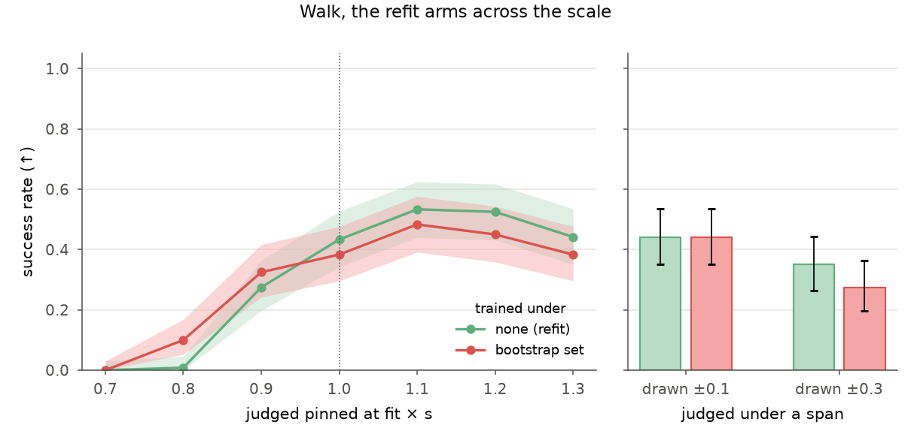

## walk-c1-refit-2026-09-06

**C1 on the walk, arms point-refit, identified on actuator xl330-m6@e57c25635c89 — same G3 recipe, trained under [point-refit: none: the bundle's point fit exactly (no law DR); identified: identified-set: joint draw from 100 bootstrap replicates of xl330-m6@e57c25635c89 (marginal 95 % box on the bundle as `uncertainty`)] — each certified AT THE FIT of that bundle (no law DR, pushes on) on 120 matched trials; a second certificate per run judges under ±0.10 law DR.**

- date: 2026-09-06 · commit: `e2da61f-dirty`
- instrument: `mjlab-1.6.0+mujoco-3.11.0+warp-1.17.0+cuda`
- command: `tools/walk-c1-fold.py docs/artifacts/walk-c1 --arms point-refit,identified --id walk-c1-refit --date 2026-09-06`
- protocol: docs/66 §8 (C1 on the walk: tools/walk-c1-arm.sh, judged at the fit)
- inputs:
  - robot: microduck@14b51b63c52e
  - actuator: xl330-m6@e57c25635c89
  - recipe: g3_agent, 8000 iterations, 4096 envs
- outcome:
  - arms: {'point-refit': {'successes': 52, 'trials': 120, 'ci95': [0.3432, 0.5269], 'runs': 3, 'per_run': [18, 13, 21], 'funnel': {'survived': 120, 'tracked': 52}, 'median_err_ratio': 0.5393, 'trained_dr_basis': "none: the bundle's point fit exactly (no law DR)", 'judged_at': "the bundle's point fit (no law DR)", 'instrument': ['mjlab-1.6.0+mujoco-3.11.0+warp-1.17.0+cuda']}, 'identified': {'successes': 46, 'trials': 120, 'ci95': [0.2961, 0.4765], 'runs': 3, 'per_run': [19, 4, 23], 'funnel': {'survived': 120, 'tracked': 46}, 'median_err_ratio': 0.5095, 'trained_dr_basis': 'identified-set: joint draw from 100 bootstrap replicates of xl330-m6@e57c25635c89 (marginal 95 % box on the bundle as `uncertainty`)', 'judged_at': "the bundle's point fit (no law DR)", 'instrument': ['mjlab-1.6.0+mujoco-3.11.0+warp-1.17.0+cuda']}}
  - under_span_0.10: {'point-refit': {'successes': 58, 'trials': 120, 'per_run': [18, 18, 22], 'dr_basis': 'identified-interval'}, 'identified': {'successes': 56, 'trials': 120, 'per_run': [26, 4, 26], 'dr_basis': 'identified-interval'}}
  - replicates: {'point-refit': [{'run': 'point-refit#1', 'seed': 42, 'successes': 18, 'trials': 40, 'ci95': [0.2926, 0.6151], 'funnel': {'survived': 40, 'tracked': 18}}, {'run': 'point-refit#2', 'seed': 43, 'successes': 13, 'trials': 40, 'ci95': [0.1857, 0.4913], 'funnel': {'survived': 40, 'tracked': 13}}, {'run': 'point-refit#3', 'seed': 44, 'successes': 21, 'trials': 40, 'ci95': [0.3613, 0.6849], 'funnel': {'survived': 40, 'tracked': 21}}], 'identified': [{'run': 'identified#1', 'seed': 42, 'successes': 19, 'trials': 40, 'ci95': [0.3151, 0.6387], 'funnel': {'survived': 40, 'tracked': 19}}, {'run': 'identified#2', 'seed': 43, 'successes': 4, 'trials': 40, 'ci95': [0.0279, 0.2366], 'funnel': {'survived': 40, 'tracked': 4}}, {'run': 'identified#3', 'seed': 44, 'successes': 23, 'trials': 40, 'ci95': [0.4089, 0.7296], 'funnel': {'survived': 40, 'tracked': 23}}]}
  - effects: [{'a': 'point-refit', 'b': 'identified', 'difference': -0.04999999999999999, 'p': 0.5115213503941369, 'verdict': 'UNRESOLVED'}]
  - alpha: 0.05
  - delta: 0.15
- artifacts:
  - point-refit#1.at_fit: docs/artifacts/walk-c1/point-refit#1/train/verdict/walk-verdict-at-fit-cuda.json
  - point-refit#2.at_fit: docs/artifacts/walk-c1/point-refit#2/train/verdict/walk-verdict-at-fit-cuda.json
  - point-refit#3.at_fit: docs/artifacts/walk-c1/point-refit#3/train/verdict/walk-verdict-at-fit-cuda.json
  - identified#1.at_fit: docs/artifacts/walk-c1/identified#1/train/verdict/walk-verdict-at-fit-cuda.json
  - identified#2.at_fit: docs/artifacts/walk-c1/identified#2/train/verdict/walk-verdict-at-fit-cuda.json
  - identified#3.at_fit: docs/artifacts/walk-c1/identified#3/train/verdict/walk-verdict-at-fit-cuda.json
  - figure.svg: docs/figures/walk-c1-refit-2026-09-06.svg
  - figure.pdf: docs/figures/walk-c1-refit-2026-09-06.pdf
  - figure.png: docs/figures/walk-c1-refit-2026-09-06.png
  - figure.csv: docs/figures/walk-c1-refit-2026-09-06.csv
- caveats:
  - The identified arm draws from the bundle's bootstrap interval (docs/e2e-research/72): log-sampling variability on one unit and one bench, not unit-to-unit spread; its point arm is the same bundle with no draw, so the comparison is at one point.
  - Replicates are pooled per arm (trial k of each run starts identically); per-run counts are on the record so the between-run spread is visible.
  - The second certificate per run (`under_span_0.10`) was judged under the bundle's marginal interval boxes, not ±0.10: the DR event preferred a bundle's interval over a declared span (fixed in commit 62b999b). The at-fit column is unaffected. Those six certificates are being re-judged.

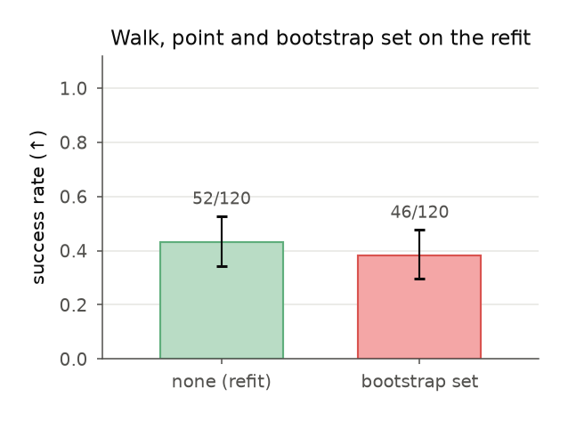

## bam-xl330-bootstrap-interval-2026-09-06

**A block bootstrap over Rhoban's 358 public XL330 bench logs (100 replicate refits of BAM's M6, 5000 trials each) identifies the motor constant to ±3.5 % (kt [0.3416, 0.3662]), the resistance to ±9 % (R [2.545, 3.036]), the armature to ±7 % and viscous friction to ±23 %, while the friction split between motor and external sides, the Stribeck knee and the alpha exponent span most of BAM's declared search ranges (bam/model.py: alpha [0.5, 10], dtheta_stribeck [0.01, 5], the quadratic terms [0, 0.01]) — unidentified by this bench. The shipped fit's kt (0.3660) sits at the interval's upper edge. The interval and all 100 replicate vectors ride on bundle xl330-m6@e57c25635c89 (robots/actuator-bundles/xl330-refit.m6.bundle.json).**

- date: 2026-09-06 · commit: `09b00e6-dirty`
- instrument: `Rhoban/bam v1.0.2 (aa17d1c), optuna 4.9.0 CmaEsSampler bipop, Apple M1 Pro CPU (8 workers), ~75 min`
- command: `python3 tools/bam-bootstrap.py --bam <Rhoban/bam @ aa17d1cd5a84938b79143239de09ae33e175b402> --processed <bam.process --raw data_raw_2 --logdir processed --dt 0.005> --raw-zip xl330_raw.zip --actuator xl330 --model m6 --out boot-100 --replicates 100 --trials 5000 --workers 8 --seed 7 --emit-uncertainty robots/actuators/xl330-refit/m6.uncertainty.json`
- protocol: docs/e2e-research/72 §4 and §6 (block bootstrap; the identified arm draws whole replicate vectors, not marginal boxes)
- inputs:
  - raw_zip: https://huggingface.co/buckets/Gregwar/bam_data/resolve/xl330_raw.zip
  - raw_zip_sha256: d308d126585235264cd4045b4702e35992fe36a9bb6b4a280987ba6ae5f09546
  - recordings: 358
  - blocks: 60 blocks of 5-6 trajectories by (kp, mass, length), resampled within block with replacement
  - bam_commit_full: aa17d1cd5a84938b79143239de09ae33e175b402
  - optuna: 4.9.0
  - outer_workers: 8
  - machine: Apple M1 Pro (10 cores), macOS 25.5
- outcome:
  - replicates: 100
  - trials_per_fit: 5000
  - sampler: optuna CmaEsSampler(restart_strategy='bipop'), bam.fit defaults
  - bootstrap: block bootstrap within ('kp', 'mass', 'length'); 60 blocks; seed 7
  - bam_commit: aa17d1c
  - raw_zip_sha256: d308d126585235264cd4045b4702e35992fe36a9bb6b4a280987ba6ae5f09546
  - interval: {'kt': {'low': 0.341608, 'high': 0.366241, 'median': 0.352989, 'shipped': 0.36601349688984386}, 'R': {'low': 2.545341, 'high': 3.036212, 'median': 2.777607, 'shipped': 2.8113923539223227}, 'armature': {'low': 0.001707, 'high': 0.001972, 'median': 0.001844, 'shipped': 0.0018077432831600838}, 'q_offset': {'low': 0.000602, 'high': 0.010076, 'median': 0.005031, 'shipped': 0.0271132870444849}, 'friction_base': {'low': 0.000526, 'high': 0.010343, 'median': 0.008044, 'shipped': 0.004771183165566}, 'friction_stribeck': {'low': 1.1e-05, 'high': 0.011056, 'median': 0.001678, 'shipped': 0.004676345799486616}, 'load_friction_motor': {'low': 0.002766, 'high': 0.327083, 'median': 0.26783, 'shipped': 0.2667860954283698}, 'load_friction_external': {'low': 4.2e-05, 'high': 0.140258, 'median': 0.076343, 'shipped': 8.515871897059342e-06}, 'load_friction_motor_stribeck': {'low': 2e-06, 'high': 0.210942, 'median': 0.000205, 'shipped': 1.0722918395099123e-05}, 'load_friction_external_stribeck': {'low': 0.004897, 'high': 0.384174, 'median': 0.154983, 'shipped': 0.08077928978935671}, 'load_friction_motor_quad': {'low': 0.000165, 'high': 0.009869, 'median': 0.004662, 'shipped': 0.009972471242139415}, 'load_friction_external_quad': {'low': 0.000156, 'high': 0.009976, 'median': 0.004635, 'shipped': 0.004902565732332559}, 'dtheta_stribeck': {'low': 0.070957, 'high': 4.973314, 'median': 0.836235, 'shipped': 2.890372094130307}, 'alpha': {'low': 0.500085, 'high': 9.658182, 'median': 4.253413, 'shipped': 8.683259907618984}, 'friction_viscous': {'low': 0.005377, 'high': 0.00853, 'median': 0.006924, 'shipped': 0.005359668274599504}}
  - relative_halfwidth: {'kt': 0.035, 'R': 0.088, 'armature': 0.072, 'friction_viscous': 0.228}
  - unidentified: ['q_offset', 'friction_base', 'friction_stribeck', 'load_friction_motor', 'load_friction_external', 'load_friction_motor_stribeck', 'load_friction_external_stribeck', 'load_friction_motor_quad', 'load_friction_external_quad', 'dtheta_stribeck', 'alpha']
  - replicate_mae_rad_summary: {'min': 0.01850141667023873, 'median': 0.020166314469753137, 'max': 0.0221419861518104, 'n': 100}
  - declared_search_bounds_bam: {'source': 'Rhoban/bam aa17d1c: bam/model.py (Parameter(initial, min, max)) and bam/dynamixel/actuator.py (xl330 block)', 'alpha': [0.5, 10.0], 'dtheta_stribeck': [0.01, 5.0], 'load_friction_motor_quad': [0.0, 0.01], 'load_friction_external_quad': [0.0, 0.01], 'load_friction_motor_stribeck': [0.0, 1.0], 'load_friction_external_stribeck': [0.0, 1.0], 'friction_base': [0.0, 'max_friction_base'], 'friction_viscous': [0.0, 'max_viscous_friction'], 'kt (xl330)': [0.25, 1.5], 'armature (xl330)': [0.0001, 0.01]}
  - at_declared_bound: {'alpha': 'refit 0.5009 at min 0.5; 20 of 100 replicates below 0.51', 'friction_viscous': "replicate min 0.00500 — the xl330 block's floor; shipped 0.00536 lies below the 95 % box's low 0.00538"}
  - shipped_outside_box: ['friction_viscous (0.005360 < 0.005377)', 'q_offset (0.0271 vs [0.0006, 0.0101]; a rig parameter)']
- artifacts:
  - summary: docs/artifacts/bam/xl330/bootstrap.json
  - replicates: docs/artifacts/bam/xl330/bootstrap-replicates/
  - bundle: robots/actuator-bundles/xl330-refit.m6.bundle.json
  - interval_file: robots/actuators/xl330-refit/m6.uncertainty.json
- caveats:
  - The interval is log-sampling variability on Rhoban's single unit and bench (their rig's q_offset and command_delay included), not unit-to-unit or temperature spread.
  - Each replicate is one optimiser run at the stated trial budget; optimiser variance is inside the interval, not separated from it.
  - The data licence is unstated on the HF bucket; the logs are not redistributed here, only the fitted numbers.
  - The bootstrap centre is the refit, not the shipped point (record bam-xl330-refit-2026-09-05); the walk C1's shipped-point policies are a different world from the refit arms.
  - Percentiles over 100 replicates interpolate between the 3rd and 4th lowest (and highest) values; the tails are coarse — quote the interval to two significant figures.
  - BAM's optimiser sets no seed (docs/e2e-research/72 §1): a replicate is not bit-reproducible; each is one CMA-ES run at 5000 trials, final position MAE 0.0185–0.0221 rad (median 0.0202) across the 100.
  - The identified arm draws the twelve LAW parameters jointly from these replicates; armature is drawn by mjlab's joint_armature event from the declared ±0.10 (microduck_walk.ARMATURE) in every arm, and viscous friction sits at the bundle's point — so the two parameters the bootstrap identifies most tightly are the two not drawn from the set (record walk-c1-refit).
  - The bundle's `metrics` section carries the bootstrap summary as emitted (sampler, worker count, optuna version and machine are on this record and docs/artifacts/bam/xl330/bootstrap.json, not in the bundle; re-wrapping would change the stamp the six refit arms trained under).
  - Relative half-widths are (high − low) / (2 · median): kt 3.5 %, R 8.8 %, armature 7.2 %, friction_viscous 22.8 %.

## walk-mismatch-matrix-kt-2026-09-05

**The mismatch matrix on the walk (kt alone): the C1 policies point, narrow, wide (replicates pooled) judged pinned at the fit scaled by s (only kt moved) and under drawn spans, 40 matched trials per run — point (trained none): x0.7 19/120, x0.8 74/120, x0.9 99/120, fit 108/120, x1.1 98/120, x1.2 91/120, x1.3 78/120, pm0.1 101/120, pm0.3 85/120; narrow (trained ±0.1): x0.7 40/120, x0.8 96/120, x0.9 104/120, fit 108/120, x1.1 107/120, x1.2 104/120, x1.3 103/120, pm0.1 105/120, pm0.3 95/120; wide (trained ±0.3): x0.7 57/120, x0.8 82/120, x0.9 87/120, fit 84/120, x1.1 91/120, x1.2 90/120, x1.3 92/120, pm0.1 87/120, pm0.3 90/120.**

- date: 2026-09-05 · commit: `d989135-dirty`
- instrument: `mjlab-1.6.0+mujoco-3.11.0+warp-1.17.0+cuda`
- command: `tools/walk-matrix-fold.py docs/artifacts/walk-c1 --param kt --span 0.30 --date 2026-09-05`
- protocol: docs/70 §9 (the mismatch matrix: tools/walk-mismatch-matrix.sh, every C1 policy judged pinned at fit x s and under drawn spans)
- inputs:
  - study_root: docs/artifacts/walk-c1
  - policies: the walk C1 checkpoints (record walk-c1-2026-09-04)
  - scales: [0.7, 0.8, 0.9, 1.1, 1.2, 1.3]
  - spans: [0.1, 0.3]
- outcome:
  - conditions: ['x0.7', 'x0.8', 'x0.9', 'fit', 'x1.1', 'x1.2', 'x1.3', 'pm0.1', 'pm0.3']
  - arms: {'point': {'trained_under': 'none', 'runs': 3, 'x0.7': {'successes': 19, 'trials': 120, 'per_run': [1, 4, 14], 'ci95': [0.0981, 0.2362]}, 'x0.8': {'successes': 74, 'trials': 120, 'per_run': [19, 27, 28], 'ci95': [0.5235, 0.7039]}, 'x0.9': {'successes': 99, 'trials': 120, 'per_run': [29, 35, 35], 'ci95': [0.745, 0.8883]}, 'fit': {'successes': 108, 'trials': 120, 'per_run': [34, 37, 37], 'ci95': [0.8318, 0.9473]}, 'x1.1': {'successes': 98, 'trials': 120, 'per_run': [29, 34, 35], 'ci95': [0.7357, 0.8814]}, 'x1.2': {'successes': 91, 'trials': 120, 'per_run': [25, 32, 34], 'ci95': [0.6717, 0.8318]}, 'x1.3': {'successes': 78, 'trials': 120, 'per_run': [23, 27, 28], 'ci95': [0.5576, 0.7348]}, 'pm0.1': {'successes': 101, 'trials': 120, 'per_run': [31, 35, 35], 'ci95': [0.7638, 0.9019]}, 'pm0.3': {'successes': 85, 'trials': 120, 'per_run': [25, 27, 33], 'ci95': [0.6184, 0.7877]}}, 'narrow': {'trained_under': '±0.1', 'runs': 3, 'x0.7': {'successes': 40, 'trials': 120, 'per_run': [21, 17, 2], 'ci95': [0.2499, 0.4252]}, 'x0.8': {'successes': 96, 'trials': 120, 'per_run': [34, 32, 30], 'ci95': [0.7172, 0.8675]}, 'x0.9': {'successes': 104, 'trials': 120, 'per_run': [35, 35, 34], 'ci95': [0.7925, 0.9218]}, 'fit': {'successes': 108, 'trials': 120, 'per_run': [37, 36, 35], 'ci95': [0.8318, 0.9473]}, 'x1.1': {'successes': 107, 'trials': 120, 'per_run': [35, 37, 35], 'ci95': [0.8219, 0.941]}, 'x1.2': {'successes': 104, 'trials': 120, 'per_run': [35, 34, 35], 'ci95': [0.7925, 0.9218]}, 'x1.3': {'successes': 103, 'trials': 120, 'per_run': [33, 35, 35], 'ci95': [0.7829, 0.9153]}, 'pm0.1': {'successes': 105, 'trials': 120, 'per_run': [35, 35, 35], 'ci95': [0.8022, 0.9283]}, 'pm0.3': {'successes': 95, 'trials': 120, 'per_run': [32, 31, 32], 'ci95': [0.708, 0.8604]}}, 'wide': {'trained_under': '±0.3', 'runs': 3, 'x0.7': {'successes': 57, 'trials': 120, 'per_run': [26, 23, 8], 'ci95': [0.3831, 0.5682]}, 'x0.8': {'successes': 82, 'trials': 120, 'per_run': [31, 32, 19], 'ci95': [0.5922, 0.7652]}, 'x0.9': {'successes': 87, 'trials': 120, 'per_run': [32, 34, 21], 'ci95': [0.636, 0.8025]}, 'fit': {'successes': 84, 'trials': 120, 'per_run': [29, 31, 24], 'ci95': [0.6096, 0.7802]}, 'x1.1': {'successes': 91, 'trials': 120, 'per_run': [30, 34, 27], 'ci95': [0.6717, 0.8318]}, 'x1.2': {'successes': 90, 'trials': 120, 'per_run': [30, 34, 26], 'ci95': [0.6627, 0.8245]}, 'x1.3': {'successes': 92, 'trials': 120, 'per_run': [31, 34, 27], 'ci95': [0.6807, 0.839]}, 'pm0.1': {'successes': 87, 'trials': 120, 'per_run': [30, 34, 23], 'ci95': [0.636, 0.8025]}, 'pm0.3': {'successes': 90, 'trials': 120, 'per_run': [31, 34, 25], 'ci95': [0.6627, 0.8245]}}}
  - effects: [{'condition': 'x0.7', 'a': 'wide', 'b': 'point', 'difference': -0.31666666666666665, 'p': 1.8453369821242087e-07, 'verdict': 'SENSITIVE'}, {'condition': 'x0.7', 'a': 'wide', 'b': 'narrow', 'difference': -0.14166666666666666, 'p': 0.035074308019954585, 'verdict': 'SENSITIVE'}, {'condition': 'x0.7', 'a': 'point', 'b': 'narrow', 'difference': 0.175, 'p': 0.0025363430058776963, 'verdict': 'SENSITIVE'}, {'condition': 'x0.8', 'a': 'wide', 'b': 'point', 'difference': -0.06666666666666665, 'p': 0.3435015262907777, 'verdict': 'UNRESOLVED'}, {'condition': 'x0.8', 'a': 'wide', 'b': 'narrow', 'difference': 0.1166666666666667, 'p': 0.054724171798772515, 'verdict': 'UNRESOLVED'}, {'condition': 'x0.8', 'a': 'point', 'b': 'narrow', 'difference': 0.18333333333333335, 'p': 0.0027194992583970466, 'verdict': 'SENSITIVE'}, {'condition': 'x0.9', 'a': 'wide', 'b': 'point', 'difference': 0.09999999999999998, 'p': 0.08848965037021113, 'verdict': 'UNRESOLVED'}, {'condition': 'x0.9', 'a': 'wide', 'b': 'narrow', 'difference': 0.14166666666666672, 'p': 0.009927464215946294, 'verdict': 'SENSITIVE'}, {'condition': 'x0.9', 'a': 'point', 'b': 'narrow', 'difference': 0.04166666666666674, 'p': 0.4749838334682442, 'verdict': 'UNRESOLVED'}, {'condition': 'fit', 'a': 'wide', 'b': 'point', 'difference': 0.20000000000000007, 'p': 0.0001632121538072269, 'verdict': 'SENSITIVE'}, {'condition': 'fit', 'a': 'wide', 'b': 'narrow', 'difference': 0.20000000000000007, 'p': 0.0001632121538072269, 'verdict': 'SENSITIVE'}, {'condition': 'fit', 'a': 'point', 'b': 'narrow', 'difference': 0.0, 'p': 1.0, 'verdict': 'INSENSITIVE'}, {'condition': 'x1.1', 'a': 'wide', 'b': 'point', 'difference': 0.05833333333333335, 'p': 0.34383096771599564, 'verdict': 'UNRESOLVED'}, {'condition': 'x1.1', 'a': 'wide', 'b': 'narrow', 'difference': 0.13333333333333341, 'p': 0.010224660918705757, 'verdict': 'SENSITIVE'}, {'condition': 'x1.1', 'a': 'point', 'b': 'narrow', 'difference': 0.07500000000000007, 'p': 0.14265223949936712, 'verdict': 'UNRESOLVED'}, {'condition': 'x1.2', 'a': 'wide', 'b': 'point', 'difference': 0.008333333333333304, 'p': 1.0, 'verdict': 'UNRESOLVED'}, {'condition': 'x1.2', 'a': 'wide', 'b': 'narrow', 'difference': 0.1166666666666667, 'p': 0.0322614914695511, 'verdict': 'SENSITIVE'}, {'condition': 'x1.2', 'a': 'point', 'b': 'narrow', 'difference': 0.10833333333333339, 'p': 0.04638512021375249, 'verdict': 'SENSITIVE'}, {'condition': 'x1.3', 'a': 'wide', 'b': 'point', 'difference': -0.1166666666666667, 'p': 0.0644541855357979, 'verdict': 'UNRESOLVED'}, {'condition': 'x1.3', 'a': 'wide', 'b': 'narrow', 'difference': 0.09166666666666656, 'p': 0.09745233284063896, 'verdict': 'UNRESOLVED'}, {'condition': 'x1.3', 'a': 'point', 'b': 'narrow', 'difference': 0.20833333333333326, 'p': 0.0002770459975312191, 'verdict': 'SENSITIVE'}, {'condition': 'pm0.1', 'a': 'wide', 'b': 'point', 'difference': 0.1166666666666667, 'p': 0.041011591447111334, 'verdict': 'SENSITIVE'}, {'condition': 'pm0.1', 'a': 'wide', 'b': 'narrow', 'difference': 0.15000000000000002, 'p': 0.005702011298989904, 'verdict': 'SENSITIVE'}, {'condition': 'pm0.1', 'a': 'point', 'b': 'narrow', 'difference': 0.033333333333333326, 'p': 0.579179503997317, 'verdict': 'UNRESOLVED'}, {'condition': 'pm0.3', 'a': 'wide', 'b': 'point', 'difference': -0.04166666666666663, 'p': 0.5614237704225251, 'verdict': 'UNRESOLVED'}, {'condition': 'pm0.3', 'a': 'wide', 'b': 'narrow', 'difference': 0.04166666666666663, 'p': 0.5392482271012907, 'verdict': 'UNRESOLVED'}, {'condition': 'pm0.3', 'a': 'point', 'b': 'narrow', 'difference': 0.08333333333333326, 'p': 0.17944039377598606, 'verdict': 'UNRESOLVED'}]
  - alpha: 0.05
  - delta: 0.15
  - missing: []
- artifacts:
  - point.x0.7: docs/artifacts/walk-c1/point/train/verdict/records-at-x0.7-kt-at-fit-cuda.jsonl
  - point.x0.8: docs/artifacts/walk-c1/point/train/verdict/records-at-x0.8-kt-at-fit-cuda.jsonl
  - point.x0.9: docs/artifacts/walk-c1/point/train/verdict/records-at-x0.9-kt-at-fit-cuda.jsonl
  - point.fit: docs/artifacts/walk-c1/point/train/verdict/records-at-fit-cuda.jsonl
  - point.x1.1: docs/artifacts/walk-c1/point/train/verdict/records-at-x1.1-kt-at-fit-cuda.jsonl
  - point.x1.2: docs/artifacts/walk-c1/point/train/verdict/records-at-x1.2-kt-at-fit-cuda.jsonl
  - point.x1.3: docs/artifacts/walk-c1/point/train/verdict/records-at-x1.3-kt-at-fit-cuda.jsonl
  - point.pm0.1: docs/artifacts/walk-c1/point/train/verdict/records-cuda.jsonl
  - point.pm0.3: docs/artifacts/walk-c1/point/train/verdict/records-under-pm0.3-cuda.jsonl
  - point#2.x0.7: docs/artifacts/walk-c1/point#2/train/verdict/records-at-x0.7-kt-at-fit-cuda.jsonl
  - point#2.x0.8: docs/artifacts/walk-c1/point#2/train/verdict/records-at-x0.8-kt-at-fit-cuda.jsonl
  - point#2.x0.9: docs/artifacts/walk-c1/point#2/train/verdict/records-at-x0.9-kt-at-fit-cuda.jsonl
  - point#2.fit: docs/artifacts/walk-c1/point#2/train/verdict/records-at-fit-cuda.jsonl
  - point#2.x1.1: docs/artifacts/walk-c1/point#2/train/verdict/records-at-x1.1-kt-at-fit-cuda.jsonl
  - point#2.x1.2: docs/artifacts/walk-c1/point#2/train/verdict/records-at-x1.2-kt-at-fit-cuda.jsonl
  - point#2.x1.3: docs/artifacts/walk-c1/point#2/train/verdict/records-at-x1.3-kt-at-fit-cuda.jsonl
  - point#2.pm0.1: docs/artifacts/walk-c1/point#2/train/verdict/records-cuda.jsonl
  - point#2.pm0.3: docs/artifacts/walk-c1/point#2/train/verdict/records-under-pm0.3-cuda.jsonl
  - point#3.x0.7: docs/artifacts/walk-c1/point#3/train/verdict/records-at-x0.7-kt-at-fit-cuda.jsonl
  - point#3.x0.8: docs/artifacts/walk-c1/point#3/train/verdict/records-at-x0.8-kt-at-fit-cuda.jsonl
  - point#3.x0.9: docs/artifacts/walk-c1/point#3/train/verdict/records-at-x0.9-kt-at-fit-cuda.jsonl
  - point#3.fit: docs/artifacts/walk-c1/point#3/train/verdict/records-at-fit-cuda.jsonl
  - point#3.x1.1: docs/artifacts/walk-c1/point#3/train/verdict/records-at-x1.1-kt-at-fit-cuda.jsonl
  - point#3.x1.2: docs/artifacts/walk-c1/point#3/train/verdict/records-at-x1.2-kt-at-fit-cuda.jsonl
  - point#3.x1.3: docs/artifacts/walk-c1/point#3/train/verdict/records-at-x1.3-kt-at-fit-cuda.jsonl
  - point#3.pm0.1: docs/artifacts/walk-c1/point#3/train/verdict/records-cuda.jsonl
  - point#3.pm0.3: docs/artifacts/walk-c1/point#3/train/verdict/records-under-pm0.3-cuda.jsonl
  - narrow.x0.7: docs/artifacts/walk-c1/narrow/train/verdict/records-at-x0.7-kt-at-fit-cuda.jsonl
  - narrow.x0.8: docs/artifacts/walk-c1/narrow/train/verdict/records-at-x0.8-kt-at-fit-cuda.jsonl
  - narrow.x0.9: docs/artifacts/walk-c1/narrow/train/verdict/records-at-x0.9-kt-at-fit-cuda.jsonl
  - narrow.fit: docs/artifacts/walk-c1/narrow/train/verdict/records-at-fit-cuda.jsonl
  - narrow.x1.1: docs/artifacts/walk-c1/narrow/train/verdict/records-at-x1.1-kt-at-fit-cuda.jsonl
  - narrow.x1.2: docs/artifacts/walk-c1/narrow/train/verdict/records-at-x1.2-kt-at-fit-cuda.jsonl
  - narrow.x1.3: docs/artifacts/walk-c1/narrow/train/verdict/records-at-x1.3-kt-at-fit-cuda.jsonl
  - narrow.pm0.1: docs/artifacts/walk-c1/narrow/train/verdict/records-cuda.jsonl
  - narrow.pm0.3: docs/artifacts/walk-c1/narrow/train/verdict/records-under-pm0.3-cuda.jsonl
  - narrow#2.x0.7: docs/artifacts/walk-c1/narrow#2/train/verdict/records-at-x0.7-kt-at-fit-cuda.jsonl
  - narrow#2.x0.8: docs/artifacts/walk-c1/narrow#2/train/verdict/records-at-x0.8-kt-at-fit-cuda.jsonl
  - narrow#2.x0.9: docs/artifacts/walk-c1/narrow#2/train/verdict/records-at-x0.9-kt-at-fit-cuda.jsonl
  - narrow#2.fit: docs/artifacts/walk-c1/narrow#2/train/verdict/records-at-fit-cuda.jsonl
  - narrow#2.x1.1: docs/artifacts/walk-c1/narrow#2/train/verdict/records-at-x1.1-kt-at-fit-cuda.jsonl
  - narrow#2.x1.2: docs/artifacts/walk-c1/narrow#2/train/verdict/records-at-x1.2-kt-at-fit-cuda.jsonl
  - narrow#2.x1.3: docs/artifacts/walk-c1/narrow#2/train/verdict/records-at-x1.3-kt-at-fit-cuda.jsonl
  - narrow#2.pm0.1: docs/artifacts/walk-c1/narrow#2/train/verdict/records-cuda.jsonl
  - narrow#2.pm0.3: docs/artifacts/walk-c1/narrow#2/train/verdict/records-under-pm0.3-cuda.jsonl
  - narrow#3.x0.7: docs/artifacts/walk-c1/narrow#3/train/verdict/records-at-x0.7-kt-at-fit-cuda.jsonl
  - narrow#3.x0.8: docs/artifacts/walk-c1/narrow#3/train/verdict/records-at-x0.8-kt-at-fit-cuda.jsonl
  - narrow#3.x0.9: docs/artifacts/walk-c1/narrow#3/train/verdict/records-at-x0.9-kt-at-fit-cuda.jsonl
  - narrow#3.fit: docs/artifacts/walk-c1/narrow#3/train/verdict/records-at-fit-cuda.jsonl
  - narrow#3.x1.1: docs/artifacts/walk-c1/narrow#3/train/verdict/records-at-x1.1-kt-at-fit-cuda.jsonl
  - narrow#3.x1.2: docs/artifacts/walk-c1/narrow#3/train/verdict/records-at-x1.2-kt-at-fit-cuda.jsonl
  - narrow#3.x1.3: docs/artifacts/walk-c1/narrow#3/train/verdict/records-at-x1.3-kt-at-fit-cuda.jsonl
  - narrow#3.pm0.1: docs/artifacts/walk-c1/narrow#3/train/verdict/records-cuda.jsonl
  - narrow#3.pm0.3: docs/artifacts/walk-c1/narrow#3/train/verdict/records-under-pm0.3-cuda.jsonl
  - wide.x0.7: docs/artifacts/walk-c1/wide/train/verdict/records-at-x0.7-kt-at-fit-cuda.jsonl
  - wide.x0.8: docs/artifacts/walk-c1/wide/train/verdict/records-at-x0.8-kt-at-fit-cuda.jsonl
  - wide.x0.9: docs/artifacts/walk-c1/wide/train/verdict/records-at-x0.9-kt-at-fit-cuda.jsonl
  - wide.fit: docs/artifacts/walk-c1/wide/train/verdict/records-at-fit-cuda.jsonl
  - wide.x1.1: docs/artifacts/walk-c1/wide/train/verdict/records-at-x1.1-kt-at-fit-cuda.jsonl
  - wide.x1.2: docs/artifacts/walk-c1/wide/train/verdict/records-at-x1.2-kt-at-fit-cuda.jsonl
  - wide.x1.3: docs/artifacts/walk-c1/wide/train/verdict/records-at-x1.3-kt-at-fit-cuda.jsonl
  - wide.pm0.1: docs/artifacts/walk-c1/wide/train/verdict/records-cuda.jsonl
  - wide.pm0.3: docs/artifacts/walk-c1/wide/train/verdict/records-under-pm0.3-cuda.jsonl
  - wide#2.x0.7: docs/artifacts/walk-c1/wide#2/train/verdict/records-at-x0.7-kt-at-fit-cuda.jsonl
  - wide#2.x0.8: docs/artifacts/walk-c1/wide#2/train/verdict/records-at-x0.8-kt-at-fit-cuda.jsonl
  - wide#2.x0.9: docs/artifacts/walk-c1/wide#2/train/verdict/records-at-x0.9-kt-at-fit-cuda.jsonl
  - wide#2.fit: docs/artifacts/walk-c1/wide#2/train/verdict/records-at-fit-cuda.jsonl
  - wide#2.x1.1: docs/artifacts/walk-c1/wide#2/train/verdict/records-at-x1.1-kt-at-fit-cuda.jsonl
  - wide#2.x1.2: docs/artifacts/walk-c1/wide#2/train/verdict/records-at-x1.2-kt-at-fit-cuda.jsonl
  - wide#2.x1.3: docs/artifacts/walk-c1/wide#2/train/verdict/records-at-x1.3-kt-at-fit-cuda.jsonl
  - wide#2.pm0.1: docs/artifacts/walk-c1/wide#2/train/verdict/records-cuda.jsonl
  - wide#2.pm0.3: docs/artifacts/walk-c1/wide#2/train/verdict/records-under-pm0.3-cuda.jsonl
  - wide#3.x0.7: docs/artifacts/walk-c1/wide#3/train/verdict/records-at-x0.7-kt-at-fit-cuda.jsonl
  - wide#3.x0.8: docs/artifacts/walk-c1/wide#3/train/verdict/records-at-x0.8-kt-at-fit-cuda.jsonl
  - wide#3.x0.9: docs/artifacts/walk-c1/wide#3/train/verdict/records-at-x0.9-kt-at-fit-cuda.jsonl
  - wide#3.fit: docs/artifacts/walk-c1/wide#3/train/verdict/records-at-fit-cuda.jsonl
  - wide#3.x1.1: docs/artifacts/walk-c1/wide#3/train/verdict/records-at-x1.1-kt-at-fit-cuda.jsonl
  - wide#3.x1.2: docs/artifacts/walk-c1/wide#3/train/verdict/records-at-x1.2-kt-at-fit-cuda.jsonl
  - wide#3.x1.3: docs/artifacts/walk-c1/wide#3/train/verdict/records-at-x1.3-kt-at-fit-cuda.jsonl
  - wide#3.pm0.1: docs/artifacts/walk-c1/wide#3/train/verdict/records-cuda.jsonl
  - wide#3.pm0.3: docs/artifacts/walk-c1/wide#3/train/verdict/records-under-pm0.3-cuda.jsonl
  - figure.svg: docs/figures/walk-mismatch-matrix-kt-2026-09-05.svg
  - figure.pdf: docs/figures/walk-mismatch-matrix-kt-2026-09-05.pdf
  - figure.png: docs/figures/walk-mismatch-matrix-kt-2026-09-05.png
  - figure.csv: docs/figures/walk-mismatch-matrix-kt-2026-09-05.csv
- caveats:
  - Pinned scale s multiplies only the kt axis of the actuator model by s; every other law parameter sits at the fit.
  - One robot, one gait, one recipe; the policies are the C1 runs (three per arm).
  - The fit is a point estimate: 'how wrong the measurement is' is simulated, not measured — paper 2's bench says how wrong it actually was.

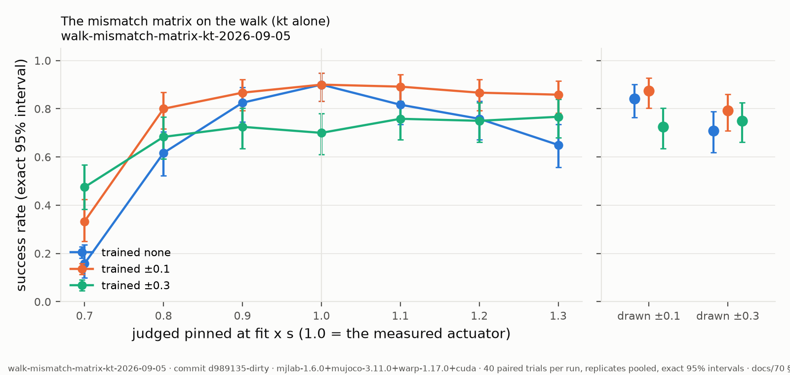

## walk-mismatch-matrix-friction-2026-09-05

**The mismatch matrix on the walk (friction alone): the C1 policies point, narrow, wide (replicates pooled) judged pinned at the fit scaled by s (only friction moved) and under drawn spans, 40 matched trials per run — point (trained none): x0.7 106/120, x0.8 102/120, x0.9 104/120, fit 108/120, x1.1 104/120, x1.2 103/120, x1.3 105/120, pm0.1 101/120, pm0.3 85/120; narrow (trained ±0.1): x0.7 106/120, x0.8 106/120, x0.9 106/120, fit 108/120, x1.1 108/120, x1.2 108/120, x1.3 107/120, pm0.1 105/120, pm0.3 95/120; wide (trained ±0.3): x0.7 88/120, x0.8 84/120, x0.9 87/120, fit 84/120, x1.1 87/120, x1.2 88/120, x1.3 87/120, pm0.1 87/120, pm0.3 90/120.**

- date: 2026-09-05 · commit: `d989135-dirty`
- instrument: `mjlab-1.6.0+mujoco-3.11.0+warp-1.17.0+cuda`
- command: `tools/walk-matrix-fold.py docs/artifacts/walk-c1 --param friction --span 0.30 --date 2026-09-05`
- protocol: docs/70 §9 (the mismatch matrix: tools/walk-mismatch-matrix.sh, every C1 policy judged pinned at fit x s and under drawn spans)
- inputs:
  - study_root: docs/artifacts/walk-c1
  - policies: the walk C1 checkpoints (record walk-c1-2026-09-04)
  - scales: [0.7, 0.8, 0.9, 1.1, 1.2, 1.3]
  - spans: [0.1, 0.3]
- outcome:
  - conditions: ['x0.7', 'x0.8', 'x0.9', 'fit', 'x1.1', 'x1.2', 'x1.3', 'pm0.1', 'pm0.3']
  - arms: {'point': {'trained_under': 'none', 'runs': 3, 'x0.7': {'successes': 106, 'trials': 120, 'per_run': [35, 35, 36], 'ci95': [0.812, 0.9347]}, 'x0.8': {'successes': 102, 'trials': 120, 'per_run': [32, 35, 35], 'ci95': [0.7733, 0.9086]}, 'x0.9': {'successes': 104, 'trials': 120, 'per_run': [34, 35, 35], 'ci95': [0.7925, 0.9218]}, 'fit': {'successes': 108, 'trials': 120, 'per_run': [34, 37, 37], 'ci95': [0.8318, 0.9473]}, 'x1.1': {'successes': 104, 'trials': 120, 'per_run': [33, 35, 36], 'ci95': [0.7925, 0.9218]}, 'x1.2': {'successes': 103, 'trials': 120, 'per_run': [33, 35, 35], 'ci95': [0.7829, 0.9153]}, 'x1.3': {'successes': 105, 'trials': 120, 'per_run': [32, 37, 36], 'ci95': [0.8022, 0.9283]}, 'pm0.1': {'successes': 101, 'trials': 120, 'per_run': [31, 35, 35], 'ci95': [0.7638, 0.9019]}, 'pm0.3': {'successes': 85, 'trials': 120, 'per_run': [25, 27, 33], 'ci95': [0.6184, 0.7877]}}, 'narrow': {'trained_under': '±0.1', 'runs': 3, 'x0.7': {'successes': 106, 'trials': 120, 'per_run': [35, 36, 35], 'ci95': [0.812, 0.9347]}, 'x0.8': {'successes': 106, 'trials': 120, 'per_run': [35, 36, 35], 'ci95': [0.812, 0.9347]}, 'x0.9': {'successes': 106, 'trials': 120, 'per_run': [35, 36, 35], 'ci95': [0.812, 0.9347]}, 'fit': {'successes': 108, 'trials': 120, 'per_run': [37, 36, 35], 'ci95': [0.8318, 0.9473]}, 'x1.1': {'successes': 108, 'trials': 120, 'per_run': [37, 36, 35], 'ci95': [0.8318, 0.9473]}, 'x1.2': {'successes': 108, 'trials': 120, 'per_run': [35, 37, 36], 'ci95': [0.8318, 0.9473]}, 'x1.3': {'successes': 107, 'trials': 120, 'per_run': [35, 37, 35], 'ci95': [0.8219, 0.941]}, 'pm0.1': {'successes': 105, 'trials': 120, 'per_run': [35, 35, 35], 'ci95': [0.8022, 0.9283]}, 'pm0.3': {'successes': 95, 'trials': 120, 'per_run': [32, 31, 32], 'ci95': [0.708, 0.8604]}}, 'wide': {'trained_under': '±0.3', 'runs': 3, 'x0.7': {'successes': 88, 'trials': 120, 'per_run': [30, 34, 24], 'ci95': [0.6449, 0.8099]}, 'x0.8': {'successes': 84, 'trials': 120, 'per_run': [29, 34, 21], 'ci95': [0.6096, 0.7802]}, 'x0.9': {'successes': 87, 'trials': 120, 'per_run': [30, 34, 23], 'ci95': [0.636, 0.8025]}, 'fit': {'successes': 84, 'trials': 120, 'per_run': [29, 31, 24], 'ci95': [0.6096, 0.7802]}, 'x1.1': {'successes': 87, 'trials': 120, 'per_run': [29, 34, 24], 'ci95': [0.636, 0.8025]}, 'x1.2': {'successes': 88, 'trials': 120, 'per_run': [30, 34, 24], 'ci95': [0.6449, 0.8099]}, 'x1.3': {'successes': 87, 'trials': 120, 'per_run': [29, 34, 24], 'ci95': [0.636, 0.8025]}, 'pm0.1': {'successes': 87, 'trials': 120, 'per_run': [30, 34, 23], 'ci95': [0.636, 0.8025]}, 'pm0.3': {'successes': 90, 'trials': 120, 'per_run': [31, 34, 25], 'ci95': [0.6627, 0.8245]}}}
  - effects: [{'condition': 'x0.7', 'a': 'wide', 'b': 'point', 'difference': 0.15000000000000002, 'p': 0.00492923251001377, 'verdict': 'SENSITIVE'}, {'condition': 'x0.7', 'a': 'wide', 'b': 'narrow', 'difference': 0.15000000000000002, 'p': 0.00492923251001377, 'verdict': 'SENSITIVE'}, {'condition': 'x0.7', 'a': 'point', 'b': 'narrow', 'difference': 0.0, 'p': 1.0, 'verdict': 'INSENSITIVE'}, {'condition': 'x0.8', 'a': 'wide', 'b': 'point', 'difference': 0.15000000000000002, 'p': 0.008215971198042227, 'verdict': 'SENSITIVE'}, {'condition': 'x0.8', 'a': 'wide', 'b': 'narrow', 'difference': 0.18333333333333335, 'p': 0.000734833676570913, 'verdict': 'SENSITIVE'}, {'condition': 'x0.8', 'a': 'point', 'b': 'narrow', 'difference': 0.033333333333333326, 'p': 0.5694588900044372, 'verdict': 'UNRESOLVED'}, {'condition': 'x0.9', 'a': 'wide', 'b': 'point', 'difference': 0.14166666666666672, 'p': 0.009927464215946294, 'verdict': 'SENSITIVE'}, {'condition': 'x0.9', 'a': 'wide', 'b': 'narrow', 'difference': 0.15833333333333333, 'p': 0.0031264971400834407, 'verdict': 'SENSITIVE'}, {'condition': 'x0.9', 'a': 'point', 'b': 'narrow', 'difference': 0.016666666666666607, 'p': 0.8455839888138967, 'verdict': 'INSENSITIVE'}, {'condition': 'fit', 'a': 'wide', 'b': 'point', 'difference': 0.20000000000000007, 'p': 0.0001632121538072269, 'verdict': 'SENSITIVE'}, {'condition': 'fit', 'a': 'wide', 'b': 'narrow', 'difference': 0.20000000000000007, 'p': 0.0001632121538072269, 'verdict': 'SENSITIVE'}, {'condition': 'fit', 'a': 'point', 'b': 'narrow', 'difference': 0.0, 'p': 1.0, 'verdict': 'INSENSITIVE'}, {'condition': 'x1.1', 'a': 'wide', 'b': 'point', 'difference': 0.14166666666666672, 'p': 0.009927464215946294, 'verdict': 'SENSITIVE'}, {'condition': 'x1.1', 'a': 'wide', 'b': 'narrow', 'difference': 0.17500000000000004, 'p': 0.0008040446884663292, 'verdict': 'SENSITIVE'}, {'condition': 'x1.1', 'a': 'point', 'b': 'narrow', 'difference': 0.033333333333333326, 'p': 0.5470102808557893, 'verdict': 'UNRESOLVED'}, {'condition': 'x1.2', 'a': 'wide', 'b': 'point', 'difference': 0.125, 'p': 0.024321119339482524, 'verdict': 'SENSITIVE'}, {'condition': 'x1.2', 'a': 'wide', 'b': 'narrow', 'difference': 0.16666666666666674, 'p': 0.001332708667763336, 'verdict': 'SENSITIVE'}, {'condition': 'x1.2', 'a': 'point', 'b': 'narrow', 'difference': 0.04166666666666674, 'p': 0.4286985389353026, 'verdict': 'UNRESOLVED'}, {'condition': 'x1.3', 'a': 'wide', 'b': 'point', 'difference': 0.15000000000000002, 'p': 0.005702011298989904, 'verdict': 'SENSITIVE'}, {'condition': 'x1.3', 'a': 'wide', 'b': 'narrow', 'difference': 0.16666666666666674, 'p': 0.0016298866442912723, 'verdict': 'SENSITIVE'}, {'condition': 'x1.3', 'a': 'point', 'b': 'narrow', 'difference': 0.01666666666666672, 'p': 0.8410127926466, 'verdict': 'INSENSITIVE'}, {'condition': 'pm0.1', 'a': 'wide', 'b': 'point', 'difference': 0.1166666666666667, 'p': 0.041011591447111334, 'verdict': 'SENSITIVE'}, {'condition': 'pm0.1', 'a': 'wide', 'b': 'narrow', 'difference': 0.15000000000000002, 'p': 0.005702011298989904, 'verdict': 'SENSITIVE'}, {'condition': 'pm0.1', 'a': 'point', 'b': 'narrow', 'difference': 0.033333333333333326, 'p': 0.579179503997317, 'verdict': 'UNRESOLVED'}, {'condition': 'pm0.3', 'a': 'wide', 'b': 'point', 'difference': -0.04166666666666663, 'p': 0.5614237704225251, 'verdict': 'UNRESOLVED'}, {'condition': 'pm0.3', 'a': 'wide', 'b': 'narrow', 'difference': 0.04166666666666663, 'p': 0.5392482271012907, 'verdict': 'UNRESOLVED'}, {'condition': 'pm0.3', 'a': 'point', 'b': 'narrow', 'difference': 0.08333333333333326, 'p': 0.17944039377598606, 'verdict': 'UNRESOLVED'}]
  - alpha: 0.05
  - delta: 0.15
  - missing: []
- artifacts:
  - point.x0.7: docs/artifacts/walk-c1/point/train/verdict/records-at-x0.7-friction-at-fit-cuda.jsonl
  - point.x0.8: docs/artifacts/walk-c1/point/train/verdict/records-at-x0.8-friction-at-fit-cuda.jsonl
  - point.x0.9: docs/artifacts/walk-c1/point/train/verdict/records-at-x0.9-friction-at-fit-cuda.jsonl
  - point.fit: docs/artifacts/walk-c1/point/train/verdict/records-at-fit-cuda.jsonl
  - point.x1.1: docs/artifacts/walk-c1/point/train/verdict/records-at-x1.1-friction-at-fit-cuda.jsonl
  - point.x1.2: docs/artifacts/walk-c1/point/train/verdict/records-at-x1.2-friction-at-fit-cuda.jsonl
  - point.x1.3: docs/artifacts/walk-c1/point/train/verdict/records-at-x1.3-friction-at-fit-cuda.jsonl
  - point.pm0.1: docs/artifacts/walk-c1/point/train/verdict/records-cuda.jsonl
  - point.pm0.3: docs/artifacts/walk-c1/point/train/verdict/records-under-pm0.3-cuda.jsonl
  - point#2.x0.7: docs/artifacts/walk-c1/point#2/train/verdict/records-at-x0.7-friction-at-fit-cuda.jsonl
  - point#2.x0.8: docs/artifacts/walk-c1/point#2/train/verdict/records-at-x0.8-friction-at-fit-cuda.jsonl
  - point#2.x0.9: docs/artifacts/walk-c1/point#2/train/verdict/records-at-x0.9-friction-at-fit-cuda.jsonl
  - point#2.fit: docs/artifacts/walk-c1/point#2/train/verdict/records-at-fit-cuda.jsonl
  - point#2.x1.1: docs/artifacts/walk-c1/point#2/train/verdict/records-at-x1.1-friction-at-fit-cuda.jsonl
  - point#2.x1.2: docs/artifacts/walk-c1/point#2/train/verdict/records-at-x1.2-friction-at-fit-cuda.jsonl
  - point#2.x1.3: docs/artifacts/walk-c1/point#2/train/verdict/records-at-x1.3-friction-at-fit-cuda.jsonl
  - point#2.pm0.1: docs/artifacts/walk-c1/point#2/train/verdict/records-cuda.jsonl
  - point#2.pm0.3: docs/artifacts/walk-c1/point#2/train/verdict/records-under-pm0.3-cuda.jsonl
  - point#3.x0.7: docs/artifacts/walk-c1/point#3/train/verdict/records-at-x0.7-friction-at-fit-cuda.jsonl
  - point#3.x0.8: docs/artifacts/walk-c1/point#3/train/verdict/records-at-x0.8-friction-at-fit-cuda.jsonl
  - point#3.x0.9: docs/artifacts/walk-c1/point#3/train/verdict/records-at-x0.9-friction-at-fit-cuda.jsonl
  - point#3.fit: docs/artifacts/walk-c1/point#3/train/verdict/records-at-fit-cuda.jsonl
  - point#3.x1.1: docs/artifacts/walk-c1/point#3/train/verdict/records-at-x1.1-friction-at-fit-cuda.jsonl
  - point#3.x1.2: docs/artifacts/walk-c1/point#3/train/verdict/records-at-x1.2-friction-at-fit-cuda.jsonl
  - point#3.x1.3: docs/artifacts/walk-c1/point#3/train/verdict/records-at-x1.3-friction-at-fit-cuda.jsonl
  - point#3.pm0.1: docs/artifacts/walk-c1/point#3/train/verdict/records-cuda.jsonl
  - point#3.pm0.3: docs/artifacts/walk-c1/point#3/train/verdict/records-under-pm0.3-cuda.jsonl
  - narrow.x0.7: docs/artifacts/walk-c1/narrow/train/verdict/records-at-x0.7-friction-at-fit-cuda.jsonl
  - narrow.x0.8: docs/artifacts/walk-c1/narrow/train/verdict/records-at-x0.8-friction-at-fit-cuda.jsonl
  - narrow.x0.9: docs/artifacts/walk-c1/narrow/train/verdict/records-at-x0.9-friction-at-fit-cuda.jsonl
  - narrow.fit: docs/artifacts/walk-c1/narrow/train/verdict/records-at-fit-cuda.jsonl
  - narrow.x1.1: docs/artifacts/walk-c1/narrow/train/verdict/records-at-x1.1-friction-at-fit-cuda.jsonl
  - narrow.x1.2: docs/artifacts/walk-c1/narrow/train/verdict/records-at-x1.2-friction-at-fit-cuda.jsonl
  - narrow.x1.3: docs/artifacts/walk-c1/narrow/train/verdict/records-at-x1.3-friction-at-fit-cuda.jsonl
  - narrow.pm0.1: docs/artifacts/walk-c1/narrow/train/verdict/records-cuda.jsonl
  - narrow.pm0.3: docs/artifacts/walk-c1/narrow/train/verdict/records-under-pm0.3-cuda.jsonl
  - narrow#2.x0.7: docs/artifacts/walk-c1/narrow#2/train/verdict/records-at-x0.7-friction-at-fit-cuda.jsonl
  - narrow#2.x0.8: docs/artifacts/walk-c1/narrow#2/train/verdict/records-at-x0.8-friction-at-fit-cuda.jsonl
  - narrow#2.x0.9: docs/artifacts/walk-c1/narrow#2/train/verdict/records-at-x0.9-friction-at-fit-cuda.jsonl
  - narrow#2.fit: docs/artifacts/walk-c1/narrow#2/train/verdict/records-at-fit-cuda.jsonl
  - narrow#2.x1.1: docs/artifacts/walk-c1/narrow#2/train/verdict/records-at-x1.1-friction-at-fit-cuda.jsonl
  - narrow#2.x1.2: docs/artifacts/walk-c1/narrow#2/train/verdict/records-at-x1.2-friction-at-fit-cuda.jsonl
  - narrow#2.x1.3: docs/artifacts/walk-c1/narrow#2/train/verdict/records-at-x1.3-friction-at-fit-cuda.jsonl
  - narrow#2.pm0.1: docs/artifacts/walk-c1/narrow#2/train/verdict/records-cuda.jsonl
  - narrow#2.pm0.3: docs/artifacts/walk-c1/narrow#2/train/verdict/records-under-pm0.3-cuda.jsonl
  - narrow#3.x0.7: docs/artifacts/walk-c1/narrow#3/train/verdict/records-at-x0.7-friction-at-fit-cuda.jsonl
  - narrow#3.x0.8: docs/artifacts/walk-c1/narrow#3/train/verdict/records-at-x0.8-friction-at-fit-cuda.jsonl
  - narrow#3.x0.9: docs/artifacts/walk-c1/narrow#3/train/verdict/records-at-x0.9-friction-at-fit-cuda.jsonl
  - narrow#3.fit: docs/artifacts/walk-c1/narrow#3/train/verdict/records-at-fit-cuda.jsonl
  - narrow#3.x1.1: docs/artifacts/walk-c1/narrow#3/train/verdict/records-at-x1.1-friction-at-fit-cuda.jsonl
  - narrow#3.x1.2: docs/artifacts/walk-c1/narrow#3/train/verdict/records-at-x1.2-friction-at-fit-cuda.jsonl
  - narrow#3.x1.3: docs/artifacts/walk-c1/narrow#3/train/verdict/records-at-x1.3-friction-at-fit-cuda.jsonl
  - narrow#3.pm0.1: docs/artifacts/walk-c1/narrow#3/train/verdict/records-cuda.jsonl
  - narrow#3.pm0.3: docs/artifacts/walk-c1/narrow#3/train/verdict/records-under-pm0.3-cuda.jsonl
  - wide.x0.7: docs/artifacts/walk-c1/wide/train/verdict/records-at-x0.7-friction-at-fit-cuda.jsonl
  - wide.x0.8: docs/artifacts/walk-c1/wide/train/verdict/records-at-x0.8-friction-at-fit-cuda.jsonl
  - wide.x0.9: docs/artifacts/walk-c1/wide/train/verdict/records-at-x0.9-friction-at-fit-cuda.jsonl
  - wide.fit: docs/artifacts/walk-c1/wide/train/verdict/records-at-fit-cuda.jsonl
  - wide.x1.1: docs/artifacts/walk-c1/wide/train/verdict/records-at-x1.1-friction-at-fit-cuda.jsonl
  - wide.x1.2: docs/artifacts/walk-c1/wide/train/verdict/records-at-x1.2-friction-at-fit-cuda.jsonl
  - wide.x1.3: docs/artifacts/walk-c1/wide/train/verdict/records-at-x1.3-friction-at-fit-cuda.jsonl
  - wide.pm0.1: docs/artifacts/walk-c1/wide/train/verdict/records-cuda.jsonl
  - wide.pm0.3: docs/artifacts/walk-c1/wide/train/verdict/records-under-pm0.3-cuda.jsonl
  - wide#2.x0.7: docs/artifacts/walk-c1/wide#2/train/verdict/records-at-x0.7-friction-at-fit-cuda.jsonl
  - wide#2.x0.8: docs/artifacts/walk-c1/wide#2/train/verdict/records-at-x0.8-friction-at-fit-cuda.jsonl
  - wide#2.x0.9: docs/artifacts/walk-c1/wide#2/train/verdict/records-at-x0.9-friction-at-fit-cuda.jsonl
  - wide#2.fit: docs/artifacts/walk-c1/wide#2/train/verdict/records-at-fit-cuda.jsonl
  - wide#2.x1.1: docs/artifacts/walk-c1/wide#2/train/verdict/records-at-x1.1-friction-at-fit-cuda.jsonl
  - wide#2.x1.2: docs/artifacts/walk-c1/wide#2/train/verdict/records-at-x1.2-friction-at-fit-cuda.jsonl
  - wide#2.x1.3: docs/artifacts/walk-c1/wide#2/train/verdict/records-at-x1.3-friction-at-fit-cuda.jsonl
  - wide#2.pm0.1: docs/artifacts/walk-c1/wide#2/train/verdict/records-cuda.jsonl
  - wide#2.pm0.3: docs/artifacts/walk-c1/wide#2/train/verdict/records-under-pm0.3-cuda.jsonl
  - wide#3.x0.7: docs/artifacts/walk-c1/wide#3/train/verdict/records-at-x0.7-friction-at-fit-cuda.jsonl
  - wide#3.x0.8: docs/artifacts/walk-c1/wide#3/train/verdict/records-at-x0.8-friction-at-fit-cuda.jsonl
  - wide#3.x0.9: docs/artifacts/walk-c1/wide#3/train/verdict/records-at-x0.9-friction-at-fit-cuda.jsonl
  - wide#3.fit: docs/artifacts/walk-c1/wide#3/train/verdict/records-at-fit-cuda.jsonl
  - wide#3.x1.1: docs/artifacts/walk-c1/wide#3/train/verdict/records-at-x1.1-friction-at-fit-cuda.jsonl
  - wide#3.x1.2: docs/artifacts/walk-c1/wide#3/train/verdict/records-at-x1.2-friction-at-fit-cuda.jsonl
  - wide#3.x1.3: docs/artifacts/walk-c1/wide#3/train/verdict/records-at-x1.3-friction-at-fit-cuda.jsonl
  - wide#3.pm0.1: docs/artifacts/walk-c1/wide#3/train/verdict/records-cuda.jsonl
  - wide#3.pm0.3: docs/artifacts/walk-c1/wide#3/train/verdict/records-under-pm0.3-cuda.jsonl
  - figure.svg: docs/figures/walk-mismatch-matrix-friction-2026-09-05.svg
  - figure.pdf: docs/figures/walk-mismatch-matrix-friction-2026-09-05.pdf
  - figure.png: docs/figures/walk-mismatch-matrix-friction-2026-09-05.png
  - figure.csv: docs/figures/walk-mismatch-matrix-friction-2026-09-05.csv
- caveats:
  - Pinned scale s multiplies only the friction axis of the actuator model by s; every other law parameter sits at the fit.
  - One robot, one gait, one recipe; the policies are the C1 runs (three per arm).
  - The fit is a point estimate: 'how wrong the measurement is' is simulated, not measured — paper 2's bench says how wrong it actually was.

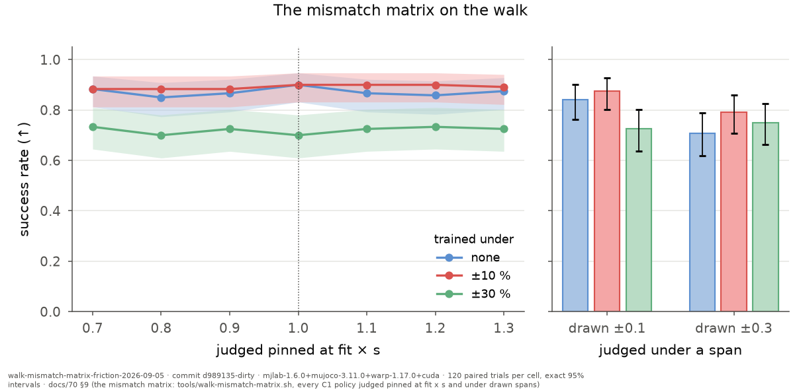

## walk-mismatch-matrix-R-2026-09-05

**The mismatch matrix on the walk (R alone): the C1 policies point, narrow, wide (replicates pooled) judged pinned at the fit scaled by s (only R moved) and under drawn spans, 40 matched trials per run — point (trained none): x0.7 91/120, x0.8 97/120, x0.9 100/120, fit 108/120, x1.1 103/120, x1.2 100/120, x1.3 101/120, pm0.1 101/120, pm0.3 85/120; narrow (trained ±0.1): x0.7 94/120, x0.8 102/120, x0.9 102/120, fit 108/120, x1.1 107/120, x1.2 107/120, x1.3 106/120, pm0.1 105/120, pm0.3 95/120; wide (trained ±0.3): x0.7 87/120, x0.8 88/120, x0.9 88/120, fit 84/120, x1.1 86/120, x1.2 87/120, x1.3 84/120, pm0.1 87/120, pm0.3 90/120.**

- date: 2026-09-05 · commit: `d989135-dirty`
- instrument: `mjlab-1.6.0+mujoco-3.11.0+warp-1.17.0+cuda`
- command: `tools/walk-matrix-fold.py docs/artifacts/walk-c1 --param R --span 0.30 --date 2026-09-05`
- protocol: docs/70 §9 (the mismatch matrix: tools/walk-mismatch-matrix.sh, every C1 policy judged pinned at fit x s and under drawn spans)
- inputs:
  - study_root: docs/artifacts/walk-c1
  - policies: the walk C1 checkpoints (record walk-c1-2026-09-04)
  - scales: [0.7, 0.8, 0.9, 1.1, 1.2, 1.3]
  - spans: [0.1, 0.3]
- outcome:
  - conditions: ['x0.7', 'x0.8', 'x0.9', 'fit', 'x1.1', 'x1.2', 'x1.3', 'pm0.1', 'pm0.3']
  - arms: {'point': {'trained_under': 'none', 'runs': 3, 'x0.7': {'successes': 91, 'trials': 120, 'per_run': [28, 29, 34], 'ci95': [0.6717, 0.8318]}, 'x0.8': {'successes': 97, 'trials': 120, 'per_run': [28, 34, 35], 'ci95': [0.7264, 0.8744]}, 'x0.9': {'successes': 100, 'trials': 120, 'per_run': [30, 35, 35], 'ci95': [0.7544, 0.8951]}, 'fit': {'successes': 108, 'trials': 120, 'per_run': [34, 37, 37], 'ci95': [0.8318, 0.9473]}, 'x1.1': {'successes': 103, 'trials': 120, 'per_run': [33, 35, 35], 'ci95': [0.7829, 0.9153]}, 'x1.2': {'successes': 100, 'trials': 120, 'per_run': [34, 31, 35], 'ci95': [0.7544, 0.8951]}, 'x1.3': {'successes': 101, 'trials': 120, 'per_run': [33, 33, 35], 'ci95': [0.7638, 0.9019]}, 'pm0.1': {'successes': 101, 'trials': 120, 'per_run': [31, 35, 35], 'ci95': [0.7638, 0.9019]}, 'pm0.3': {'successes': 85, 'trials': 120, 'per_run': [25, 27, 33], 'ci95': [0.6184, 0.7877]}}, 'narrow': {'trained_under': '±0.1', 'runs': 3, 'x0.7': {'successes': 94, 'trials': 120, 'per_run': [34, 28, 32], 'ci95': [0.6989, 0.8533]}, 'x0.8': {'successes': 102, 'trials': 120, 'per_run': [35, 33, 34], 'ci95': [0.7733, 0.9086]}, 'x0.9': {'successes': 102, 'trials': 120, 'per_run': [35, 33, 34], 'ci95': [0.7733, 0.9086]}, 'fit': {'successes': 108, 'trials': 120, 'per_run': [37, 36, 35], 'ci95': [0.8318, 0.9473]}, 'x1.1': {'successes': 107, 'trials': 120, 'per_run': [35, 37, 35], 'ci95': [0.8219, 0.941]}, 'x1.2': {'successes': 107, 'trials': 120, 'per_run': [35, 37, 35], 'ci95': [0.8219, 0.941]}, 'x1.3': {'successes': 106, 'trials': 120, 'per_run': [35, 36, 35], 'ci95': [0.812, 0.9347]}, 'pm0.1': {'successes': 105, 'trials': 120, 'per_run': [35, 35, 35], 'ci95': [0.8022, 0.9283]}, 'pm0.3': {'successes': 95, 'trials': 120, 'per_run': [32, 31, 32], 'ci95': [0.708, 0.8604]}}, 'wide': {'trained_under': '±0.3', 'runs': 3, 'x0.7': {'successes': 87, 'trials': 120, 'per_run': [29, 31, 27], 'ci95': [0.636, 0.8025]}, 'x0.8': {'successes': 88, 'trials': 120, 'per_run': [29, 34, 25], 'ci95': [0.6449, 0.8099]}, 'x0.9': {'successes': 88, 'trials': 120, 'per_run': [29, 34, 25], 'ci95': [0.6449, 0.8099]}, 'fit': {'successes': 84, 'trials': 120, 'per_run': [29, 31, 24], 'ci95': [0.6096, 0.7802]}, 'x1.1': {'successes': 86, 'trials': 120, 'per_run': [31, 34, 21], 'ci95': [0.6272, 0.7951]}, 'x1.2': {'successes': 87, 'trials': 120, 'per_run': [32, 34, 21], 'ci95': [0.636, 0.8025]}, 'x1.3': {'successes': 84, 'trials': 120, 'per_run': [31, 33, 20], 'ci95': [0.6096, 0.7802]}, 'pm0.1': {'successes': 87, 'trials': 120, 'per_run': [30, 34, 23], 'ci95': [0.636, 0.8025]}, 'pm0.3': {'successes': 90, 'trials': 120, 'per_run': [31, 34, 25], 'ci95': [0.6627, 0.8245]}}}
  - effects: [{'condition': 'x0.7', 'a': 'wide', 'b': 'point', 'difference': 0.033333333333333326, 'p': 0.6584026166772984, 'verdict': 'UNRESOLVED'}, {'condition': 'x0.7', 'a': 'wide', 'b': 'narrow', 'difference': 0.05833333333333335, 'p': 0.3684873505720635, 'verdict': 'UNRESOLVED'}, {'condition': 'x0.7', 'a': 'point', 'b': 'narrow', 'difference': 0.025000000000000022, 'p': 0.75892335260607, 'verdict': 'UNRESOLVED'}, {'condition': 'x0.8', 'a': 'wide', 'b': 'point', 'difference': 0.07500000000000007, 'p': 0.2189996255248086, 'verdict': 'UNRESOLVED'}, {'condition': 'x0.8', 'a': 'wide', 'b': 'narrow', 'difference': 0.1166666666666667, 'p': 0.038120272128077615, 'verdict': 'SENSITIVE'}, {'condition': 'x0.8', 'a': 'point', 'b': 'narrow', 'difference': 0.04166666666666663, 'p': 0.49304114965029, 'verdict': 'UNRESOLVED'}, {'condition': 'x0.9', 'a': 'wide', 'b': 'point', 'difference': 0.10000000000000009, 'p': 0.08418024597570299, 'verdict': 'UNRESOLVED'}, {'condition': 'x0.9', 'a': 'wide', 'b': 'narrow', 'difference': 0.1166666666666667, 'p': 0.038120272128077615, 'verdict': 'SENSITIVE'}, {'condition': 'x0.9', 'a': 'point', 'b': 'narrow', 'difference': 0.016666666666666607, 'p': 0.8598683531049625, 'verdict': 'UNRESOLVED'}, {'condition': 'fit', 'a': 'wide', 'b': 'point', 'difference': 0.20000000000000007, 'p': 0.0001632121538072269, 'verdict': 'SENSITIVE'}, {'condition': 'fit', 'a': 'wide', 'b': 'narrow', 'difference': 0.20000000000000007, 'p': 0.0001632121538072269, 'verdict': 'SENSITIVE'}, {'condition': 'fit', 'a': 'point', 'b': 'narrow', 'difference': 0.0, 'p': 1.0, 'verdict': 'INSENSITIVE'}, {'condition': 'x1.1', 'a': 'wide', 'b': 'point', 'difference': 0.1416666666666666, 'p': 0.011112061900405357, 'verdict': 'SENSITIVE'}, {'condition': 'x1.1', 'a': 'wide', 'b': 'narrow', 'difference': 0.17500000000000004, 'p': 0.0009949609794100847, 'verdict': 'SENSITIVE'}, {'condition': 'x1.1', 'a': 'point', 'b': 'narrow', 'difference': 0.03333333333333344, 'p': 0.5587853831323583, 'verdict': 'UNRESOLVED'}, {'condition': 'x1.2', 'a': 'wide', 'b': 'point', 'difference': 0.10833333333333339, 'p': 0.06121819569454326, 'verdict': 'UNRESOLVED'}, {'condition': 'x1.2', 'a': 'wide', 'b': 'narrow', 'difference': 0.16666666666666674, 'p': 0.0016298866442912723, 'verdict': 'SENSITIVE'}, {'condition': 'x1.2', 'a': 'point', 'b': 'narrow', 'difference': 0.05833333333333335, 'p': 0.2605448806214526, 'verdict': 'UNRESOLVED'}, {'condition': 'x1.3', 'a': 'wide', 'b': 'point', 'difference': 0.14166666666666672, 'p': 0.013548003412410631, 'verdict': 'SENSITIVE'}, {'condition': 'x1.3', 'a': 'wide', 'b': 'narrow', 'difference': 0.18333333333333335, 'p': 0.000734833676570913, 'verdict': 'SENSITIVE'}, {'condition': 'x1.3', 'a': 'point', 'b': 'narrow', 'difference': 0.04166666666666663, 'p': 0.4538171028488397, 'verdict': 'UNRESOLVED'}, {'condition': 'pm0.1', 'a': 'wide', 'b': 'point', 'difference': 0.1166666666666667, 'p': 0.041011591447111334, 'verdict': 'SENSITIVE'}, {'condition': 'pm0.1', 'a': 'wide', 'b': 'narrow', 'difference': 0.15000000000000002, 'p': 0.005702011298989904, 'verdict': 'SENSITIVE'}, {'condition': 'pm0.1', 'a': 'point', 'b': 'narrow', 'difference': 0.033333333333333326, 'p': 0.579179503997317, 'verdict': 'UNRESOLVED'}, {'condition': 'pm0.3', 'a': 'wide', 'b': 'point', 'difference': -0.04166666666666663, 'p': 0.5614237704225251, 'verdict': 'UNRESOLVED'}, {'condition': 'pm0.3', 'a': 'wide', 'b': 'narrow', 'difference': 0.04166666666666663, 'p': 0.5392482271012907, 'verdict': 'UNRESOLVED'}, {'condition': 'pm0.3', 'a': 'point', 'b': 'narrow', 'difference': 0.08333333333333326, 'p': 0.17944039377598606, 'verdict': 'UNRESOLVED'}]
  - alpha: 0.05
  - delta: 0.15
  - missing: []
- artifacts:
  - point.x0.7: docs/artifacts/walk-c1/point/train/verdict/records-at-x0.7-R-at-fit-cuda.jsonl
  - point.x0.8: docs/artifacts/walk-c1/point/train/verdict/records-at-x0.8-R-at-fit-cuda.jsonl
  - point.x0.9: docs/artifacts/walk-c1/point/train/verdict/records-at-x0.9-R-at-fit-cuda.jsonl
  - point.fit: docs/artifacts/walk-c1/point/train/verdict/records-at-fit-cuda.jsonl
  - point.x1.1: docs/artifacts/walk-c1/point/train/verdict/records-at-x1.1-R-at-fit-cuda.jsonl
  - point.x1.2: docs/artifacts/walk-c1/point/train/verdict/records-at-x1.2-R-at-fit-cuda.jsonl
  - point.x1.3: docs/artifacts/walk-c1/point/train/verdict/records-at-x1.3-R-at-fit-cuda.jsonl
  - point.pm0.1: docs/artifacts/walk-c1/point/train/verdict/records-cuda.jsonl
  - point.pm0.3: docs/artifacts/walk-c1/point/train/verdict/records-under-pm0.3-cuda.jsonl
  - point#2.x0.7: docs/artifacts/walk-c1/point#2/train/verdict/records-at-x0.7-R-at-fit-cuda.jsonl
  - point#2.x0.8: docs/artifacts/walk-c1/point#2/train/verdict/records-at-x0.8-R-at-fit-cuda.jsonl
  - point#2.x0.9: docs/artifacts/walk-c1/point#2/train/verdict/records-at-x0.9-R-at-fit-cuda.jsonl
  - point#2.fit: docs/artifacts/walk-c1/point#2/train/verdict/records-at-fit-cuda.jsonl
  - point#2.x1.1: docs/artifacts/walk-c1/point#2/train/verdict/records-at-x1.1-R-at-fit-cuda.jsonl
  - point#2.x1.2: docs/artifacts/walk-c1/point#2/train/verdict/records-at-x1.2-R-at-fit-cuda.jsonl
  - point#2.x1.3: docs/artifacts/walk-c1/point#2/train/verdict/records-at-x1.3-R-at-fit-cuda.jsonl
  - point#2.pm0.1: docs/artifacts/walk-c1/point#2/train/verdict/records-cuda.jsonl
  - point#2.pm0.3: docs/artifacts/walk-c1/point#2/train/verdict/records-under-pm0.3-cuda.jsonl
  - point#3.x0.7: docs/artifacts/walk-c1/point#3/train/verdict/records-at-x0.7-R-at-fit-cuda.jsonl
  - point#3.x0.8: docs/artifacts/walk-c1/point#3/train/verdict/records-at-x0.8-R-at-fit-cuda.jsonl
  - point#3.x0.9: docs/artifacts/walk-c1/point#3/train/verdict/records-at-x0.9-R-at-fit-cuda.jsonl
  - point#3.fit: docs/artifacts/walk-c1/point#3/train/verdict/records-at-fit-cuda.jsonl
  - point#3.x1.1: docs/artifacts/walk-c1/point#3/train/verdict/records-at-x1.1-R-at-fit-cuda.jsonl
  - point#3.x1.2: docs/artifacts/walk-c1/point#3/train/verdict/records-at-x1.2-R-at-fit-cuda.jsonl
  - point#3.x1.3: docs/artifacts/walk-c1/point#3/train/verdict/records-at-x1.3-R-at-fit-cuda.jsonl
  - point#3.pm0.1: docs/artifacts/walk-c1/point#3/train/verdict/records-cuda.jsonl
  - point#3.pm0.3: docs/artifacts/walk-c1/point#3/train/verdict/records-under-pm0.3-cuda.jsonl
  - narrow.x0.7: docs/artifacts/walk-c1/narrow/train/verdict/records-at-x0.7-R-at-fit-cuda.jsonl
  - narrow.x0.8: docs/artifacts/walk-c1/narrow/train/verdict/records-at-x0.8-R-at-fit-cuda.jsonl
  - narrow.x0.9: docs/artifacts/walk-c1/narrow/train/verdict/records-at-x0.9-R-at-fit-cuda.jsonl
  - narrow.fit: docs/artifacts/walk-c1/narrow/train/verdict/records-at-fit-cuda.jsonl
  - narrow.x1.1: docs/artifacts/walk-c1/narrow/train/verdict/records-at-x1.1-R-at-fit-cuda.jsonl
  - narrow.x1.2: docs/artifacts/walk-c1/narrow/train/verdict/records-at-x1.2-R-at-fit-cuda.jsonl
  - narrow.x1.3: docs/artifacts/walk-c1/narrow/train/verdict/records-at-x1.3-R-at-fit-cuda.jsonl
  - narrow.pm0.1: docs/artifacts/walk-c1/narrow/train/verdict/records-cuda.jsonl
  - narrow.pm0.3: docs/artifacts/walk-c1/narrow/train/verdict/records-under-pm0.3-cuda.jsonl
  - narrow#2.x0.7: docs/artifacts/walk-c1/narrow#2/train/verdict/records-at-x0.7-R-at-fit-cuda.jsonl
  - narrow#2.x0.8: docs/artifacts/walk-c1/narrow#2/train/verdict/records-at-x0.8-R-at-fit-cuda.jsonl
  - narrow#2.x0.9: docs/artifacts/walk-c1/narrow#2/train/verdict/records-at-x0.9-R-at-fit-cuda.jsonl
  - narrow#2.fit: docs/artifacts/walk-c1/narrow#2/train/verdict/records-at-fit-cuda.jsonl
  - narrow#2.x1.1: docs/artifacts/walk-c1/narrow#2/train/verdict/records-at-x1.1-R-at-fit-cuda.jsonl
  - narrow#2.x1.2: docs/artifacts/walk-c1/narrow#2/train/verdict/records-at-x1.2-R-at-fit-cuda.jsonl
  - narrow#2.x1.3: docs/artifacts/walk-c1/narrow#2/train/verdict/records-at-x1.3-R-at-fit-cuda.jsonl
  - narrow#2.pm0.1: docs/artifacts/walk-c1/narrow#2/train/verdict/records-cuda.jsonl
  - narrow#2.pm0.3: docs/artifacts/walk-c1/narrow#2/train/verdict/records-under-pm0.3-cuda.jsonl
  - narrow#3.x0.7: docs/artifacts/walk-c1/narrow#3/train/verdict/records-at-x0.7-R-at-fit-cuda.jsonl
  - narrow#3.x0.8: docs/artifacts/walk-c1/narrow#3/train/verdict/records-at-x0.8-R-at-fit-cuda.jsonl
  - narrow#3.x0.9: docs/artifacts/walk-c1/narrow#3/train/verdict/records-at-x0.9-R-at-fit-cuda.jsonl
  - narrow#3.fit: docs/artifacts/walk-c1/narrow#3/train/verdict/records-at-fit-cuda.jsonl
  - narrow#3.x1.1: docs/artifacts/walk-c1/narrow#3/train/verdict/records-at-x1.1-R-at-fit-cuda.jsonl
  - narrow#3.x1.2: docs/artifacts/walk-c1/narrow#3/train/verdict/records-at-x1.2-R-at-fit-cuda.jsonl
  - narrow#3.x1.3: docs/artifacts/walk-c1/narrow#3/train/verdict/records-at-x1.3-R-at-fit-cuda.jsonl
  - narrow#3.pm0.1: docs/artifacts/walk-c1/narrow#3/train/verdict/records-cuda.jsonl
  - narrow#3.pm0.3: docs/artifacts/walk-c1/narrow#3/train/verdict/records-under-pm0.3-cuda.jsonl
  - wide.x0.7: docs/artifacts/walk-c1/wide/train/verdict/records-at-x0.7-R-at-fit-cuda.jsonl
  - wide.x0.8: docs/artifacts/walk-c1/wide/train/verdict/records-at-x0.8-R-at-fit-cuda.jsonl
  - wide.x0.9: docs/artifacts/walk-c1/wide/train/verdict/records-at-x0.9-R-at-fit-cuda.jsonl
  - wide.fit: docs/artifacts/walk-c1/wide/train/verdict/records-at-fit-cuda.jsonl
  - wide.x1.1: docs/artifacts/walk-c1/wide/train/verdict/records-at-x1.1-R-at-fit-cuda.jsonl
  - wide.x1.2: docs/artifacts/walk-c1/wide/train/verdict/records-at-x1.2-R-at-fit-cuda.jsonl
  - wide.x1.3: docs/artifacts/walk-c1/wide/train/verdict/records-at-x1.3-R-at-fit-cuda.jsonl
  - wide.pm0.1: docs/artifacts/walk-c1/wide/train/verdict/records-cuda.jsonl
  - wide.pm0.3: docs/artifacts/walk-c1/wide/train/verdict/records-under-pm0.3-cuda.jsonl
  - wide#2.x0.7: docs/artifacts/walk-c1/wide#2/train/verdict/records-at-x0.7-R-at-fit-cuda.jsonl
  - wide#2.x0.8: docs/artifacts/walk-c1/wide#2/train/verdict/records-at-x0.8-R-at-fit-cuda.jsonl
  - wide#2.x0.9: docs/artifacts/walk-c1/wide#2/train/verdict/records-at-x0.9-R-at-fit-cuda.jsonl
  - wide#2.fit: docs/artifacts/walk-c1/wide#2/train/verdict/records-at-fit-cuda.jsonl
  - wide#2.x1.1: docs/artifacts/walk-c1/wide#2/train/verdict/records-at-x1.1-R-at-fit-cuda.jsonl
  - wide#2.x1.2: docs/artifacts/walk-c1/wide#2/train/verdict/records-at-x1.2-R-at-fit-cuda.jsonl
  - wide#2.x1.3: docs/artifacts/walk-c1/wide#2/train/verdict/records-at-x1.3-R-at-fit-cuda.jsonl
  - wide#2.pm0.1: docs/artifacts/walk-c1/wide#2/train/verdict/records-cuda.jsonl
  - wide#2.pm0.3: docs/artifacts/walk-c1/wide#2/train/verdict/records-under-pm0.3-cuda.jsonl
  - wide#3.x0.7: docs/artifacts/walk-c1/wide#3/train/verdict/records-at-x0.7-R-at-fit-cuda.jsonl
  - wide#3.x0.8: docs/artifacts/walk-c1/wide#3/train/verdict/records-at-x0.8-R-at-fit-cuda.jsonl
  - wide#3.x0.9: docs/artifacts/walk-c1/wide#3/train/verdict/records-at-x0.9-R-at-fit-cuda.jsonl
  - wide#3.fit: docs/artifacts/walk-c1/wide#3/train/verdict/records-at-fit-cuda.jsonl
  - wide#3.x1.1: docs/artifacts/walk-c1/wide#3/train/verdict/records-at-x1.1-R-at-fit-cuda.jsonl
  - wide#3.x1.2: docs/artifacts/walk-c1/wide#3/train/verdict/records-at-x1.2-R-at-fit-cuda.jsonl
  - wide#3.x1.3: docs/artifacts/walk-c1/wide#3/train/verdict/records-at-x1.3-R-at-fit-cuda.jsonl
  - wide#3.pm0.1: docs/artifacts/walk-c1/wide#3/train/verdict/records-cuda.jsonl
  - wide#3.pm0.3: docs/artifacts/walk-c1/wide#3/train/verdict/records-under-pm0.3-cuda.jsonl
  - figure.svg: docs/figures/walk-mismatch-matrix-R-2026-09-05.svg
  - figure.pdf: docs/figures/walk-mismatch-matrix-R-2026-09-05.pdf
  - figure.png: docs/figures/walk-mismatch-matrix-R-2026-09-05.png
  - figure.csv: docs/figures/walk-mismatch-matrix-R-2026-09-05.csv
- caveats:
  - Pinned scale s multiplies only the R axis of the actuator model by s; every other law parameter sits at the fit.
  - One robot, one gait, one recipe; the policies are the C1 runs (three per arm).
  - The fit is a point estimate: 'how wrong the measurement is' is simulated, not measured — paper 2's bench says how wrong it actually was.

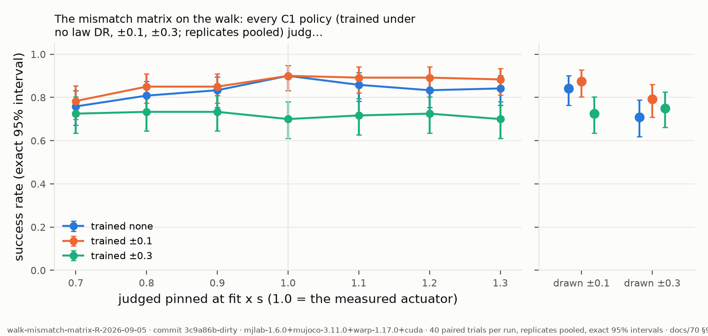

## bam-xl330-refit-2026-09-05

**BAM's shipped XL330 M6 fit (v1.0.2) scores a position MAE of 0.0272 rad on Rhoban's own 358 public bench logs; a 5000-trial refit of the same model with their optimiser on the same logs scores 0.0202 rad. The refit reproduces the load-bearing parameters within about 5 % (kt 0.952x, R 0.950x, armature 0.993x, load_friction_motor 1.033x) while the terms the shipped fit holds at its search floors, alpha (0.50 vs 8.68; BAM declares alpha in [0.5, 10] in bam/model.py, so the refit sits at the floor) and the rig offset move freely — the objective does not constrain them.**

- date: 2026-09-05 · commit: `cccc4dc-dirty`
- instrument: `Rhoban/bam v1.0.2 (aa17d1c), optuna 4.9.0 CmaEsSampler bipop, Apple M1 Pro CPU`
- command: `bam.process --raw data_raw_2 --logdir processed --dt 0.005 bam.fit --actuator xl330 --model m6 --logdir processed --output full-5000.json --trials 5000 --workers 1 bam.fit --eval --actuator xl330 --model m6 --logdir processed (params.json = shipped / refit)`
- protocol: docs/e2e-research/72 §4 (refit and score with Rhoban's own bam.fit; --eval loads params.json from cwd)
- inputs:
  - raw_zip: https://huggingface.co/buckets/Gregwar/bam_data/resolve/xl330_raw.zip
  - recordings: 358
  - design: kp {50,100,150,200,300} x mass {0.04,0.059,0.117,0.159} kg x length {0.11,0.14,0.17} m, six trajectories
  - dt: 0.005
  - raw_zip_sha256: d308d126585235264cd4045b4702e35992fe36a9bb6b4a280987ba6ae5f09546
  - bam_commit_full: aa17d1cd5a84938b79143239de09ae33e175b402
- outcome:
  - mae_rad: {'shipped_m6': 0.027171396579687947, 'refit_5000': 0.020246159983196465}
  - refit: {'kt': 0.3484217300064758, 'R': 2.6704289528696585, 'armature': 0.0017956795209984515, 'q_offset': 0.004758369721713576, 'friction_base': 0.006818520716114002, 'friction_stribeck': 0.0028775802738118476, 'load_friction_motor': 0.27549362955360135, 'load_friction_external': 0.00016670539844619098, 'load_friction_motor_stribeck': 0.0005262044845091928, 'load_friction_external_stribeck': 0.21091318214875926, 'load_friction_motor_quad': 0.009128778709221576, 'load_friction_external_quad': 0.009315492054235966, 'dtheta_stribeck': 3.662222354987697, 'alpha': 0.5009196794987004, 'friction_viscous': 0.006894075181044391, 'model': 'm6', 'actuator': 'xl330'}
  - shipped: {'kt': 0.36601349688984386, 'R': 2.8113923539223227, 'armature': 0.0018077432831600838, 'q_offset': 0.0271132870444849, 'friction_base': 0.004771183165566, 'friction_stribeck': 0.004676345799486616, 'load_friction_motor': 0.2667860954283698, 'load_friction_external': 8.515871897059342e-06, 'load_friction_motor_stribeck': 1.0722918395099123e-05, 'load_friction_external_stribeck': 0.08077928978935671, 'load_friction_motor_quad': 0.009972471242139415, 'load_friction_external_quad': 0.004902565732332559, 'dtheta_stribeck': 2.890372094130307, 'alpha': 8.683259907618984, 'friction_viscous': 0.005359668274599504, 'model': 'm6', 'actuator': 'xl330'}
  - ratio_refit_over_shipped: {'kt': 0.952, 'R': 0.95, 'armature': 0.993, 'q_offset': 0.175, 'friction_base': 1.429, 'friction_stribeck': 0.615, 'load_friction_motor': 1.033, 'load_friction_external': 19.576, 'load_friction_motor_stribeck': 49.073, 'load_friction_external_stribeck': 2.611, 'load_friction_motor_quad': 0.915, 'load_friction_external_quad': 1.9, 'dtheta_stribeck': 1.267, 'alpha': 0.058, 'friction_viscous': 1.286}
  - trials: 5000
  - fit_wall_s: 370
- artifacts:
  - refit_params: docs/artifacts/bam/xl330/refit-m6-5000-trials.json
  - shipped_params: docs/artifacts/bam/xl330/shipped-m6-v1.0.2.json
  - eval_scores: docs/artifacts/bam/xl330/eval-scores.txt
- caveats:
  - The shipped fit may come from a different recording campaign than the published zip (its folder is data_raw_2); the comparison is on the public logs only.
  - One refit run; the optimiser plateaued after ~3700 of 5000 trials at 0.0202 rad. Optimiser variance is measured by the bootstrap that follows, not here.
  - A lower MAE on the fitting logs is not a better model of the servo: no held-out split was used here (BAM's paper uses 75/25).
  - Our certified bundle wraps the SHIPPED point; every walk result in this repo is at that point. The refit is a second candidate point, not a replacement.

## walk-mismatch-matrix-2026-09-04

**The mismatch matrix on the walk: the C1 policies point, narrow, wide (replicates pooled) judged pinned at the fit scaled by s (every law parameter moved) and under drawn spans, 40 matched trials per run — point (trained none): x0.7 17/120, x0.8 78/120, x0.9 99/120, fit 108/120, x1.1 103/120, x1.2 103/120, x1.3 99/120, pm0.1 101/120, pm0.3 85/120; narrow (trained ±0.1): x0.7 39/120, x0.8 89/120, x0.9 103/120, fit 108/120, x1.1 108/120, x1.2 106/120, x1.3 105/120, pm0.1 105/120, pm0.3 95/120; wide (trained ±0.3): x0.7 56/120, x0.8 79/120, x0.9 85/120, fit 84/120, x1.1 88/120, x1.2 87/120, x1.3 87/120, pm0.1 87/120, pm0.3 90/120.**

- date: 2026-09-04 · commit: `d989135-dirty`
- instrument: `mjlab-1.6.0+mujoco-3.11.0+warp-1.17.0+cuda`
- command: `tools/walk-matrix-fold.py docs/artifacts/walk-c1 --date 2026-09-04`
- protocol: docs/70 §9 (the mismatch matrix: tools/walk-mismatch-matrix.sh, every C1 policy judged pinned at fit x s and under drawn spans)
- inputs:
  - study_root: docs/artifacts/walk-c1
  - policies: the walk C1 checkpoints (record walk-c1-2026-09-04)
  - scales: [0.7, 0.8, 0.9, 1.1, 1.2, 1.3]
  - spans: [0.1, 0.3]
- outcome:
  - conditions: ['x0.7', 'x0.8', 'x0.9', 'fit', 'x1.1', 'x1.2', 'x1.3', 'pm0.1', 'pm0.3']
  - arms: {'point': {'trained_under': 'none', 'runs': 3, 'x0.7': {'successes': 17, 'trials': 120, 'per_run': [1, 4, 12], 'ci95': [0.0847, 0.2171]}, 'x0.8': {'successes': 78, 'trials': 120, 'per_run': [22, 27, 29], 'ci95': [0.5576, 0.7348]}, 'x0.9': {'successes': 99, 'trials': 120, 'per_run': [29, 35, 35], 'ci95': [0.745, 0.8883]}, 'fit': {'successes': 108, 'trials': 120, 'per_run': [34, 37, 37], 'ci95': [0.8318, 0.9473]}, 'x1.1': {'successes': 103, 'trials': 120, 'per_run': [32, 35, 36], 'ci95': [0.7829, 0.9153]}, 'x1.2': {'successes': 103, 'trials': 120, 'per_run': [33, 33, 37], 'ci95': [0.7829, 0.9153]}, 'x1.3': {'successes': 99, 'trials': 120, 'per_run': [31, 34, 34], 'ci95': [0.745, 0.8883]}, 'pm0.1': {'successes': 101, 'trials': 120, 'per_run': [31, 35, 35], 'ci95': [0.7638, 0.9019]}, 'pm0.3': {'successes': 85, 'trials': 120, 'per_run': [25, 27, 33], 'ci95': [0.6184, 0.7877]}}, 'narrow': {'trained_under': '±0.1', 'runs': 3, 'x0.7': {'successes': 39, 'trials': 120, 'per_run': [16, 20, 3], 'ci95': [0.2423, 0.4165]}, 'x0.8': {'successes': 89, 'trials': 120, 'per_run': [32, 29, 28], 'ci95': [0.6538, 0.8172]}, 'x0.9': {'successes': 103, 'trials': 120, 'per_run': [35, 34, 34], 'ci95': [0.7829, 0.9153]}, 'fit': {'successes': 108, 'trials': 120, 'per_run': [37, 36, 35], 'ci95': [0.8318, 0.9473]}, 'x1.1': {'successes': 108, 'trials': 120, 'per_run': [35, 37, 36], 'ci95': [0.8318, 0.9473]}, 'x1.2': {'successes': 106, 'trials': 120, 'per_run': [35, 35, 36], 'ci95': [0.812, 0.9347]}, 'x1.3': {'successes': 105, 'trials': 120, 'per_run': [34, 35, 36], 'ci95': [0.8022, 0.9283]}, 'pm0.1': {'successes': 105, 'trials': 120, 'per_run': [35, 35, 35], 'ci95': [0.8022, 0.9283]}, 'pm0.3': {'successes': 95, 'trials': 120, 'per_run': [32, 31, 32], 'ci95': [0.708, 0.8604]}}, 'wide': {'trained_under': '±0.3', 'runs': 3, 'x0.7': {'successes': 56, 'trials': 120, 'per_run': [20, 25, 11], 'ci95': [0.3751, 0.5599]}, 'x0.8': {'successes': 79, 'trials': 120, 'per_run': [28, 32, 19], 'ci95': [0.5662, 0.7424]}, 'x0.9': {'successes': 85, 'trials': 120, 'per_run': [30, 34, 21], 'ci95': [0.6184, 0.7877]}, 'fit': {'successes': 84, 'trials': 120, 'per_run': [29, 31, 24], 'ci95': [0.6096, 0.7802]}, 'x1.1': {'successes': 88, 'trials': 120, 'per_run': [31, 34, 23], 'ci95': [0.6449, 0.8099]}, 'x1.2': {'successes': 87, 'trials': 120, 'per_run': [30, 33, 24], 'ci95': [0.636, 0.8025]}, 'x1.3': {'successes': 87, 'trials': 120, 'per_run': [31, 33, 23], 'ci95': [0.636, 0.8025]}, 'pm0.1': {'successes': 87, 'trials': 120, 'per_run': [30, 34, 23], 'ci95': [0.636, 0.8025]}, 'pm0.3': {'successes': 90, 'trials': 120, 'per_run': [31, 34, 25], 'ci95': [0.6627, 0.8245]}}}
  - effects: [{'condition': 'x0.7', 'a': 'wide', 'b': 'point', 'difference': -0.325, 'p': 5.673247850537565e-08, 'verdict': 'SENSITIVE'}, {'condition': 'x0.7', 'a': 'wide', 'b': 'narrow', 'difference': -0.14166666666666666, 'p': 0.03443578775817735, 'verdict': 'SENSITIVE'}, {'condition': 'x0.7', 'a': 'point', 'b': 'narrow', 'difference': 0.18333333333333335, 'p': 0.0012247701297911904, 'verdict': 'SENSITIVE'}, {'condition': 'x0.8', 'a': 'wide', 'b': 'point', 'difference': -0.008333333333333304, 'p': 1.0, 'verdict': 'UNRESOLVED'}, {'condition': 'x0.8', 'a': 'wide', 'b': 'narrow', 'difference': 0.08333333333333337, 'p': 0.20473371361207304, 'verdict': 'UNRESOLVED'}, {'condition': 'x0.8', 'a': 'point', 'b': 'narrow', 'difference': 0.09166666666666667, 'p': 0.1603534120081146, 'verdict': 'UNRESOLVED'}, {'condition': 'x0.9', 'a': 'wide', 'b': 'point', 'difference': 0.11666666666666659, 'p': 0.04666777881581481, 'verdict': 'SENSITIVE'}, {'condition': 'x0.9', 'a': 'wide', 'b': 'narrow', 'difference': 0.1499999999999999, 'p': 0.007351014617799333, 'verdict': 'SENSITIVE'}, {'condition': 'x0.9', 'a': 'point', 'b': 'narrow', 'difference': 0.033333333333333326, 'p': 0.5962285193880767, 'verdict': 'UNRESOLVED'}, {'condition': 'fit', 'a': 'wide', 'b': 'point', 'difference': 0.20000000000000007, 'p': 0.0001632121538072269, 'verdict': 'SENSITIVE'}, {'condition': 'fit', 'a': 'wide', 'b': 'narrow', 'difference': 0.20000000000000007, 'p': 0.0001632121538072269, 'verdict': 'SENSITIVE'}, {'condition': 'fit', 'a': 'point', 'b': 'narrow', 'difference': 0.0, 'p': 1.0, 'verdict': 'INSENSITIVE'}, {'condition': 'x1.1', 'a': 'wide', 'b': 'point', 'difference': 0.125, 'p': 0.024321119339482524, 'verdict': 'SENSITIVE'}, {'condition': 'x1.1', 'a': 'wide', 'b': 'narrow', 'difference': 0.16666666666666674, 'p': 0.001332708667763336, 'verdict': 'SENSITIVE'}, {'condition': 'x1.1', 'a': 'point', 'b': 'narrow', 'difference': 0.04166666666666674, 'p': 0.4286985389353026, 'verdict': 'UNRESOLVED'}, {'condition': 'x1.2', 'a': 'wide', 'b': 'point', 'difference': 0.1333333333333333, 'p': 0.016559095895902043, 'verdict': 'SENSITIVE'}, {'condition': 'x1.2', 'a': 'wide', 'b': 'narrow', 'difference': 0.15833333333333333, 'p': 0.0031264971400834407, 'verdict': 'SENSITIVE'}, {'condition': 'x1.2', 'a': 'point', 'b': 'narrow', 'difference': 0.025000000000000022, 'p': 0.70081897832701, 'verdict': 'UNRESOLVED'}, {'condition': 'x1.3', 'a': 'wide', 'b': 'point', 'difference': 0.09999999999999998, 'p': 0.08848965037021113, 'verdict': 'UNRESOLVED'}, {'condition': 'x1.3', 'a': 'wide', 'b': 'narrow', 'difference': 0.15000000000000002, 'p': 0.005702011298989904, 'verdict': 'SENSITIVE'}, {'condition': 'x1.3', 'a': 'point', 'b': 'narrow', 'difference': 0.050000000000000044, 'p': 0.3662480197703214, 'verdict': 'UNRESOLVED'}, {'condition': 'pm0.1', 'a': 'wide', 'b': 'point', 'difference': 0.1166666666666667, 'p': 0.041011591447111334, 'verdict': 'SENSITIVE'}, {'condition': 'pm0.1', 'a': 'wide', 'b': 'narrow', 'difference': 0.15000000000000002, 'p': 0.005702011298989904, 'verdict': 'SENSITIVE'}, {'condition': 'pm0.1', 'a': 'point', 'b': 'narrow', 'difference': 0.033333333333333326, 'p': 0.579179503997317, 'verdict': 'UNRESOLVED'}, {'condition': 'pm0.3', 'a': 'wide', 'b': 'point', 'difference': -0.04166666666666663, 'p': 0.5614237704225251, 'verdict': 'UNRESOLVED'}, {'condition': 'pm0.3', 'a': 'wide', 'b': 'narrow', 'difference': 0.04166666666666663, 'p': 0.5392482271012907, 'verdict': 'UNRESOLVED'}, {'condition': 'pm0.3', 'a': 'point', 'b': 'narrow', 'difference': 0.08333333333333326, 'p': 0.17944039377598606, 'verdict': 'UNRESOLVED'}]
  - alpha: 0.05
  - delta: 0.15
  - missing: []
- artifacts:
  - point.x0.7: docs/artifacts/walk-c1/point/train/verdict/records-at-x0.7-at-fit-cuda.jsonl
  - point.x0.8: docs/artifacts/walk-c1/point/train/verdict/records-at-x0.8-at-fit-cuda.jsonl
  - point.x0.9: docs/artifacts/walk-c1/point/train/verdict/records-at-x0.9-at-fit-cuda.jsonl
  - point.fit: docs/artifacts/walk-c1/point/train/verdict/records-at-fit-cuda.jsonl
  - point.x1.1: docs/artifacts/walk-c1/point/train/verdict/records-at-x1.1-at-fit-cuda.jsonl
  - point.x1.2: docs/artifacts/walk-c1/point/train/verdict/records-at-x1.2-at-fit-cuda.jsonl
  - point.x1.3: docs/artifacts/walk-c1/point/train/verdict/records-at-x1.3-at-fit-cuda.jsonl
  - point.pm0.1: docs/artifacts/walk-c1/point/train/verdict/records-cuda.jsonl
  - point.pm0.3: docs/artifacts/walk-c1/point/train/verdict/records-under-pm0.3-cuda.jsonl
  - point#2.x0.7: docs/artifacts/walk-c1/point#2/train/verdict/records-at-x0.7-at-fit-cuda.jsonl
  - point#2.x0.8: docs/artifacts/walk-c1/point#2/train/verdict/records-at-x0.8-at-fit-cuda.jsonl
  - point#2.x0.9: docs/artifacts/walk-c1/point#2/train/verdict/records-at-x0.9-at-fit-cuda.jsonl
  - point#2.fit: docs/artifacts/walk-c1/point#2/train/verdict/records-at-fit-cuda.jsonl
  - point#2.x1.1: docs/artifacts/walk-c1/point#2/train/verdict/records-at-x1.1-at-fit-cuda.jsonl
  - point#2.x1.2: docs/artifacts/walk-c1/point#2/train/verdict/records-at-x1.2-at-fit-cuda.jsonl
  - point#2.x1.3: docs/artifacts/walk-c1/point#2/train/verdict/records-at-x1.3-at-fit-cuda.jsonl
  - point#2.pm0.1: docs/artifacts/walk-c1/point#2/train/verdict/records-cuda.jsonl
  - point#2.pm0.3: docs/artifacts/walk-c1/point#2/train/verdict/records-under-pm0.3-cuda.jsonl
  - point#3.x0.7: docs/artifacts/walk-c1/point#3/train/verdict/records-at-x0.7-at-fit-cuda.jsonl
  - point#3.x0.8: docs/artifacts/walk-c1/point#3/train/verdict/records-at-x0.8-at-fit-cuda.jsonl
  - point#3.x0.9: docs/artifacts/walk-c1/point#3/train/verdict/records-at-x0.9-at-fit-cuda.jsonl
  - point#3.fit: docs/artifacts/walk-c1/point#3/train/verdict/records-at-fit-cuda.jsonl
  - point#3.x1.1: docs/artifacts/walk-c1/point#3/train/verdict/records-at-x1.1-at-fit-cuda.jsonl
  - point#3.x1.2: docs/artifacts/walk-c1/point#3/train/verdict/records-at-x1.2-at-fit-cuda.jsonl
  - point#3.x1.3: docs/artifacts/walk-c1/point#3/train/verdict/records-at-x1.3-at-fit-cuda.jsonl
  - point#3.pm0.1: docs/artifacts/walk-c1/point#3/train/verdict/records-cuda.jsonl
  - point#3.pm0.3: docs/artifacts/walk-c1/point#3/train/verdict/records-under-pm0.3-cuda.jsonl
  - narrow.x0.7: docs/artifacts/walk-c1/narrow/train/verdict/records-at-x0.7-at-fit-cuda.jsonl
  - narrow.x0.8: docs/artifacts/walk-c1/narrow/train/verdict/records-at-x0.8-at-fit-cuda.jsonl
  - narrow.x0.9: docs/artifacts/walk-c1/narrow/train/verdict/records-at-x0.9-at-fit-cuda.jsonl
  - narrow.fit: docs/artifacts/walk-c1/narrow/train/verdict/records-at-fit-cuda.jsonl
  - narrow.x1.1: docs/artifacts/walk-c1/narrow/train/verdict/records-at-x1.1-at-fit-cuda.jsonl
  - narrow.x1.2: docs/artifacts/walk-c1/narrow/train/verdict/records-at-x1.2-at-fit-cuda.jsonl
  - narrow.x1.3: docs/artifacts/walk-c1/narrow/train/verdict/records-at-x1.3-at-fit-cuda.jsonl
  - narrow.pm0.1: docs/artifacts/walk-c1/narrow/train/verdict/records-cuda.jsonl
  - narrow.pm0.3: docs/artifacts/walk-c1/narrow/train/verdict/records-under-pm0.3-cuda.jsonl
  - narrow#2.x0.7: docs/artifacts/walk-c1/narrow#2/train/verdict/records-at-x0.7-at-fit-cuda.jsonl
  - narrow#2.x0.8: docs/artifacts/walk-c1/narrow#2/train/verdict/records-at-x0.8-at-fit-cuda.jsonl
  - narrow#2.x0.9: docs/artifacts/walk-c1/narrow#2/train/verdict/records-at-x0.9-at-fit-cuda.jsonl
  - narrow#2.fit: docs/artifacts/walk-c1/narrow#2/train/verdict/records-at-fit-cuda.jsonl
  - narrow#2.x1.1: docs/artifacts/walk-c1/narrow#2/train/verdict/records-at-x1.1-at-fit-cuda.jsonl
  - narrow#2.x1.2: docs/artifacts/walk-c1/narrow#2/train/verdict/records-at-x1.2-at-fit-cuda.jsonl
  - narrow#2.x1.3: docs/artifacts/walk-c1/narrow#2/train/verdict/records-at-x1.3-at-fit-cuda.jsonl
  - narrow#2.pm0.1: docs/artifacts/walk-c1/narrow#2/train/verdict/records-cuda.jsonl
  - narrow#2.pm0.3: docs/artifacts/walk-c1/narrow#2/train/verdict/records-under-pm0.3-cuda.jsonl
  - narrow#3.x0.7: docs/artifacts/walk-c1/narrow#3/train/verdict/records-at-x0.7-at-fit-cuda.jsonl
  - narrow#3.x0.8: docs/artifacts/walk-c1/narrow#3/train/verdict/records-at-x0.8-at-fit-cuda.jsonl
  - narrow#3.x0.9: docs/artifacts/walk-c1/narrow#3/train/verdict/records-at-x0.9-at-fit-cuda.jsonl
  - narrow#3.fit: docs/artifacts/walk-c1/narrow#3/train/verdict/records-at-fit-cuda.jsonl
  - narrow#3.x1.1: docs/artifacts/walk-c1/narrow#3/train/verdict/records-at-x1.1-at-fit-cuda.jsonl
  - narrow#3.x1.2: docs/artifacts/walk-c1/narrow#3/train/verdict/records-at-x1.2-at-fit-cuda.jsonl
  - narrow#3.x1.3: docs/artifacts/walk-c1/narrow#3/train/verdict/records-at-x1.3-at-fit-cuda.jsonl
  - narrow#3.pm0.1: docs/artifacts/walk-c1/narrow#3/train/verdict/records-cuda.jsonl
  - narrow#3.pm0.3: docs/artifacts/walk-c1/narrow#3/train/verdict/records-under-pm0.3-cuda.jsonl
  - wide.x0.7: docs/artifacts/walk-c1/wide/train/verdict/records-at-x0.7-at-fit-cuda.jsonl
  - wide.x0.8: docs/artifacts/walk-c1/wide/train/verdict/records-at-x0.8-at-fit-cuda.jsonl
  - wide.x0.9: docs/artifacts/walk-c1/wide/train/verdict/records-at-x0.9-at-fit-cuda.jsonl
  - wide.fit: docs/artifacts/walk-c1/wide/train/verdict/records-at-fit-cuda.jsonl
  - wide.x1.1: docs/artifacts/walk-c1/wide/train/verdict/records-at-x1.1-at-fit-cuda.jsonl
  - wide.x1.2: docs/artifacts/walk-c1/wide/train/verdict/records-at-x1.2-at-fit-cuda.jsonl
  - wide.x1.3: docs/artifacts/walk-c1/wide/train/verdict/records-at-x1.3-at-fit-cuda.jsonl
  - wide.pm0.1: docs/artifacts/walk-c1/wide/train/verdict/records-cuda.jsonl
  - wide.pm0.3: docs/artifacts/walk-c1/wide/train/verdict/records-under-pm0.3-cuda.jsonl
  - wide#2.x0.7: docs/artifacts/walk-c1/wide#2/train/verdict/records-at-x0.7-at-fit-cuda.jsonl
  - wide#2.x0.8: docs/artifacts/walk-c1/wide#2/train/verdict/records-at-x0.8-at-fit-cuda.jsonl
  - wide#2.x0.9: docs/artifacts/walk-c1/wide#2/train/verdict/records-at-x0.9-at-fit-cuda.jsonl
  - wide#2.fit: docs/artifacts/walk-c1/wide#2/train/verdict/records-at-fit-cuda.jsonl
  - wide#2.x1.1: docs/artifacts/walk-c1/wide#2/train/verdict/records-at-x1.1-at-fit-cuda.jsonl
  - wide#2.x1.2: docs/artifacts/walk-c1/wide#2/train/verdict/records-at-x1.2-at-fit-cuda.jsonl
  - wide#2.x1.3: docs/artifacts/walk-c1/wide#2/train/verdict/records-at-x1.3-at-fit-cuda.jsonl
  - wide#2.pm0.1: docs/artifacts/walk-c1/wide#2/train/verdict/records-cuda.jsonl
  - wide#2.pm0.3: docs/artifacts/walk-c1/wide#2/train/verdict/records-under-pm0.3-cuda.jsonl
  - wide#3.x0.7: docs/artifacts/walk-c1/wide#3/train/verdict/records-at-x0.7-at-fit-cuda.jsonl
  - wide#3.x0.8: docs/artifacts/walk-c1/wide#3/train/verdict/records-at-x0.8-at-fit-cuda.jsonl
  - wide#3.x0.9: docs/artifacts/walk-c1/wide#3/train/verdict/records-at-x0.9-at-fit-cuda.jsonl
  - wide#3.fit: docs/artifacts/walk-c1/wide#3/train/verdict/records-at-fit-cuda.jsonl
  - wide#3.x1.1: docs/artifacts/walk-c1/wide#3/train/verdict/records-at-x1.1-at-fit-cuda.jsonl
  - wide#3.x1.2: docs/artifacts/walk-c1/wide#3/train/verdict/records-at-x1.2-at-fit-cuda.jsonl
  - wide#3.x1.3: docs/artifacts/walk-c1/wide#3/train/verdict/records-at-x1.3-at-fit-cuda.jsonl
  - wide#3.pm0.1: docs/artifacts/walk-c1/wide#3/train/verdict/records-cuda.jsonl
  - wide#3.pm0.3: docs/artifacts/walk-c1/wide#3/train/verdict/records-under-pm0.3-cuda.jsonl
  - figure.svg: docs/figures/walk-mismatch-matrix-2026-09-04.svg
  - figure.pdf: docs/figures/walk-mismatch-matrix-2026-09-04.pdf
  - figure.png: docs/figures/walk-mismatch-matrix-2026-09-04.png
  - figure.csv: docs/figures/walk-mismatch-matrix-2026-09-04.csv
- caveats:
  - Pinned scale s multiplies EVERY law parameter of the actuator model by s (walk_verdict --judge-at-scale); a real mismatch moves them separately — the per-axis matrices (--judge-param) are the slices.
  - One robot, one gait, one recipe; the policies are the C1 runs (three per arm).
  - The fit is a point estimate: 'how wrong the measurement is' is simulated, not measured — paper 2's bench says how wrong it actually was.

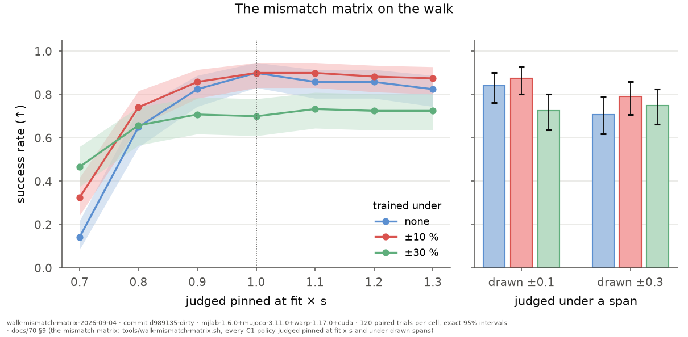

## walk-distillation-campaigns-2026-09-04

**RL teacher -> vision student on the microduck walk, certified on 40 matched pushed trials (seed 1000): teacher 33/40 cuda (37/40 cpu); students campaign 1 (10 Hz data) 0/40, campaign 2 (120 ep at 50 Hz, 30k) 18/40, campaign 3 (240 ep, 60k) 24/40, campaign 4 (same recipe re-pressed) 27/40, campaign 4b (campaign 4's dataset retrained from scratch) 22/40; campaign 4's student with the camera blanked 0/40 and with the state blanked 0/40.**

- date: 2026-09-04 · commit: `d25fb30`
- instrument: `mjlab-1.6.0+mujoco-3.11.0+warp-1.17.0+cuda`
- command: `rq_mjlab.walk_verdict <teacher> --trials 40 --seed 1000 --device cuda:0 [--student <pretrained_model>] [--blank-camera | --blank-state]`
- protocol: docs/e2e-research/63 §2 (the certificate); docs/07 campaigns 1-4
- inputs:
  - teacher: runs/microduck-walk/20260901-163412/model_7999.pt (microduck-walk@824eba27c48c)
  - criterion: survived and err_ratio<0.5
- outcome:
  - arms: {'teacher-cuda': {'successes': 33, 'trials': 40, 'survived': 40, 'tracked': 33, 'instrument': 'mjlab-1.6.0+mujoco-3.11.0+warp-1.17.0+cuda', 'seed': 1000, 'policy': 'model_7999', 'ci95': [0.6722, 0.9266]}, 'teacher-cpu': {'successes': 37, 'trials': 40, 'survived': 40, 'tracked': 37, 'instrument': 'mjlab-1.6.0+mujoco-3.11.0+warp-1.17.0+cpu', 'seed': 1000, 'policy': 'model_7999', 'ci95': [0.7961, 0.9843]}, 'campaign-1': {'successes': 0, 'trials': 40, 'survived': 0, 'tracked': 0, 'instrument': 'mjlab-1.6.0+mujoco-3.11.0+warp-1.17.0+cuda', 'seed': 1000, 'policy': 'student-last@d406ee7d7680', 'ci95': [0.0, 0.0881]}, 'campaign-2': {'successes': 18, 'trials': 40, 'survived': 26, 'tracked': 25, 'instrument': 'mjlab-1.6.0+mujoco-3.11.0+warp-1.17.0+cuda', 'seed': 1000, 'policy': 'student-last@5ca41ffb2fc6', 'ci95': [0.2926, 0.6151]}, 'campaign-3': {'successes': 24, 'trials': 40, 'survived': 29, 'tracked': 30, 'instrument': 'mjlab-1.6.0+mujoco-3.11.0+warp-1.17.0+cuda', 'seed': 1000, 'policy': 'student-last@c39a1b54c06b', 'ci95': [0.4333, 0.7514]}, 'campaign-4': {'successes': 27, 'trials': 40, 'survived': 34, 'tracked': 29, 'instrument': 'mjlab-1.6.0+mujoco-3.11.0+warp-1.17.0+cuda', 'seed': 1000, 'policy': 'student-last@d2c35fcf3459', 'ci95': [0.5087, 0.8143]}, 'campaign-4-camera-blanked': {'successes': 0, 'trials': 40, 'survived': 0, 'tracked': 4, 'instrument': 'mjlab-1.6.0+mujoco-3.11.0+warp-1.17.0+cuda', 'seed': 1000, 'policy': 'student-last@d2c35fcf3459', 'ci95': [0.0, 0.0881]}, 'campaign-4-state-blanked': {'successes': 0, 'trials': 40, 'survived': 0, 'tracked': 0, 'instrument': 'mjlab-1.6.0+mujoco-3.11.0+warp-1.17.0+cuda', 'seed': 1000, 'policy': 'student-last@d2c35fcf3459', 'ci95': [0.0, 0.0881]}, 'campaign-4b': {'successes': 22, 'trials': 40, 'survived': 31, 'tracked': 29, 'instrument': 'mjlab-1.6.0+mujoco-3.11.0+warp-1.17.0+cuda', 'seed': 1000, 'policy': 'student-last@6b6cef16e54f', 'ci95': [0.3849, 0.7074], 'note': "campaign 4's dataset (240 episodes, 50 Hz) retrained from scratch after the storage prune deleted campaign 4's checkpoint (docs/07 2026-09-04); same recipe, 60k steps, new training seed"}}
- artifacts:
  - records_cuda: docs/artifacts/walk-verdicts/records-cuda.jsonl
  - records_cpu: docs/artifacts/walk-verdicts/records-cpu.jsonl
  - records_students: docs/artifacts/walk-verdicts/records-student-cuda.jsonl
  - records_blank_camera: docs/artifacts/walk-verdicts/records-student-blank-cuda.jsonl
  - records_blank_state: docs/artifacts/walk-verdicts/records-student-blank-state-cuda.jsonl
  - certificate_campaign_4b: docs/artifacts/walk-verdicts/walk-verdict-student-cuda.campaign-4b.json
- caveats:
  - Only walk-verdict-cuda.json (the teacher's cuda certificate) had been overwritten by an 8-trial smoke run at seed 7 (5/8); the other certificate files match their arms; records-student-cuda.jsonl also carries 16 seed-7 rows of student-last@f2d75d0b075f that belong to no arm here. The per-trial rows are the primary artifact; the overwrite guard now renames a previous certificate.
  - Campaign 4's student weights were deleted by a storage prune (docs/07 2026-09-04); its rows survive.
  - Blanked inputs are out of distribution: 0/40 proves load-bearing, not contribution.
  - Training-run variance on the student is at least five trials of forty: campaign 4 and 4b share one dataset and differ only in the training run (27 vs 22). Campaign 3 vs 4 (re-pressed, 24 vs 27) is inside that spread, so the press's repeatability cannot be separated from the trainer's at n=1 each.
  - The task source hash on campaign 4b's and DAgger round 1's certificates is microduck-walk@0bb340d9f38d where the earlier students' is @824eba27c48c: walk_verdict's identity gained the training run's dr_basis and seed fields on 2026-09-04 (the certificate-overwrite guard commit), so the hash of the identity dict changed while robot, actuator and judged dr_basis are byte-identical — the same world, a wider identity.
  - Every certificate in this record is judged under law DR drawn from ±0.10 around the fit (walk_verdict's default certificate world, pushes on) — not pinned at the fit as the walk C1 study's arms are.

## walk-dagger-round-1-2026-09-04

**DAgger round 1 on the walk: the base student drove 120 episodes, the teacher labeled every state, the referee kept the passes; a new student trained on the union of the base dataset and the relabeled batch, certified on the same 40 matched trials as the base — base 22/40 vs round-1 26/40.**

- date: 2026-09-04 · commit: `cced727-dirty`
- instrument: `mjlab-1.6.0+mujoco-3.11.0+warp-1.17.0+cuda`
- command: `tools/dagger-fold.py docs/artifacts/walk-verdicts student-last@6b6cef16e54f student-last@c9020b1b1ce3 --round-dir docs/artifacts/dagger/round-1 --date 2026-09-04`
- protocol: docs/66 §6 (DAgger on the walk: tools/walk-dagger-round.sh)
- inputs:
  - teacher_verdict_dir: docs/artifacts/walk-verdicts
  - round_datasheet: # Datasheet … (full datasheet: docs/artifacts/dagger/round-1/datasheet.md)
  - union: {'sources': ['dataset', 'dataset'], 'episodes': 360, 'experts': ['model_7999@6a7479eec9ee', 'model_7999@6a7479eec9ee+dagger:student-last@6b6cef16e54f']}
- outcome:
  - arms: {'base': {'policy': 'student-last@6b6cef16e54f', 'successes': 22, 'trials': 40, 'ci95': [0.3849, 0.7074], 'funnel': {'survived': 31, 'tracked': 29}, 'instrument': ['mjlab-1.6.0+mujoco-3.11.0+warp-1.17.0+cuda']}, 'dagger-1': {'policy': 'student-last@c9020b1b1ce3', 'successes': 26, 'trials': 40, 'ci95': [0.4832, 0.7937], 'funnel': {'survived': 34, 'tracked': 31}, 'instrument': ['mjlab-1.6.0+mujoco-3.11.0+warp-1.17.0+cuda']}}
  - effects: [{'a': 'base', 'b': 'dagger-1', 'difference': 0.09999999999999998, 'p': 0.49389114635085757, 'verdict': 'UNRESOLVED'}]
  - alpha: 0.05
  - delta: 0.15
  - press: {'kept': 120, 'highest_attempt_recorded': 189, 'note': 'attempts after the last keep are not recorded, so 189 is a lower bound (datasheet: docs/artifacts/dagger/round-1/datasheet.md)'}
- artifacts:
  - records: docs/artifacts/walk-verdicts/records-student-cuda.jsonl
  - round_datasheet: docs/artifacts/dagger/round-1/datasheet.md
  - union_provenance: docs/artifacts/dagger/round-1/union-provenance.json
  - figure.svg: docs/figures/walk-dagger-round-1-2026-09-04.svg
  - figure.pdf: docs/figures/walk-dagger-round-1-2026-09-04.pdf
  - figure.png: docs/figures/walk-dagger-round-1-2026-09-04.png
  - figure.csv: docs/figures/walk-dagger-round-1-2026-09-04.csv
  - base_records: docs/artifacts/walk-verdicts/records-student-cuda.jsonl (policy student-last@6b6cef16e54f rows)
- caveats:
  - One round, one training run per student, 40 trials each: a direction, replicate before a sentence.
  - The round student trained 20k steps on 360 episodes; the base trained 60k on 240 — steps per episode differ.
  - The task source hash on campaign 4b's and DAgger round 1's certificates is microduck-walk@0bb340d9f38d where the earlier students' is @824eba27c48c: walk_verdict's identity gained the training run's dr_basis and seed fields on 2026-09-04 (the certificate-overwrite guard commit), so the hash of the identity dict changed while robot, actuator and judged dr_basis are byte-identical — the same world, a wider identity.
  - Both students are judged under law DR drawn from ±0.10 around the fit (the default certificate world), not pinned at the fit.

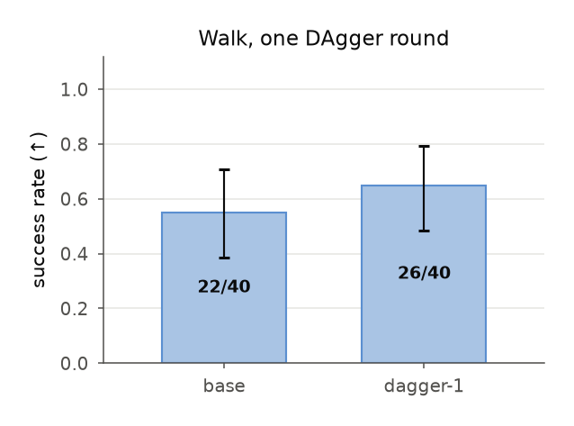

## walk-c1-2026-09-04

**C1 on the walk: the microduck teacher trained under NO law DR (the bundle's point fit), the declared ±0.10 span, and the folklore ±0.30 span — same G3 recipe — each certified AT THE FIT (no law DR, pushes on) on 120 matched trials; a second certificate per run judges the policy under law DR drawn from ±0.10 around the fit (the module constant LAW_DR_SPAN, the same span for every arm — not each arm's own span).**

- date: 2026-09-04 · commit: `9cb7916-archive`
- instrument: `mjlab-1.6.0+mujoco-3.11.0+warp-1.17.0+cuda`
- command: `../tools/walk-c1-fold.py /workspace/robotiq/runs/studies/walk-c1`
- protocol: docs/66 §8 (C1 on the walk: tools/walk-c1-arm.sh, judged at the fit)
- inputs:
  - robot: microduck@14b51b63c52e
  - actuator: xl330-m6@3ae1b8c2156b (point fit, no intervals)
  - recipe: g3_agent, 8000 iterations, 4096 envs
- outcome:
  - arms: {'point': {'successes': 108, 'trials': 120, 'ci95': [0.8318, 0.9473], 'runs': 3, 'per_run': [34, 37, 37], 'funnel': {'survived': 120, 'tracked': 108}, 'median_err_ratio': 0.3763, 'trained_dr_basis': "none: the bundle's point fit exactly (no law DR)", 'judged_at': "the bundle's point fit (no law DR)", 'instrument': ['mjlab-1.6.0+mujoco-3.11.0+warp-1.17.0+cuda']}, 'narrow': {'successes': 108, 'trials': 120, 'ci95': [0.8318, 0.9473], 'runs': 3, 'per_run': [37, 36, 35], 'funnel': {'survived': 120, 'tracked': 108}, 'median_err_ratio': 0.371, 'trained_dr_basis': 'caller-declared span ±0.1 (bundle is point estimates)', 'judged_at': "the bundle's point fit (no law DR)", 'instrument': ['mjlab-1.6.0+mujoco-3.11.0+warp-1.17.0+cuda']}, 'wide': {'successes': 84, 'trials': 120, 'ci95': [0.6096, 0.7802], 'runs': 3, 'per_run': [29, 31, 24], 'funnel': {'survived': 120, 'tracked': 84}, 'median_err_ratio': 0.4248, 'trained_dr_basis': 'caller-declared span ±0.3 (bundle is point estimates)', 'judged_at': "the bundle's point fit (no law DR)", 'instrument': ['mjlab-1.6.0+mujoco-3.11.0+warp-1.17.0+cuda']}}
  - replicates: {'point': [{'run': 'point', 'seed': 42, 'successes': 34, 'trials': 40, 'ci95': [0.7016, 0.9429], 'funnel': {'survived': 40, 'tracked': 34}}, {'run': 'point#2', 'seed': 43, 'successes': 37, 'trials': 40, 'ci95': [0.7961, 0.9843], 'funnel': {'survived': 40, 'tracked': 37}}, {'run': 'point#3', 'seed': 44, 'successes': 37, 'trials': 40, 'ci95': [0.7961, 0.9843], 'funnel': {'survived': 40, 'tracked': 37}}], 'narrow': [{'run': 'narrow', 'seed': 42, 'successes': 37, 'trials': 40, 'ci95': [0.7961, 0.9843], 'funnel': {'survived': 40, 'tracked': 37}}, {'run': 'narrow#2', 'seed': 43, 'successes': 36, 'trials': 40, 'ci95': [0.7634, 0.9721], 'funnel': {'survived': 40, 'tracked': 36}}, {'run': 'narrow#3', 'seed': 44, 'successes': 35, 'trials': 40, 'ci95': [0.732, 0.9581], 'funnel': {'survived': 40, 'tracked': 35}}], 'wide': [{'run': 'wide', 'seed': 42, 'successes': 29, 'trials': 40, 'ci95': [0.5611, 0.854], 'funnel': {'survived': 40, 'tracked': 29}}, {'run': 'wide#2', 'seed': 43, 'successes': 31, 'trials': 40, 'ci95': [0.6155, 0.8916], 'funnel': {'survived': 40, 'tracked': 31}}, {'run': 'wide#3', 'seed': 44, 'successes': 24, 'trials': 40, 'ci95': [0.4333, 0.7514], 'funnel': {'survived': 40, 'tracked': 24}}]}
  - effects: [{'a': 'wide', 'b': 'narrow', 'difference': 0.20000000000000007, 'p': 0.00016321215380720133, 'verdict': 'SENSITIVE'}, {'a': 'point', 'b': 'narrow', 'difference': 0.0, 'p': 1.0, 'verdict': 'INSENSITIVE'}, {'a': 'wide', 'b': 'point', 'difference': 0.20000000000000007, 'p': 0.00016321215380720133, 'verdict': 'SENSITIVE'}]
  - alpha: 0.05
  - delta: 0.15
  - under_span_0.10: {'point': {'successes': 101, 'trials': 120, 'per_run': [31, 35, 35], 'dr_basis': 'caller-declared span ±0.1 (bundle is point estimates)'}, 'narrow': {'successes': 105, 'trials': 120, 'per_run': [35, 35, 35], 'dr_basis': 'caller-declared span ±0.1 (bundle is point estimates)'}, 'wide': {'successes': 87, 'trials': 120, 'per_run': [30, 34, 23], 'dr_basis': 'caller-declared span ±0.1 (bundle is point estimates)'}}
  - under_span_0.10_note: every arm judged under ±0.10 law DR (LAW_DR_SPAN); mislabeled 'own DR' until 2026-09-04 — the key was renamed when the mismatch matrix was designed
- artifacts:
  - point.at_fit: docs/artifacts/walk-c1/point/train/verdict/walk-verdict-at-fit-cuda.json
  - point#2.at_fit: docs/artifacts/walk-c1/point#2/train/verdict/walk-verdict-at-fit-cuda.json
  - point#3.at_fit: docs/artifacts/walk-c1/point#3/train/verdict/walk-verdict-at-fit-cuda.json
  - narrow.at_fit: docs/artifacts/walk-c1/narrow/train/verdict/walk-verdict-at-fit-cuda.json
  - narrow#2.at_fit: docs/artifacts/walk-c1/narrow#2/train/verdict/walk-verdict-at-fit-cuda.json
  - narrow#3.at_fit: docs/artifacts/walk-c1/narrow#3/train/verdict/walk-verdict-at-fit-cuda.json
  - wide.at_fit: docs/artifacts/walk-c1/wide/train/verdict/walk-verdict-at-fit-cuda.json
  - wide#2.at_fit: docs/artifacts/walk-c1/wide#2/train/verdict/walk-verdict-at-fit-cuda.json
  - wide#3.at_fit: docs/artifacts/walk-c1/wide#3/train/verdict/walk-verdict-at-fit-cuda.json
  - figure.svg: docs/figures/walk-c1-2026-09-04.svg
  - figure.pdf: docs/figures/walk-c1-2026-09-04.pdf
  - figure.png: docs/figures/walk-c1-2026-09-04.png
  - figure.csv: docs/figures/walk-c1-2026-09-04.csv
- caveats:
  - When this study ran no bundle carried an interval: the arms are point / declared ±0.10 / declared ±0.30 around BAM's shipped point fit. The identified arm ran later on a refit bundle (record walk-c1-refit) — a different point, so not one table with this study. It needed a fit with intervals (the bench chapter).
  - Replicates are pooled per arm (trial k of each run starts identically); per-run counts are on the record so the between-run spread is visible.
  - Run 1 of each arm predates the --seed knob and ran under mjlab's default seed 42 (read from identity.json: absent = default); runs 2 and 3 recorded 43 and 44.
  - The non-at-fit certificates are all under ±0.10 (walk_verdict's default LAW_DR_SPAN), not each arm's own span: the point arm's second certificate is at-fit-plus-±0.10-draws, the wide arm's is ±0.10 too. Judging under ±0.30 needs walk_verdict --judge-span 0.30 (added 2026-09-04).
  - Artifacts repointed 2026-09-04 to the tracked copies under docs/artifacts/walk-c1/ (every certificate, row file and identity of the nine runs was pulled from the volume after the matrix).

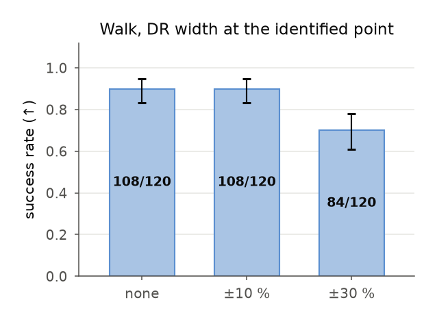

## referee-keep-rates-on-the-cliff-2026-09-04

**Pressing 128 lift episodes at gain 0.4: the folklore ±0.30 span (whose draws never reach the judged gain) needed 128 attempts; the arms that draw near it needed more — identified 151, wide 143, point 160 — the referee discarding 10-20 % of attempts exactly where the scripted expert struggles.**

- date: 2026-09-04 · commit: `d25fb30`
- instrument: `mujoco-3.11.0+x86_64`
- command: `tools/study.py generate docs/studies/c1-competent-lift-cliff.json <out> --frame-every 5`
- protocol: docs/e2e-research/60 §3 (the press records each kept episode's attempt number; the bound is kept/max_attempt)
- inputs:
  - study: docs/studies/c1-competent-lift-cliff.json
  - expert: scripted-pick@lift-study
- outcome:
  - arms: {'guessed': {'kept': 128, 'max_attempt': 128, 'keep_rate_bound': 1.0}, 'identified': {'kept': 128, 'max_attempt': 151, 'keep_rate_bound': 0.848}, 'point': {'kept': 128, 'max_attempt': 160, 'keep_rate_bound': 0.8}, 'wide': {'kept': 128, 'max_attempt': 143, 'keep_rate_bound': 0.895}}
- artifacts:
  - guessed.datasheet: docs/artifacts/cliff-datasheets/c1-competent-lift-cliff-guessed.md
  - identified.datasheet: docs/artifacts/cliff-datasheets/c1-competent-lift-cliff-identified.md
  - point.datasheet: docs/artifacts/cliff-datasheets/c1-competent-lift-cliff-point.md
  - wide.datasheet: docs/artifacts/cliff-datasheets/c1-competent-lift-cliff-wide.md
- caveats:
  - The keep rate is an UPPER bound: attempts after the last keep are not recorded (the datasheet says so).

## lift-harness-cadence-fix-2026-09-04

**The LeRobot evaluation harness played every action chunk for one control tick against datasets pressed at frame_every 5: the same lift checkpoint scored 0/3 at hold 1 and 3/3 at hold 5 on three seeds, and the visual-DR study's arms went from 0/80 and 3/80 to 80/80 and 80/80 when re-judged with the hold — the walk's cadence bug in a second costume.**

- date: 2026-09-04 · commit: `ecb04ac`
- instrument: `mujoco-3.11.0+x86_64`
- command: `rq_pipeline.envs.policy_bridge + envs.robotiq.make_env probe: hold 1 vs 5 on seeds 0,1,2 (pod, 2026-09-04) tools/study.py evaluate docs/studies/visual-dr-lift.json <out>  # before and after envs/hold.py`
- protocol: docs/e2e-research/68 §4.1
- inputs:
  - checkpoint: visual-dr-lift fixed arm, 20000 steps (studies/visual-dr-lift on the volume)
  - policy_fit: reproduced its training actions to mean |diff| 0.0045 rad on its own frames
- outcome:
  - arms: {'hold-1-probe': {'successes': 0, 'trials': 3}, 'hold-5-probe': {'successes': 3, 'trials': 3}, 'visual-dr-fixed-before': {'successes': 0, 'trials': 80}, 'visual-dr-visual-before': {'successes': 3, 'trials': 80}, 'visual-dr-fixed-after': {'successes': 80, 'trials': 80}, 'visual-dr-visual-after': {'successes': 80, 'trials': 80}}
- artifacts:
  - fix: pipeline/rq_pipeline/envs/hold.py
  - flag: --env.frame_every
  - tests: pipeline/tests/test_action_hold.py
  - after: docs/findings/visual-dr-lift-2026-09-03.json
  - log: docs/07-progress-log.md, entry 2026-09-04 'the studies'
- caveats:
  - The 'before' evaluation's per-trial rows (verdict.sweep.json, *-records.sweep.jsonl) are on the volume under runs/studies/visual-dr-lift, not tracked; the 'after' numbers are the tracked finding.

## lift-expert-envelope-2026-09-04

**The SO-101 lift's scripted expert is insensitive to joint damping (identical success from 1x to 5x) and fails on servo gain alone: 4/4 at gain 1.0 and 0.75, 3/4 at 0.5, 1/4 at 0.35, 0/4 at 0.25 and 0.15 on the 4-trial grid; at 12 trials, 9/12 at 0.5, 12/12 at 0.45, 10/12 at 0.4 — the cliff is below 0.4 and the 4-trial grid was too coarse to place it — the folklore ±30% span never reaches the cliff, which is why every lift study at gain 0.75-0.85 scored 80/80.**

- date: 2026-09-04 · commit: `9709cd9`
- instrument: `mujoco-3.11.0+arm64`
- command: `uv run --extra sim python ../tools/lift-envelope-cell.py <damping> <gain> [trials]  # one process per cell`
- protocol: docs/e2e-research/62 §1 (the expert's competence ceiling, mapped before choosing a truth)
- inputs:
  - task: lift-study (build_lift_study, LiftStudySpec trials=40)
  - expert: scripted-pick@lift-study
- outcome:
  - grid: {'damping': [1.0, 1.35, 2.0, 3.0, 5.0], 'gain': [1.0, 0.75, 0.5, 0.35, 0.25, 0.15], 'success_of_4_by_gain': {'1.0': 4, '0.75': 4, '0.5': 3, '0.35': 1, '0.25': 0, '0.15': 0}, 'damping_effect': 'none: every damping row identical'}
  - fine_cells_12_trials: {'d1.0 g0.5': '9/12', 'd1.0 g0.45': '12/12', 'd1.0 g0.4': '10/12'}
- artifacts:
  - cell_tool: tools/lift-envelope-cell.py
- caveats:
  - Four trials per cell on the grid: the cliff's position is coarse; the three 12-trial cells (0.5, 0.45, 0.4) place it below 0.4.
  - The expert's envelope bounds what any policy trained on its demos can show; a policy may be more or less robust than the script.

## demo-count-lift-cliff-rep-2026-09-04

**The demo-count curve on the SO-101 lift NEAR THE EXPERT'S EDGE (gain 0.4, where the scripted expert scores 10/12; the id says 'cliff'), with THREE replicates per demo count — three independent presses and training runs each for 8/16/32/64/128 episodes — so the between-run variance that made the single-run curve non-monotone (n8 77/80 vs n16 56/80, 2026-09-03) is measured rather than assumed; comparisons pool the replicates (240 matched trials per count).**

- date: 2026-09-04 · commit: `bbf1edd-dirty`
- instrument: `mujoco-3.11.0+x86_64`
- command: `tools/study.py finding docs/studies/demo-count-lift-cliff-rep.json docs/artifacts/lift-studies/demo-count-lift-cliff-rep`
- protocol: docs/e2e-research/62-paired-study.md (arms generalised: tools/study.py)
- inputs:
  - spec_hash: 07484b99cfc9
  - task: lift-study
  - expert: scripted-pick@lift-study
  - n8#1.datasheet: episodes kept: **8**
  - n8#2.datasheet: episodes kept: **8**
  - n8#3.datasheet: episodes kept: **8**
  - n16#1.datasheet: episodes kept: **16**
  - n16#2.datasheet: episodes kept: **16**
  - n16#3.datasheet: episodes kept: **16**
  - n32#1.datasheet: episodes kept: **32**
  - n32#2.datasheet: episodes kept: **32**
  - n32#3.datasheet: episodes kept: **32**
  - n64#1.datasheet: episodes kept: **64**
  - n64#2.datasheet: episodes kept: **64**
  - n64#3.datasheet: episodes kept: **64**
  - n128#1.datasheet: episodes kept: **128**
  - n128#2.datasheet: episodes kept: **128**
  - n128#3.datasheet: episodes kept: **128**
- outcome:
  - arms: {'n8#1': {'successes': 80, 'trials': 80, 'ci95': [0.9549, 1.0], 'funnel': {'demo-count-lift-cliff-rep-n8#1': []}, 'instrument': ['mujoco-3.11.0+x86_64'], 'episodes': 8, 'replicate_of': 'n8'}, 'n8#2': {'successes': 79, 'trials': 80, 'ci95': [0.9323, 0.9997], 'funnel': {'demo-count-lift-cliff-rep-n8#2': []}, 'instrument': ['mujoco-3.11.0+x86_64'], 'episodes': 8, 'replicate_of': 'n8'}, 'n8#3': {'successes': 79, 'trials': 80, 'ci95': [0.9323, 0.9997], 'funnel': {'demo-count-lift-cliff-rep-n8#3': []}, 'instrument': ['mujoco-3.11.0+x86_64'], 'episodes': 8, 'replicate_of': 'n8'}, 'n16#1': {'successes': 79, 'trials': 80, 'ci95': [0.9323, 0.9997], 'funnel': {'demo-count-lift-cliff-rep-n16#1': []}, 'instrument': ['mujoco-3.11.0+x86_64'], 'episodes': 16, 'replicate_of': 'n16'}, 'n16#2': {'successes': 79, 'trials': 80, 'ci95': [0.9323, 0.9997], 'funnel': {'demo-count-lift-cliff-rep-n16#2': []}, 'instrument': ['mujoco-3.11.0+x86_64'], 'episodes': 16, 'replicate_of': 'n16'}, 'n16#3': {'successes': 78, 'trials': 80, 'ci95': [0.9126, 0.997], 'funnel': {'demo-count-lift-cliff-rep-n16#3': []}, 'instrument': ['mujoco-3.11.0+x86_64'], 'episodes': 16, 'replicate_of': 'n16'}, 'n32#1': {'successes': 78, 'trials': 80, 'ci95': [0.9126, 0.997], 'funnel': {'demo-count-lift-cliff-rep-n32#1': []}, 'instrument': ['mujoco-3.11.0+x86_64'], 'episodes': 32, 'replicate_of': 'n32'}, 'n32#2': {'successes': 80, 'trials': 80, 'ci95': [0.9549, 1.0], 'funnel': {'demo-count-lift-cliff-rep-n32#2': []}, 'instrument': ['mujoco-3.11.0+x86_64'], 'episodes': 32, 'replicate_of': 'n32'}, 'n32#3': {'successes': 79, 'trials': 80, 'ci95': [0.9323, 0.9997], 'funnel': {'demo-count-lift-cliff-rep-n32#3': []}, 'instrument': ['mujoco-3.11.0+x86_64'], 'episodes': 32, 'replicate_of': 'n32'}, 'n64#1': {'successes': 77, 'trials': 80, 'ci95': [0.8943, 0.9922], 'funnel': {'demo-count-lift-cliff-rep-n64#1': []}, 'instrument': ['mujoco-3.11.0+x86_64'], 'episodes': 64, 'replicate_of': 'n64'}, 'n64#2': {'successes': 78, 'trials': 80, 'ci95': [0.9126, 0.997], 'funnel': {'demo-count-lift-cliff-rep-n64#2': []}, 'instrument': ['mujoco-3.11.0+x86_64'], 'episodes': 64, 'replicate_of': 'n64'}, 'n64#3': {'successes': 61, 'trials': 80, 'ci95': [0.6542, 0.8505], 'funnel': {'demo-count-lift-cliff-rep-n64#3': []}, 'instrument': ['mujoco-3.11.0+x86_64'], 'episodes': 64, 'replicate_of': 'n64'}, 'n128#1': {'successes': 68, 'trials': 80, 'ci95': [0.7526, 0.92], 'funnel': {'demo-count-lift-cliff-rep-n128#1': []}, 'instrument': ['mujoco-3.11.0+x86_64'], 'episodes': 128, 'replicate_of': 'n128'}, 'n128#2': {'successes': 80, 'trials': 80, 'ci95': [0.9549, 1.0], 'funnel': {'demo-count-lift-cliff-rep-n128#2': []}, 'instrument': ['mujoco-3.11.0+x86_64'], 'episodes': 128, 'replicate_of': 'n128'}, 'n128#3': {'successes': 79, 'trials': 80, 'ci95': [0.9323, 0.9997], 'funnel': {'demo-count-lift-cliff-rep-n128#3': []}, 'instrument': ['mujoco-3.11.0+x86_64'], 'episodes': 128, 'replicate_of': 'n128'}}
  - effects: [{'a': 'n8', 'b': 'n16', 'difference': -0.008333333333333415, 'p': 0.6855304448540659, 'verdict': 'INSENSITIVE'}, {'a': 'n16', 'b': 'n32', 'difference': 0.004166666666666763, 'p': 1.0, 'verdict': 'INSENSITIVE'}, {'a': 'n32', 'b': 'n64', 'difference': -0.08750000000000002, 'p': 3.0820053377760226e-05, 'verdict': 'SENSITIVE'}, {'a': 'n64', 'b': 'n128', 'difference': 0.04583333333333328, 'p': 0.08585991313225012, 'verdict': 'INSENSITIVE'}, {'a': 'n8', 'b': 'n128', 'difference': -0.04583333333333339, 'p': 0.006542898299644601, 'verdict': 'SENSITIVE'}]
  - alpha: 0.05
  - delta: 0.15
  - truth: {'damping': 1.0, 'gain': 0.4}
  - variations: ['joints.damping_scale=1.0:1.0', 'actuators.gain_scale=0.4:0.4']
  - trials: 80
  - frame_every: 5
- artifacts:
  - verdict: docs/artifacts/lift-studies/demo-count-lift-cliff-rep/verdict.json
  - study: docs/artifacts/lift-studies/demo-count-lift-cliff-rep/study.json
  - n8#1.records: docs/artifacts/lift-studies/demo-count-lift-cliff-rep/n8#1-records.jsonl
  - n8#1.datasheet: docs/artifacts/lift-studies/demo-count-lift-cliff-rep/n8#1/datasheet.md
  - n8#2.records: docs/artifacts/lift-studies/demo-count-lift-cliff-rep/n8#2-records.jsonl
  - n8#2.datasheet: docs/artifacts/lift-studies/demo-count-lift-cliff-rep/n8#2/datasheet.md
  - n8#3.records: docs/artifacts/lift-studies/demo-count-lift-cliff-rep/n8#3-records.jsonl
  - n8#3.datasheet: docs/artifacts/lift-studies/demo-count-lift-cliff-rep/n8#3/datasheet.md
  - n16#1.records: docs/artifacts/lift-studies/demo-count-lift-cliff-rep/n16#1-records.jsonl
  - n16#1.datasheet: docs/artifacts/lift-studies/demo-count-lift-cliff-rep/n16#1/datasheet.md
  - n16#2.records: docs/artifacts/lift-studies/demo-count-lift-cliff-rep/n16#2-records.jsonl
  - n16#2.datasheet: docs/artifacts/lift-studies/demo-count-lift-cliff-rep/n16#2/datasheet.md
  - n16#3.records: docs/artifacts/lift-studies/demo-count-lift-cliff-rep/n16#3-records.jsonl
  - n16#3.datasheet: docs/artifacts/lift-studies/demo-count-lift-cliff-rep/n16#3/datasheet.md
  - n32#1.records: docs/artifacts/lift-studies/demo-count-lift-cliff-rep/n32#1-records.jsonl
  - n32#1.datasheet: docs/artifacts/lift-studies/demo-count-lift-cliff-rep/n32#1/datasheet.md
  - n32#2.records: docs/artifacts/lift-studies/demo-count-lift-cliff-rep/n32#2-records.jsonl
  - n32#2.datasheet: docs/artifacts/lift-studies/demo-count-lift-cliff-rep/n32#2/datasheet.md
  - n32#3.records: docs/artifacts/lift-studies/demo-count-lift-cliff-rep/n32#3-records.jsonl
  - n32#3.datasheet: docs/artifacts/lift-studies/demo-count-lift-cliff-rep/n32#3/datasheet.md
  - n64#1.records: docs/artifacts/lift-studies/demo-count-lift-cliff-rep/n64#1-records.jsonl
  - n64#1.datasheet: docs/artifacts/lift-studies/demo-count-lift-cliff-rep/n64#1/datasheet.md
  - n64#2.records: docs/artifacts/lift-studies/demo-count-lift-cliff-rep/n64#2-records.jsonl
  - n64#2.datasheet: docs/artifacts/lift-studies/demo-count-lift-cliff-rep/n64#2/datasheet.md
  - n64#3.records: docs/artifacts/lift-studies/demo-count-lift-cliff-rep/n64#3-records.jsonl
  - n64#3.datasheet: docs/artifacts/lift-studies/demo-count-lift-cliff-rep/n64#3/datasheet.md
  - n128#1.records: docs/artifacts/lift-studies/demo-count-lift-cliff-rep/n128#1-records.jsonl
  - n128#1.datasheet: docs/artifacts/lift-studies/demo-count-lift-cliff-rep/n128#1/datasheet.md
  - n128#2.records: docs/artifacts/lift-studies/demo-count-lift-cliff-rep/n128#2-records.jsonl
  - n128#2.datasheet: docs/artifacts/lift-studies/demo-count-lift-cliff-rep/n128#2/datasheet.md
  - n128#3.records: docs/artifacts/lift-studies/demo-count-lift-cliff-rep/n128#3-records.jsonl
  - n128#3.datasheet: docs/artifacts/lift-studies/demo-count-lift-cliff-rep/n128#3/datasheet.md
  - figure.svg: docs/figures/demo-count-lift-cliff-rep-2026-09-04.svg
  - figure.pdf: docs/figures/demo-count-lift-cliff-rep-2026-09-04.pdf
  - figure.png: docs/figures/demo-count-lift-cliff-rep-2026-09-04.png
  - figure.csv: docs/figures/demo-count-lift-cliff-rep-2026-09-04.csv
- caveats:
  - One task, one expert (scripted-pick), one trainer config: the curve is for this recipe, not a law.
  - Judged at a truth inside the declared span; C1 showed DR-basis effects are invisible at easy truths.
  - At gain 0.4 the scripted expert succeeds 10/12 (12-trial cell, 2026-09-04; the 4-trial grid had read 1/4 at 0.35 and 3/4 at 0.5, and '~1 in 2' was an interpolation, corrected by measurement): the judged truth is near the expert's edge, not on its cliff, which the near-ceiling results reflect.
  - Three replicates per count is the smallest design that shows between-run spread; it is not a variance estimate anyone should quote to two digits.
  - Fifteen arms: ~6 h of one pod at 10k steps each — split across pods by arm if wall clock matters.

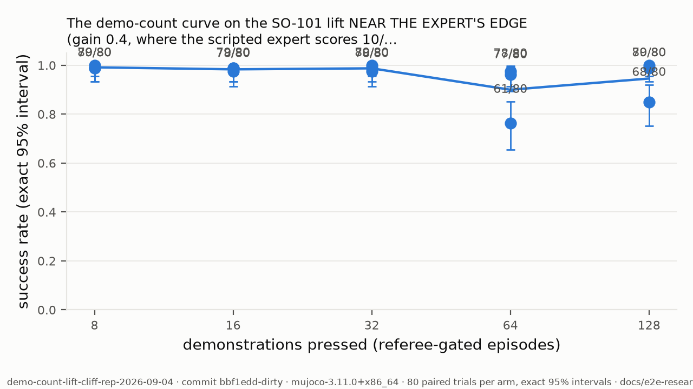

## compute-ledger-2026-09-04

**Every measured result was produced on rented RTX PRO 6000 Blackwell Server Edition cards (RunPod secure tier, US-NC-2, $2.09/h, one card per pod), one abandoned B200 attempt ($6.79/h, 94 minutes on 2026-08-27, of which 52 were provider initialization, ~$10.6), an owned RTX 3090 Ti (24 GB, WSL2) for re-measurement and short runs, and an Apple M1 Pro (16 GB) for the CPU-side presses, the expert-envelope grid and everything MuJoCo-CPU; about 79 pod-hours in total from the abandoned B200 attempt (2026-08-27) to the refit study (2026-09-06), on the order of ~$170.**

- date: 2026-09-04 · commit: `71f96cc`
- instrument: `RunPod API (pods, costPerHr) + docs/07`
- command: `assembled from docs/07's dated entries and the RunPod pod list (`cloud-gpu.py machines`; the API exposes per-pod current-session uptime only)`
- protocol: docs/34-cloud-gpu.md
- inputs:
  - rate_source: RunPod pod list, costPerHr field
  - hours_source: docs/07 entries and study logs (stage timestamps)
- outcome:
  - gpu_rented: NVIDIA RTX PRO 6000 Blackwell Server Edition, 96 GB, CUDA 13.2, $2.09/h secure (14 pods over the period, at most 6 concurrent)
  - gpu_rented_abandoned: NVIDIA B200, $6.79/h, one 94-minute attempt (2026-08-27; 52 min were provider initialization)
  - gpu_owned: NVIDIA RTX 3090 Ti 24 GB (WSL2, Ubuntu 22.04)
  - cpu_local: Apple M1 Pro, 16 GB (macOS 25.5)
  - pod_hours_by_run: {'C1 sized run 2 on the RTX PRO 6000 (2026-08-31/09-01)': 2.5, 'B200 chain attempt (2026-08-27, abandoned)': 1.57, 'G3 walk teacher, 8000 it (2026-09-01)': 1.6, 'campaign 1 (2026-09-02)': 1.5, 'campaign 2 (2026-09-02)': 1.2, 'campaign 3 (2026-09-03)': 2.0, 'campaign 4 press+export, train+3 certificates (2026-09-03/04)': 2.7, 'lift studies x3 pods (2026-09-03)': 8.0, 'cliff studies x3 pods + killed hard reruns (2026-09-03)': 11.0, 'walk C1 run 1 x3 pods (2026-09-04)': 5.7, 'campaign 4b retrain (60k) + DAgger round 1 (press 120, union, train 20k, certificate), 1 pod (2026-09-04, launch ~16:15 to stop 20:25 UTC)': 4.2, 'walk C1 replicates 2-3 x6 pods (2026-09-04)': 11.4, 'the mismatch matrix (63 certificates) + the Go1 smoke, 1 pod (2026-09-04, ~20:45 to 21:36 UTC)': 0.9, "replicated lift demo-count curve, 15 arms split over 2 pods (2026-09-04, ~12:30 to 16:55 and ~13:10 to 16:35 on the pods' clock)": 7.8, 'per-axis mismatch matrices (162 certificates) on one pod, kept idle after, then stopped (2026-09-05 UTC, ~18:20 to 20:50)': 2.5, 'walk C1 refit arms: point x3 + identified x3 on six pods, ~19:30 to 21:50, one kept to 22:03 for their 42 matrix cells (2026-09-05 UTC)': 14.1}
  - pod_hours_total_estimate: 78.7
  - dollars_estimate: {'rtx_pro_6000': '~77.1 h x $2.09 = ~$161', 'b200': '94 min x $6.79/h = ~$10.6 (docs/07 2026-08-27)', 'total': '~$170'}
  - per_result_cost: {'one walk arm (train 8000 it + two 40-trial certificates)': '~1.9 h, ~$4', 'one lift study arm (press, convert, train 20k, judge 80 trials)': '~1.0 h, ~$2.1', 'the walk C1 with three replicates per arm (9 runs)': '~17 h, ~$36', 'one 40-trial certificate on the walk': '~30 s', 'one DAgger round on the walk (120 student-driven episodes, union, train 20k, one certificate)': '~1.7 h, ~$3.5 (18:35 to 20:16 UTC, 2026-09-04)', 'the mismatch matrix (63 forty-trial certificates on nine existing policies)': '~0.5 h, ~$1 (28 min of certificates; ~30 s each warm)', 'the replicated lift curve (15 arms: train 10k, judge 80 trials each; presses done earlier)': '~7.8 h, ~$16 (about 27 min per arm; two pods halved the wall clock)', 'one per-axis mismatch matrix (54 forty-trial certificates)': '~0.4 h, ~$1 (warm cache ~10-27 s per certificate)', 'the refit study (six arms on six pods + 42 matrix cells)': '~14 h, ~$30 (2.3 h per arm incl. two certificates; ~2.5 h wall clock)'}
  - wall_clock_wins: {'three lift studies in parallel': '2.7 h instead of ~8', 'walk C1 six replicates on six pods': '~1.9 h instead of ~11'}
  - cpu_local_work: {'bam bootstrap': '100 refits x 5000 trials, 8 workers on the M1 Pro, ~75 min; full-data refit 370 s'}
- artifacts:
  - log: docs/07-progress-log.md
  - pod_list: tools/cloud-gpu.py machines
- caveats:
  - Hours are reconstructed from logged stage timestamps and pod uptimes, not from the invoice: reconcile against RunPod's billing export before the paper states a dollar figure (the API exposes current-session uptime only).
  - Idle time is included where a pod sat between stages (campaign 4's parked night is not: it was stopped).
  - The owned RTX 3090 Ti and the M1 Pro are not costed.
  - Corrected 2026-09-04 after audit: the B200 attempt was 94 min on 2026-08-27 (~$10.6), not 2 h on 08-28; the sized C1 run was 2026-08-31/09-01; the total is one figure (~$110), not $110 + $34.
  - Updated 2026-09-04 (late): +4.2 h for the campaign 4b retrain and DAgger round 1 pod (launch ~16:15, stopped 20:25 UTC; the launch time is reconstructed) — 53.4 h, ~$120.
  - Updated 2026-09-04 (later): +0.9 h for the matrix pod (63 certificates in 28 minutes, then a two-minute Go1 smoke) — 54.3 h, ~$120.
  - Updated 2026-09-04 (latest): +7.8 h for the replicated lift curve on two pods — 62.1 h, ~$140. The account balance moved $18 → $3.9 over that session, consistent with ~$14 of the two pods' billing plus the earlier matrix pod.
  - Updated 2026-09-06: +16.6 h for the per-axis matrices and the refit study — 78.7 h, ~$170; the account moved $44 → about $10 over the evening.
  - Dates in this record are UTC (the pods' clock); record ids elsewhere carry the fold's local date, which for the evening of 2026-09-05 UTC is 2026-09-06 IST.

## visual-dr-lift-cliff-2026-09-03

**On the SO-101 lift task, a policy pressed WITH per-episode visual randomization (headlight 0.5-1.5, front camera ±1 cm) vs WITHOUT, same 64 episodes, same dynamics DR, same trainer, judged on 80 matched trials under the SAME visual sweep at a pinned truth — judged NEAR THE EXPERT'S EDGE (the record id says 'cliff'; the 12-trial cells later put the expert at 10/12 there, so it is the edge, not the cliff) (gain 0.4, where the scripted expert succeeds 10/12 and the folklore span's centre is 2.5x too stiff; docs/findings lift-expert-envelope-2026-09-04).**

- date: 2026-09-03 · commit: `bcbb3fe-archive`
- instrument: `mujoco-3.11.0+x86_64`
- command: `../tools/study.py finding ../docs/studies/visual-dr-lift-cliff.json /workspace/robotiq/runs/studies/visual-dr-lift-cliff --frame-every 5`
- protocol: docs/e2e-research/62-paired-study.md (arms generalised: tools/study.py)
- inputs:
  - spec_hash: 3f557fa7c0c7
  - task: lift-study
  - expert: scripted-pick@lift-study
  - fixed.datasheet: 64 episodes, bases ['declared span ±0.30 around nominal (the folklore DR, docs/31)'], visual bases []
  - visual.datasheet: 64 episodes, bases ['declared span ±0.30 around nominal (the folklore DR, docs/31)'], visual bases ['declared visual span: headlight 0.5-1.5, front camera ±1 cm (docs/66 §4; the so101 scenes are lit by the headlight only, docs/07 2026-09-02)']
- outcome:
  - arms: {'fixed': {'successes': 79, 'trials': 80, 'ci95': [0.9323, 0.9997], 'funnel': {'visual-dr-lift-cliff-fixed': []}, 'instrument': ['mujoco-3.11.0+x86_64'], 'episodes': 64}, 'visual': {'successes': 75, 'trials': 80, 'ci95': [0.8601, 0.9794], 'funnel': {'visual-dr-lift-cliff-visual': []}, 'instrument': ['mujoco-3.11.0+x86_64'], 'episodes': 64}}
  - effects: [{'a': 'fixed', 'b': 'visual', 'difference': -0.050000000000000044, 'p': 0.2098499327391907, 'verdict': 'INSENSITIVE'}]
  - alpha: 0.05
  - delta: 0.15
  - truth: {'damping': 1.0, 'gain': 0.4}
  - variations: ['joints.damping_scale=1.0:1.0', 'actuators.gain_scale=0.4:0.4', 'headlight.diffuse_scale=0.5:1.5', 'front.offset_m=-0.01,-0.01,-0.01:0.01,0.01,0.01']
  - trials: 80
  - frame_every: 5
- artifacts:
  - verdict: docs/artifacts/lift-studies/visual-dr-lift-cliff/verdict.json
  - study: docs/artifacts/lift-studies/visual-dr-lift-cliff/study.json
  - fixed.records: docs/artifacts/lift-studies/visual-dr-lift-cliff/fixed-records.jsonl
  - fixed.datasheet: docs/artifacts/lift-studies/visual-dr-lift-cliff/fixed/datasheet.md
  - visual.records: docs/artifacts/lift-studies/visual-dr-lift-cliff/visual-records.jsonl
  - visual.datasheet: docs/artifacts/lift-studies/visual-dr-lift-cliff/visual/datasheet.md
  - figure.svg: docs/figures/visual-dr-lift-cliff-2026-09-03.svg
  - figure.pdf: docs/figures/visual-dr-lift-cliff-2026-09-03.pdf
  - figure.png: docs/figures/visual-dr-lift-cliff-2026-09-03.png
  - figure.csv: docs/figures/visual-dr-lift-cliff-2026-09-03.csv
- caveats:
  - The evaluation sweep equals the training sweep by design: this measures robustness inside the declared visual span, not generalization beyond it.
  - The scene's only light is MuJoCo's headlight; scene-light randomization is not exercised.
  - One camera (front, 576x1024): the three-camera rig trained 10x slower on the pod (1.4 step/s, 2026-09-04) and C1's earlier nulls were single-camera; comparability over coverage.
  - At gain 0.4 the scripted expert succeeds 10/12 (12-trial cell, 2026-09-04; the 4-trial grid had read 1/4 at 0.35 and 3/4 at 0.5, and '~1 in 2' was an interpolation, corrected by measurement): the judged truth is near the expert's edge, not on its cliff, which the near-ceiling results reflect.
  - Artifacts repointed 2026-09-04 to tracked copies under docs/artifacts/lift-studies/ (rows, datasheets, study.json pulled from the volume before its prune).

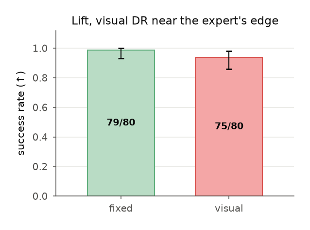

## visual-dr-lift-2026-09-03

**On the SO-101 lift task, a policy pressed WITH per-episode visual randomization (headlight 0.5-1.5, front camera ±1 cm) vs WITHOUT, same 64 episodes, same dynamics DR, same trainer, judged on 80 matched trials under the SAME visual sweep at a pinned truth.**

- date: 2026-09-03 · commit: `ecb04ac-archive`
- instrument: `mujoco-3.11.0+x86_64`
- command: `../tools/study.py finding ../docs/studies/visual-dr-lift.json /workspace/robotiq/runs/studies/visual-dr-lift`
- protocol: docs/e2e-research/62-paired-study.md (arms generalised: tools/study.py)
- inputs:
  - spec_hash: 5597bb226d86
  - task: lift-study
  - expert: scripted-pick@lift-study
  - fixed.datasheet: 64 episodes, bases ['declared span ±0.30 around nominal (the folklore DR, docs/31)'], visual bases []
  - visual.datasheet: 64 episodes, bases ['declared span ±0.30 around nominal (the folklore DR, docs/31)'], visual bases ['declared visual span: headlight 0.5-1.5, front camera ±1 cm (docs/66 §4; the so101 scenes are lit by the headlight only, docs/07 2026-09-02)']
- outcome:
  - arms: {'fixed': {'successes': 80, 'trials': 80, 'ci95': [0.9549, 1.0], 'funnel': {'visual-dr-lift-fixed': []}, 'instrument': ['mujoco-3.11.0+x86_64'], 'episodes': 64}, 'visual': {'successes': 80, 'trials': 80, 'ci95': [0.9549, 1.0], 'funnel': {'visual-dr-lift-visual': []}, 'instrument': ['mujoco-3.11.0+x86_64'], 'episodes': 64}}
  - effects: [{'a': 'fixed', 'b': 'visual', 'difference': 0.0, 'p': 1.0, 'verdict': 'INSENSITIVE'}]
  - alpha: 0.05
  - delta: 0.15
  - truth: {'damping': 1.18, 'gain': 0.85}
  - variations: ['joints.damping_scale=1.18:1.18', 'actuators.gain_scale=0.85:0.85', 'headlight.diffuse_scale=0.5:1.5', 'front.offset_m=-0.01,-0.01,-0.01:0.01,0.01,0.01']
  - trials: 80
  - frame_every: 5
- artifacts:
  - verdict: docs/artifacts/lift-studies/visual-dr-lift/verdict.json
  - study: docs/artifacts/lift-studies/visual-dr-lift/study.json
  - fixed.records: docs/artifacts/lift-studies/visual-dr-lift/fixed-records.jsonl
  - fixed.datasheet: docs/artifacts/lift-studies/visual-dr-lift/fixed/datasheet.md
  - visual.records: docs/artifacts/lift-studies/visual-dr-lift/visual-records.jsonl
  - visual.datasheet: docs/artifacts/lift-studies/visual-dr-lift/visual/datasheet.md
  - figure.svg: docs/figures/visual-dr-lift-2026-09-03.svg
  - figure.pdf: docs/figures/visual-dr-lift-2026-09-03.pdf
  - figure.png: docs/figures/visual-dr-lift-2026-09-03.png
  - figure.csv: docs/figures/visual-dr-lift-2026-09-03.csv
- caveats:
  - The evaluation sweep equals the training sweep by design: this measures robustness inside the declared visual span, not generalization beyond it.
  - The scene's only light is MuJoCo's headlight; scene-light randomization is not exercised.
  - One camera (front, 576x1024): the three-camera rig trained 10x slower on the pod (1.4 step/s, 2026-09-04) and C1's earlier nulls were single-camera; comparability over coverage.
  - Artifacts repointed 2026-09-04 to tracked copies under docs/artifacts/lift-studies/ (rows, datasheets, study.json pulled from the volume before its prune).

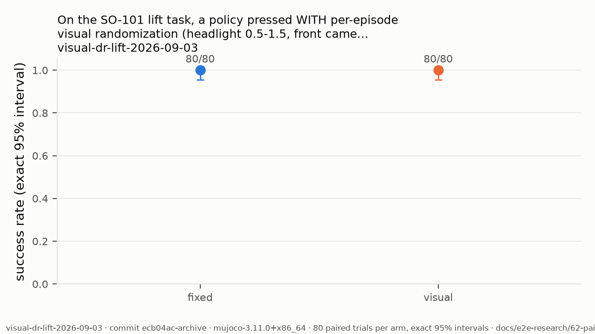

## demo-count-lift-cliff-2026-09-03

**On the SO-101 lift task, policy success (ACT, one trainer config) as a function of pressed demonstrations: 8, 16, 32, 64, 128 referee-gated episodes under the same declared DR, judged at one pinned truth on 80 matched trials per arm — judged NEAR THE EXPERT'S EDGE (the record id says 'cliff'; the 12-trial cells later put the expert at 10/12 there, so it is the edge, not the cliff) (gain 0.4, where the scripted expert succeeds 10/12 and the folklore span's centre is 2.5x too stiff; docs/findings lift-expert-envelope-2026-09-04).**

- date: 2026-09-03 · commit: `bcbb3fe-archive`
- instrument: `mujoco-3.11.0+x86_64`
- command: `../tools/study.py finding ../docs/studies/demo-count-lift-cliff.json /workspace/robotiq/runs/studies/demo-count-lift-cliff --frame-every 5`
- protocol: docs/e2e-research/62-paired-study.md (arms generalised: tools/study.py)
- inputs:
  - spec_hash: b3d78c171da0
  - task: lift-study
  - expert: scripted-pick@lift-study
  - n8.datasheet: 8 episodes, bases ['declared span ±0.30 around nominal (the folklore DR, docs/31)'], visual bases []
  - n16.datasheet: 16 episodes, bases ['declared span ±0.30 around nominal (the folklore DR, docs/31)'], visual bases []
  - n32.datasheet: 32 episodes, bases ['declared span ±0.30 around nominal (the folklore DR, docs/31)'], visual bases []
  - n64.datasheet: 64 episodes, bases ['declared span ±0.30 around nominal (the folklore DR, docs/31)'], visual bases []
  - n128.datasheet: 128 episodes, bases ['declared span ±0.30 around nominal (the folklore DR, docs/31)'], visual bases []
- outcome:
  - arms: {'n8': {'successes': 77, 'trials': 80, 'ci95': [0.8943, 0.9922], 'funnel': {'demo-count-lift-cliff-n8': []}, 'instrument': ['mujoco-3.11.0+x86_64'], 'episodes': 8}, 'n16': {'successes': 56, 'trials': 80, 'ci95': [0.5872, 0.7974], 'funnel': {'demo-count-lift-cliff-n16': []}, 'instrument': ['mujoco-3.11.0+x86_64'], 'episodes': 16}, 'n32': {'successes': 70, 'trials': 80, 'ci95': [0.7821, 0.9384], 'funnel': {'demo-count-lift-cliff-n32': []}, 'instrument': ['mujoco-3.11.0+x86_64'], 'episodes': 32}, 'n64': {'successes': 73, 'trials': 80, 'ci95': [0.828, 0.9641], 'funnel': {'demo-count-lift-cliff-n64': []}, 'instrument': ['mujoco-3.11.0+x86_64'], 'episodes': 64}, 'n128': {'successes': 80, 'trials': 80, 'ci95': [0.9549, 1.0], 'funnel': {'demo-count-lift-cliff-n128': []}, 'instrument': ['mujoco-3.11.0+x86_64'], 'episodes': 128}}
  - effects: [{'a': 'n8', 'b': 'n16', 'difference': -0.26250000000000007, 'p': 9.98937968365743e-06, 'verdict': 'SENSITIVE'}, {'a': 'n16', 'b': 'n32', 'difference': 0.17500000000000004, 'p': 0.011276969674602691, 'verdict': 'SENSITIVE'}, {'a': 'n32', 'b': 'n64', 'difference': 0.03749999999999998, 'p': 0.6090615589454278, 'verdict': 'UNRESOLVED'}, {'a': 'n64', 'b': 'n128', 'difference': 0.08750000000000002, 'p': 0.013626619009035765, 'verdict': 'SENSITIVE'}, {'a': 'n8', 'b': 'n128', 'difference': 0.03749999999999998, 'p': 0.24528301886793386, 'verdict': 'INSENSITIVE'}]
  - alpha: 0.05
  - delta: 0.15
  - truth: {'damping': 1.0, 'gain': 0.4}
  - variations: ['joints.damping_scale=1.0:1.0', 'actuators.gain_scale=0.4:0.4']
  - trials: 80
  - frame_every: 5
- artifacts:
  - verdict: docs/artifacts/lift-studies/demo-count-lift-cliff/verdict.json
  - study: docs/artifacts/lift-studies/demo-count-lift-cliff/study.json
  - n8.records: docs/artifacts/lift-studies/demo-count-lift-cliff/n8-records.jsonl
  - n8.datasheet: docs/artifacts/lift-studies/demo-count-lift-cliff/n8/datasheet.md
  - n16.records: docs/artifacts/lift-studies/demo-count-lift-cliff/n16-records.jsonl
  - n16.datasheet: docs/artifacts/lift-studies/demo-count-lift-cliff/n16/datasheet.md
  - n32.records: docs/artifacts/lift-studies/demo-count-lift-cliff/n32-records.jsonl
  - n32.datasheet: docs/artifacts/lift-studies/demo-count-lift-cliff/n32/datasheet.md
  - n64.records: docs/artifacts/lift-studies/demo-count-lift-cliff/n64-records.jsonl
  - n64.datasheet: docs/artifacts/lift-studies/demo-count-lift-cliff/n64/datasheet.md
  - n128.records: docs/artifacts/lift-studies/demo-count-lift-cliff/n128-records.jsonl
  - n128.datasheet: docs/artifacts/lift-studies/demo-count-lift-cliff/n128/datasheet.md
  - figure.svg: docs/figures/demo-count-lift-cliff-2026-09-03.svg
  - figure.pdf: docs/figures/demo-count-lift-cliff-2026-09-03.pdf
  - figure.png: docs/figures/demo-count-lift-cliff-2026-09-03.png
  - figure.csv: docs/figures/demo-count-lift-cliff-2026-09-03.csv
- caveats:
  - One task, one expert (scripted-pick), one trainer config: the curve is for this recipe, not a law.
  - Judged at gain 0.4, OUTSIDE the folklore ±0.30 span (0.7-1.3): the press's draws never reach the judged truth.
  - One camera (front, 576x1024): the three-camera rig trained 10x slower on the pod (1.4 step/s, 2026-09-04) and C1's earlier nulls were single-camera; comparability over coverage.
  - At gain 0.4 the scripted expert succeeds 10/12 (12-trial cell, 2026-09-04; the 4-trial grid had read 1/4 at 0.35 and 3/4 at 0.5, and '~1 in 2' was an interpolation, corrected by measurement): the judged truth is near the expert's edge, not on its cliff, which the near-ceiling results reflect.
  - Artifacts repointed 2026-09-04 to tracked copies under docs/artifacts/lift-studies/ (rows, datasheets, study.json pulled from the volume before its prune).

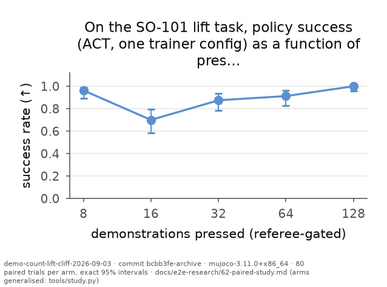

## demo-count-lift-2026-09-03

**On the SO-101 lift task, policy success (ACT, one trainer config) as a function of pressed demonstrations: 8, 16, 32, 64, 128 referee-gated episodes under the same declared DR, judged at one pinned truth on 80 matched trials per arm.**

- date: 2026-09-03 · commit: `634de76-archive`
- instrument: `mujoco-3.11.0+x86_64`
- command: `../tools/study.py finding ../docs/studies/demo-count-lift.json /workspace/robotiq/runs/studies/demo-count-lift --frame-every 5`
- protocol: docs/e2e-research/62-paired-study.md (arms generalised: tools/study.py)
- inputs:
  - spec_hash: 88343cdae1b8
  - task: lift-study
  - expert: scripted-pick@lift-study
  - n8.datasheet: 8 episodes, bases ['declared span ±0.30 around nominal (the folklore DR, docs/31)'], visual bases []
  - n16.datasheet: 16 episodes, bases ['declared span ±0.30 around nominal (the folklore DR, docs/31)'], visual bases []
  - n32.datasheet: 32 episodes, bases ['declared span ±0.30 around nominal (the folklore DR, docs/31)'], visual bases []
  - n64.datasheet: 64 episodes, bases ['declared span ±0.30 around nominal (the folklore DR, docs/31)'], visual bases []
  - n128.datasheet: 128 episodes, bases ['declared span ±0.30 around nominal (the folklore DR, docs/31)'], visual bases []
- outcome:
  - arms: {'n8': {'successes': 80, 'trials': 80, 'ci95': [0.9549, 1.0], 'funnel': {'demo-count-lift-n8': []}, 'instrument': ['mujoco-3.11.0+x86_64'], 'episodes': 8}, 'n16': {'successes': 80, 'trials': 80, 'ci95': [0.9549, 1.0], 'funnel': {'demo-count-lift-n16': []}, 'instrument': ['mujoco-3.11.0+x86_64'], 'episodes': 16}, 'n32': {'successes': 80, 'trials': 80, 'ci95': [0.9549, 1.0], 'funnel': {'demo-count-lift-n32': []}, 'instrument': ['mujoco-3.11.0+x86_64'], 'episodes': 32}, 'n64': {'successes': 80, 'trials': 80, 'ci95': [0.9549, 1.0], 'funnel': {'demo-count-lift-n64': []}, 'instrument': ['mujoco-3.11.0+x86_64'], 'episodes': 64}, 'n128': {'successes': 80, 'trials': 80, 'ci95': [0.9549, 1.0], 'funnel': {'demo-count-lift-n128': []}, 'instrument': ['mujoco-3.11.0+x86_64'], 'episodes': 128}}
  - effects: [{'a': 'n8', 'b': 'n16', 'difference': 0.0, 'p': 1.0, 'verdict': 'INSENSITIVE'}, {'a': 'n16', 'b': 'n32', 'difference': 0.0, 'p': 1.0, 'verdict': 'INSENSITIVE'}, {'a': 'n32', 'b': 'n64', 'difference': 0.0, 'p': 1.0, 'verdict': 'INSENSITIVE'}, {'a': 'n64', 'b': 'n128', 'difference': 0.0, 'p': 1.0, 'verdict': 'INSENSITIVE'}, {'a': 'n8', 'b': 'n128', 'difference': 0.0, 'p': 1.0, 'verdict': 'INSENSITIVE'}]
  - alpha: 0.05
  - delta: 0.15
  - truth: {'damping': 1.18, 'gain': 0.85}
  - variations: ['joints.damping_scale=1.18:1.18', 'actuators.gain_scale=0.85:0.85']
  - trials: 80
  - frame_every: 5
- artifacts:
  - verdict: docs/artifacts/lift-studies/demo-count-lift/verdict.json
  - study: docs/artifacts/lift-studies/demo-count-lift/study.json
  - n8.records: docs/artifacts/lift-studies/demo-count-lift/n8-records.jsonl
  - n8.datasheet: docs/artifacts/lift-studies/demo-count-lift/n8/datasheet.md
  - n16.records: docs/artifacts/lift-studies/demo-count-lift/n16-records.jsonl
  - n16.datasheet: docs/artifacts/lift-studies/demo-count-lift/n16/datasheet.md
  - n32.records: docs/artifacts/lift-studies/demo-count-lift/n32-records.jsonl
  - n32.datasheet: docs/artifacts/lift-studies/demo-count-lift/n32/datasheet.md
  - n64.records: docs/artifacts/lift-studies/demo-count-lift/n64-records.jsonl
  - n64.datasheet: docs/artifacts/lift-studies/demo-count-lift/n64/datasheet.md
  - n128.records: docs/artifacts/lift-studies/demo-count-lift/n128-records.jsonl
  - n128.datasheet: docs/artifacts/lift-studies/demo-count-lift/n128/datasheet.md
  - figure.svg: docs/figures/demo-count-lift-2026-09-03.svg
  - figure.pdf: docs/figures/demo-count-lift-2026-09-03.pdf
  - figure.png: docs/figures/demo-count-lift-2026-09-03.png
  - figure.csv: docs/figures/demo-count-lift-2026-09-03.csv
- caveats:
  - One task, one expert (scripted-pick), one trainer config: the curve is for this recipe, not a law.
  - Judged at a truth inside the declared span; C1 showed DR-basis effects are invisible at easy truths.
  - One camera (front, 576x1024): the three-camera rig trained 10x slower on the pod (1.4 step/s, 2026-09-04) and C1's earlier nulls were single-camera; comparability over coverage.
  - Artifacts repointed 2026-09-04 to tracked copies under docs/artifacts/lift-studies/ (rows, datasheets, study.json pulled from the volume before its prune).

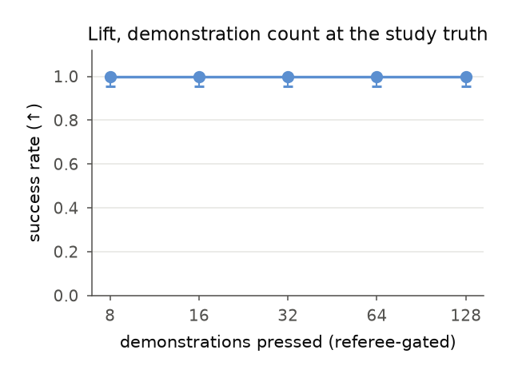

## c1-competent-lift-cliff-2026-09-03

**C1 at a competent recipe: the arm named 'identified' (a DECLARED ±5 % relative span; no fitted interval existed on 2026-09-03) (±5 % relative around the study truth) vs the folklore ±0.30 span vs the POINT estimate (no DR at the truth), 128 episodes and 20k steps per arm, judged at a truth OUTSIDE the folklore span's centre on 80 matched trials — the retest of the two nulls (docs/e2e-research/62) once the recipe can express a difference, with the point arm that Rizvi & Tomar (2026) and PACE (2025) say wins once identification is good — judged NEAR THE EXPERT'S EDGE (the record id says 'cliff'; the 12-trial cells later put the expert at 10/12 there, so it is the edge, not the cliff) (gain 0.4, where the scripted expert succeeds 10/12 and the folklore span's centre is 2.5x too stiff; docs/findings lift-expert-envelope-2026-09-04).**

- date: 2026-09-03 · commit: `89412f0-archive`
- instrument: `mujoco-3.11.0+x86_64`
- command: `../tools/study.py finding ../docs/studies/c1-competent-lift-cliff.json /workspace/robotiq/runs/studies/c1-competent-lift-cliff --frame-every 5`
- protocol: docs/e2e-research/62-paired-study.md (arms generalised: tools/study.py)
- inputs:
  - spec_hash: c1ec81c7c6a8
  - task: lift-study
  - expert: scripted-pick@lift-study
  - guessed.datasheet: 128 episodes, bases ['guessed span ±0.30 around nominal (folklore DR)'], visual bases []
  - identified.datasheet: 128 episodes, bases ['declared interval ±0.05 around the cliff truth (stand-in for an identified fit record)'], visual bases []
  - point.datasheet: 128 episodes, bases ['the point estimate: no DR, the cliff truth exactly'], visual bases []
  - wide.datasheet: 128 episodes, bases ['a wide span that COVERS the cliff (gain 0.3-1.3): the honest alternative to guessing narrow'], visual bases []
- outcome:
  - arms: {'guessed': {'successes': 80, 'trials': 80, 'ci95': [0.9549, 1.0], 'funnel': {'c1-competent-lift-cliff-guessed': []}, 'instrument': ['mujoco-3.11.0+x86_64'], 'episodes': 128}, 'identified': {'successes': 80, 'trials': 80, 'ci95': [0.9549, 1.0], 'funnel': {'c1-competent-lift-cliff-identified': []}, 'instrument': ['mujoco-3.11.0+x86_64'], 'episodes': 128}, 'point': {'successes': 80, 'trials': 80, 'ci95': [0.9549, 1.0], 'funnel': {'c1-competent-lift-cliff-point': []}, 'instrument': ['mujoco-3.11.0+x86_64'], 'episodes': 128}, 'wide': {'successes': 77, 'trials': 80, 'ci95': [0.8943, 0.9922], 'funnel': {'c1-competent-lift-cliff-wide': []}, 'instrument': ['mujoco-3.11.0+x86_64'], 'episodes': 128}}
  - effects: [{'a': 'guessed', 'b': 'identified', 'difference': 0.0, 'p': 1.0, 'verdict': 'INSENSITIVE'}, {'a': 'point', 'b': 'identified', 'difference': 0.0, 'p': 1.0, 'verdict': 'INSENSITIVE'}, {'a': 'wide', 'b': 'identified', 'difference': 0.03749999999999998, 'p': 0.24528301886793386, 'verdict': 'INSENSITIVE'}, {'a': 'guessed', 'b': 'wide', 'difference': -0.03749999999999998, 'p': 0.24528301886793386, 'verdict': 'INSENSITIVE'}]
  - alpha: 0.05
  - delta: 0.15
  - truth: {'damping': 1.0, 'gain': 0.4}
  - variations: ['joints.damping_scale=1.0:1.0', 'actuators.gain_scale=0.4:0.4']
  - trials: 80
  - frame_every: 5
- artifacts:
  - verdict: docs/artifacts/lift-studies/c1-competent-lift-cliff/verdict.json
  - study: docs/artifacts/lift-studies/c1-competent-lift-cliff/study.json
  - guessed.records: docs/artifacts/lift-studies/c1-competent-lift-cliff/guessed-records.jsonl
  - guessed.datasheet: docs/artifacts/cliff-datasheets/c1-competent-lift-cliff-guessed.md
  - identified.records: docs/artifacts/lift-studies/c1-competent-lift-cliff/identified-records.jsonl
  - identified.datasheet: docs/artifacts/cliff-datasheets/c1-competent-lift-cliff-identified.md
  - point.records: docs/artifacts/lift-studies/c1-competent-lift-cliff/point-records.jsonl
  - point.datasheet: docs/artifacts/cliff-datasheets/c1-competent-lift-cliff-point.md
  - wide.records: docs/artifacts/lift-studies/c1-competent-lift-cliff/wide-records.jsonl
  - wide.datasheet: docs/artifacts/cliff-datasheets/c1-competent-lift-cliff-wide.md
  - figure.svg: docs/figures/c1-competent-lift-cliff-2026-09-03.svg
  - figure.pdf: docs/figures/c1-competent-lift-cliff-2026-09-03.pdf
  - figure.png: docs/figures/c1-competent-lift-cliff-2026-09-03.png
  - figure.csv: docs/figures/c1-competent-lift-cliff-2026-09-03.csv
- caveats:
  - The truth is declared, not measured on hardware: this is the sim retest of the DR-basis question, the real-robot C1 is the thesis test.
  - The interval arm must beat the point arm, not only the wide arm, for identified-interval DR to stand (novelty audit, docs/e2e-research/67).
  - One camera (front, 576x1024): the three-camera rig trained 10x slower on the pod (1.4 step/s, 2026-09-04) and C1's earlier nulls were single-camera; comparability over coverage.
  - At gain 0.4 the scripted expert succeeds 10/12 (12-trial cell, 2026-09-04; the 4-trial grid had read 1/4 at 0.35 and 3/4 at 0.5, and '~1 in 2' was an interpolation, corrected by measurement): the judged truth is near the expert's edge, not on its cliff, which the near-ceiling results reflect.
  - Artifacts repointed 2026-09-04 to tracked copies under docs/artifacts/lift-studies/ (rows, datasheets, study.json pulled from the volume before its prune).

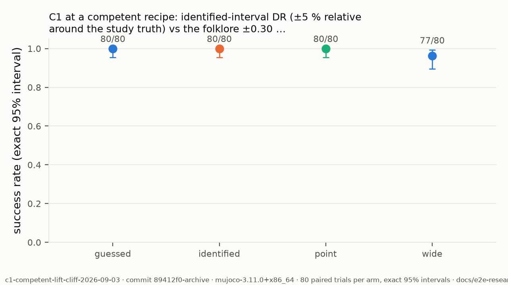

## c1-competent-lift-2026-09-03

**C1 at a competent recipe: the arm named 'identified' (a DECLARED ±5 % relative span; no fitted interval existed on 2026-09-03) (±5 % relative around the study truth) vs the folklore ±0.30 span vs the POINT estimate (no DR at the truth), 128 episodes and 20k steps per arm, judged at a truth OUTSIDE the folklore span's centre on 80 matched trials — the retest of the two nulls (docs/e2e-research/62) once the recipe can express a difference, with the point arm that Rizvi & Tomar (2026) and PACE (2025) say wins once identification is good.**

- date: 2026-09-03 · commit: `336eb39-archive`
- instrument: `mujoco-3.11.0+x86_64`
- command: `../tools/study.py finding ../docs/studies/c1-competent-lift.json /workspace/robotiq/runs/studies/c1-competent-lift --frame-every 5`
- protocol: docs/e2e-research/62-paired-study.md (arms generalised: tools/study.py)
- inputs:
  - spec_hash: 2f096c47e447
  - task: lift-study
  - expert: scripted-pick@lift-study
  - guessed.datasheet: 128 episodes, bases ['guessed span ±0.30 around nominal (folklore DR)'], visual bases []
  - identified.datasheet: 128 episodes, bases ['declared interval ±0.05 around the study truth (stand-in for an identified fit record, docs/e2e-research/62)'], visual bases []
  - point.datasheet: 128 episodes, bases ['the point estimate: no DR, the study truth exactly (the arm Rizvi & Tomar 2026 / PACE 2025 predict wins)'], visual bases []
- outcome:
  - arms: {'guessed': {'successes': 80, 'trials': 80, 'ci95': [0.9549, 1.0], 'funnel': {'c1-competent-lift-guessed': []}, 'instrument': ['mujoco-3.11.0+x86_64'], 'episodes': 128}, 'identified': {'successes': 80, 'trials': 80, 'ci95': [0.9549, 1.0], 'funnel': {'c1-competent-lift-identified': []}, 'instrument': ['mujoco-3.11.0+x86_64'], 'episodes': 128}, 'point': {'successes': 80, 'trials': 80, 'ci95': [0.9549, 1.0], 'funnel': {'c1-competent-lift-point': []}, 'instrument': ['mujoco-3.11.0+x86_64'], 'episodes': 128}}
  - effects: [{'a': 'guessed', 'b': 'identified', 'difference': 0.0, 'p': 1.0, 'verdict': 'INSENSITIVE'}, {'a': 'point', 'b': 'identified', 'difference': 0.0, 'p': 1.0, 'verdict': 'INSENSITIVE'}, {'a': 'guessed', 'b': 'point', 'difference': 0.0, 'p': 1.0, 'verdict': 'INSENSITIVE'}]
  - alpha: 0.05
  - delta: 0.15
  - truth: {'damping': 1.35, 'gain': 0.75}
  - variations: ['joints.damping_scale=1.35:1.35', 'actuators.gain_scale=0.75:0.75']
  - trials: 80
  - frame_every: 5
- artifacts:
  - verdict: docs/artifacts/lift-studies/c1-competent-lift/verdict.json
  - study: docs/artifacts/lift-studies/c1-competent-lift/study.json
  - guessed.records: docs/artifacts/lift-studies/c1-competent-lift/guessed-records.jsonl
  - guessed.datasheet: docs/artifacts/lift-studies/c1-competent-lift/guessed/datasheet.md
  - identified.records: docs/artifacts/lift-studies/c1-competent-lift/identified-records.jsonl
  - identified.datasheet: docs/artifacts/lift-studies/c1-competent-lift/identified/datasheet.md
  - point.records: docs/artifacts/lift-studies/c1-competent-lift/point-records.jsonl
  - point.datasheet: docs/artifacts/lift-studies/c1-competent-lift/point/datasheet.md
  - figure.svg: docs/figures/c1-competent-lift-2026-09-03.svg
  - figure.pdf: docs/figures/c1-competent-lift-2026-09-03.pdf
  - figure.png: docs/figures/c1-competent-lift-2026-09-03.png
  - figure.csv: docs/figures/c1-competent-lift-2026-09-03.csv
- caveats:
  - The truth is declared, not measured on hardware: this is the sim retest of the DR-basis question, the real-robot C1 is the thesis test.
  - Truth damping 1.35 lies outside the folklore span; the folklore arm never saw it.
  - The interval arm must beat the point arm, not only the wide arm, for identified-interval DR to stand (novelty audit, docs/e2e-research/67).
  - One camera (front, 576x1024): the three-camera rig trained 10x slower on the pod (1.4 step/s, 2026-09-04) and C1's earlier nulls were single-camera; comparability over coverage.
  - Artifacts repointed 2026-09-04 to tracked copies under docs/artifacts/lift-studies/ (rows, datasheets, study.json pulled from the volume before its prune).

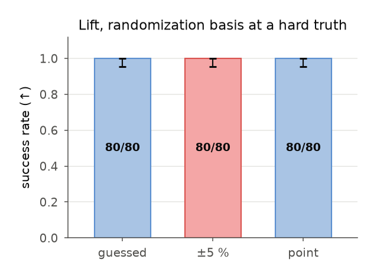

## walk-cadence-controls-2026-09-02

**The walk teacher with its own actions zero-order-held: every tick 40/40 survive 500 ticks; held 2 ticks 38/40 (falls at ticks 283, 488); held 5 ticks 0/40, first falls at ticks 20-23 — a 10 Hz dataset (frames every 5 of 50 Hz ticks) is below the hop's control bandwidth, and no student trained on it could stand however well it learned (campaign 1's 0/40 student had normalized action error 0.136 on its own frames).**

- date: 2026-09-02 · commit: `6ed84a7`
- instrument: `mjlab-1.6.0+mujoco-3.11.0+warp-1.17.0+cuda`
- command: `rq_mjlab.walk_verdict <teacher> --trials 40 --seed 1000 --device cuda:0 with the teacher's action held 1 / 2 / 5 ticks (the hold probe of 2026-09-02, run on the pod)`
- protocol: docs/e2e-research/63 §2 (the certificate) with the action held N ticks
- inputs:
  - teacher: microduck-walk@824eba27c48c, model_7999
  - dataset_cadence: frames every 5 ticks at 50 Hz control (10 Hz)
- outcome:
  - arms: {'held-1': {'successes': 40, 'trials': 40, 'survived': 40}, 'held-2': {'successes': 38, 'trials': 40, 'falls_at_ticks': [283, 488]}, 'held-5': {'successes': 0, 'trials': 40, 'first_falls_at_ticks': '20-23'}}
  - student_fit: {'campaign_1_normalized_action_error': 0.136}
- artifacts:
  - log: docs/07-progress-log.md, entry 2026-09-02 'campaign 1 - the student learned; the cadence killed it'
- caveats:
  - Log-derived: the per-trial rows of the hold probe were on the pod's container disk (released 2026-09-02) and are not tracked; the numbers are the log entry's, written the day they were measured.
  - 'survive' here is the certificate's survived milestone; the tracked milestone is not reported for the hold probe.

## campaign-2-box-remeasure-2026-09-02

**Campaign 2's vision student (student-last@5ca41ffb2fc6), certified 18/40 on the pod (CP95 [0.293, 0.615]), re-measured on the owned RTX 3090 Ti with a fresh 40-trial draw: 21/40, CP95 [0.361, 0.685], survived 29, tracked 28 — the two instruments agree within their intervals.**

- date: 2026-09-02 · commit: `see docs/07 campaign 2`
- instrument: `mjlab-1.6.0+mujoco-3.11.0+warp-1.17.0+cuda (RTX 3090 Ti)`
- command: `rq_mjlab.walk_verdict <teacher> --trials 40 --student <campaign-2 pretrained_model> --horizon 2 --stride 1 (WSL box, RTX 3090 Ti)`
- protocol: docs/e2e-research/63 §2 (the certificate)
- inputs:
  - student: student-last@5ca41ffb2fc6 (campaign 2: 120 episodes at 50 Hz, 30k steps)
  - teacher: microduck-walk@824eba27c48c
- outcome:
  - arms: {'pod': {'successes': 18, 'trials': 40, 'ci95': [0.293, 0.615]}, 'box': {'successes': 21, 'trials': 40, 'ci95': [0.361, 0.685], 'survived': 29, 'tracked': 28}}
- artifacts:
  - pod_rows: docs/artifacts/walk-verdicts/records-student-cuda.jsonl (policy student-last@5ca41ffb2fc6)
  - box_rows: runs/campaign-2/ on the WSL box (not tracked)
  - log: docs/07-progress-log.md, entry 2026-09-02 (campaign 2)
- caveats:
  - The box's 40 rows are not tracked; the pod's are (records-student-cuda.jsonl).

## audit-unitree-rl-mjlab-2026-09-02

**Unitree's official mjlab stack: two task families behind 22 IDs; fall detection in deploy stubbed to return false; no action clip between policy and motors; two different G1 definitions across families; zero provenance; DR limited to friction/encoder bias/CoM/pushes with gains derived from rotor inertia.**

- date: 2026-09-02 · commit: `aad29e0`
- instrument: `code read, no execution`
- command: `two Explore agents over the repo dump (docs/e2e-research/65)`
- protocol: docs/e2e-research/65
- outcome:
  - task_families: 2
  - task_ids: 22
  - deploy_fall_detection: returns false (dump L2974-2996)
  - dr_terms: ['geom_friction 0.3-1.6', 'encoder_bias ±0.015 rad', 'body_com_offset ±0.05 m', 'push 5-6 s']
- artifacts:
  - doc: docs/e2e-research/65-unitree-rl-mjlab-review.md
- sources:
  - unitreerobotics/unitree_rl_mjlab: commit 8a5edab (dump read 2026-09-02)
  - mjlab pin: 1.2.0
- caveats:
  - A code read at one commit; behaviour on hardware not observed.

## audit-silent-dr-knobs-2026-09-02

**Silent no-op domain-randomization knobs: five DR entries in Pollen's microduck_rl that measurably do nothing — two overwritten by the BAM actuator at construction (frictionloss, damping), one IMU field never read, one mass randomizer that is a no-op under mjlab 1.3, and config-dict writes the framework ignores (docs/e2e-research/57 §5) — plus one in our own scene (lights.diffuse_scale on a model with nlight == 0); a construction-time linter now refuses the overwritten class.**

- date: 2026-09-02 · commit: `70c078c`
- instrument: `mujoco-3.11.0+arm64 (pixel check); mjlab-1.6.0 (linter)`
- command: `read at source (docs/e2e-research/57 §5) tools/verify (rq_mjlab.linter tests) uv run --extra sim python -  # pixel check, docs/07 2026-09-02`
- protocol: docs/e2e-research/67-novelty-audit.md §5
- inputs:
  - scene: rq_pipeline.tasks.so101 lift-study (nlight == 0)
- outcome:
  - microduck_rl_no_op_knobs: 5
  - our_no_op_knobs: 1
  - pixel_check: headlight draw 0.40 -> mean pixel 23.7, 1.14 -> 39.5, 1.17 -> 40.1 after the fix (docs/07 2026-09-02 D1)
- artifacts:
  - linter: rq_mjlab/src/rq_mjlab/linter.py
  - applier: pipeline/rq_pipeline/physics/variations.py
  - log: docs/07-progress-log.md 2026-09-02 (D1)
- sources:
  - pollen-robotics/microduck_rl: repomix pack read 2026-08-31 (163 files); commit bf19b34a1ef6 (2026-08-31 12:27 UTC — the latest commit not after the read date; pinned 2026-09-07 from the GitHub history; the pack itself carried no hash)
  - Rhoban/bam: v1.0.2
  - mujocolab/mjlab: v1.6.0 (the pack read 2026-08-31; release date not verified in-repo)
  - prior sightings: mjlab #971, #1043, #1168; IsaacLab #7272, #5063, #7538, #7511; mujoco_playground v0.0.4 (docs/e2e-research/67 §5)
- caveats:
  - The phenomenon is known from the stacks' own trackers; the audit count and the refusing linter are the contribution.

## multiply-smoke-device-keep-2026-08-31

**Multiplication smoke run (3 kitting seeds -> 4 episodes, W=64 worlds, one round): the device kept 63/64 candidates under a fresh dynamics draw (damping x0.78, far from every seed's own draw), the CPU reference refused 0 of them, 4 shipped with 280 frames each — within the ±30 % DR span the open-loop actions are dynamics-robust; the brittle axis is spawn position (the basin record).**

- date: 2026-08-31 · commit: `see docs/07 B3.2`
- instrument: `mujoco-warp (RTX 3090 Ti, WSL2) filter; mujoco-3.11.0 CPU reference`
- command: `tools/press-multiply.py <seeds> <out> --episodes 4 --worlds 64 --seed 11`
- protocol: docs/e2e-research/60 §3; multiply.py's device-filter / CPU-verify contract
- inputs:
  - seeds: 3 CPU-pressed kitting seeds
  - dynamics_draw: damping x0.78 (one round)
- outcome:
  - arms: {'device-keep': {'successes': 63, 'trials': 64}, 'cpu-refused-of-device-keepers': {'successes': 0, 'trials': 63}}
  - shipped_episodes: 4
  - frames_per_episode: 280
- artifacts:
  - log: docs/07-progress-log.md B3.2 (2026-08-31)
  - code: pipeline/rq_pipeline/collect/multiply.py
- caveats:
  - Run directories are on the WSL box, not tracked; the numbers are the log entry's.

## multiplication-basin-2026-08-31

**Open-loop replay of a kept kitting episode from a jittered start survives inside a measured basin: 9/9 and 63/63 (W=64) keep at ±5 mm spawn jitter, 1/12 at ±30 mm; the seed's own actions from its own start keep 3/3 on the device and 3/3 on the CPU reference — the amplification radius (SPAWN_NOISE = 0.004) is set inside the basin, not guessed.**

- date: 2026-08-31 · commit: `see docs/07 B3.1`
- instrument: `mujoco-warp (RTX 3090 Ti, WSL2) filter; mujoco-3.11.0 CPU reference`
- command: `tools/press-multiply.py <seeds> <out> --worlds 64 (MJXWarpBackend filter, MuJoCoBackend re-verify)`
- protocol: docs/e2e-research/59 §5 (Mimic's contract) and docs/e2e-research/60 §3
- inputs:
  - task: aloha2 kitting (3 CPU-pressed seeds, each replayed under its own damping/gain draw)
  - constant: SPAWN_NOISE = 0.004 in collect/kitting_demos.py
- outcome:
  - arms: {'own-start-device': {'successes': 3, 'trials': 3}, 'own-start-cpu': {'successes': 3, 'trials': 3}, 'jitter-5mm-w8': {'successes': 9, 'trials': 9}, 'jitter-5mm-w64': {'successes': 63, 'trials': 63}, 'jitter-30mm': {'successes': 1, 'trials': 12}}
- artifacts:
  - log: docs/07-progress-log.md B3.1 (2026-08-31)
  - code: pipeline/rq_pipeline/collect/multiply.py
  - positioning: docs/33-what-we-say.md
- caveats:
  - Measured on the WSL box; the run directories live there, not on the volume or in git — the numbers are the log entry's.

## t5-first-funnel-2026-08-27

**The T5 chain's first certificate, a 600-step ACT on four demonstrations: 0/4 on four paired starts, CP95 [0, 0.602], and the funnel that turns a row of zeros into a diagnosis — part_moved 2/4, part_lifted 0/4, one_in_slot 0/4, both_in_slot 0/4; the trainer's own in-loop eval 0/2.**

- date: 2026-08-27 · commit: `see docs/07 2026-08-27 (pre-ledger)`
- instrument: `mujoco-3.11.0 (Mac, arm64)`
- command: `lerobot-eval --env.type=robotiq --env.task=kitting --env.record_to=<records> --eval.n_episodes=4 (the 600-step checkpoint)`
- protocol: docs/32 (the evaluation layer): paired starts, exact interval, milestone funnel
- inputs:
  - policy: ACT, 600 steps, 4 demonstrations (a smoke-scale run)
  - task: aloha2 kitting
- outcome:
  - arms: {'t5-600-step': {'successes': 0, 'trials': 4, 'ci95': [0.0, 0.602], 'funnel': {'part_moved': '2/4', 'part_lifted': '0/4', 'one_in_slot': '0/4', 'both_in_slot': '0/4'}}}
  - funnel_from_claim: {'part_moved': '2/4', 'part_lifted': '0/4', 'one_in_slot': '0/4', 'both_in_slot': '0/4', 'in_loop_eval': '0/2'}
- artifacts:
  - log: docs/07-progress-log.md, entry 2026-08-27 (the T5 chain end to end)
- caveats:
  - A smoke-scale run whose purpose was the chain, not the policy; kept because docs/33 quotes its funnel as the example of a row of zeros made legible.

## audit-newton-solvermujoco-roundtrip-2026-08-27

**Newton's SolverMuJoCo import of a MuJoCo model drops sensors, keyframes and visual geoms, rewrites the root mass, flips the integrator and ZEROES servo kv (undamped servos) — measured by round-trip.**

- date: 2026-08-27 · commit: `see docs/e2e-research/51 (pre-ledger)`
- instrument: `newton v1.5.0 (PyPI `newton`), mujoco-3.11.0`
- command: `tools/newton-roundtrip probe (docs/e2e-research/51)`
- protocol: docs/e2e-research/51
- outcome:
  - lost: ['sensors', 'keyframes', 'visual geoms']
  - rewritten: ['root mass', 'integrator']
  - zeroed: ['servo kv']
- artifacts:
  - doc: docs/e2e-research/51-solvermujoco-roundtrip.md
- sources:
  - newton-physics/newton: v1.5.0 (latest 2026-08-27); docs read at 1.6.0.dev0
- caveats:
  - Measured on our so101.xml; other models may lose different fields.
