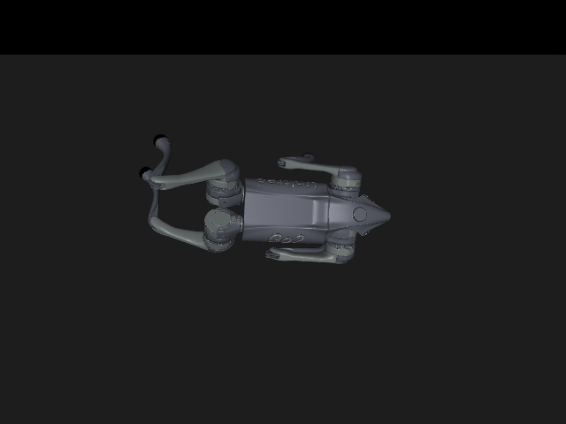
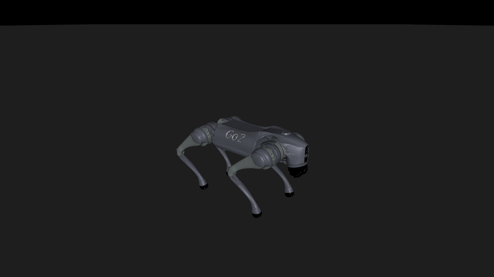
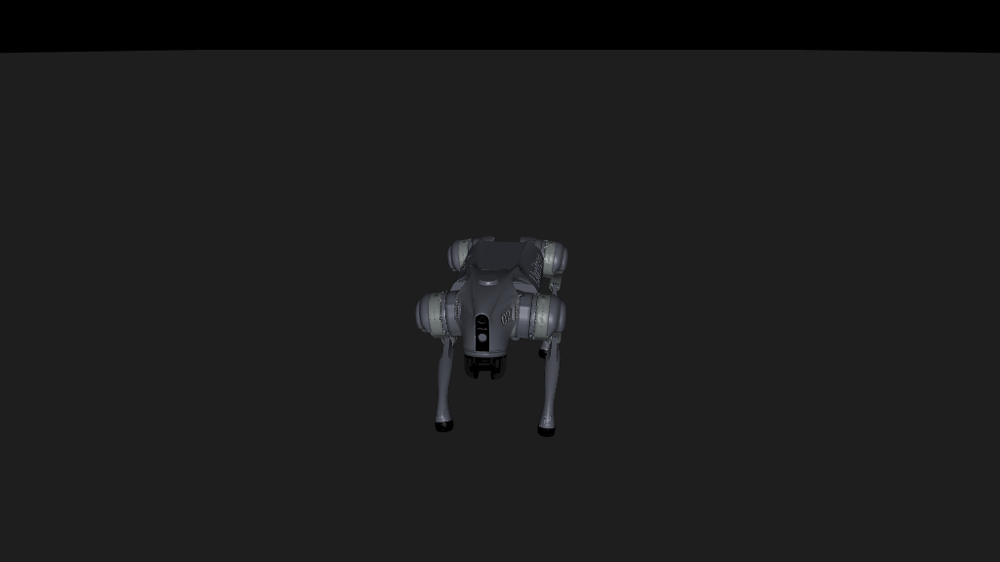
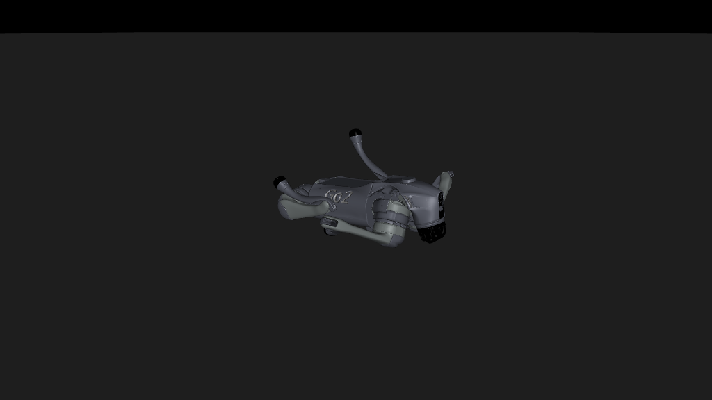
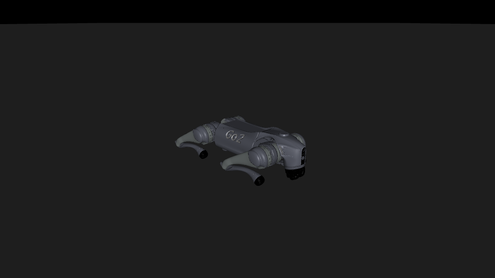

# 77 — The Unitree loop: a Go2 from asset to deployment, by the doors alone

*Started 2026-09-10 on branch `unitree-e2e-2026-09-10`. Prakhar: "start
with a new branch where we do end to end with a new unitree robot and in
the process fix all the bugs and issues and ui ux to make the tool super
helpful efficient", with `unitreerobotics/unitree_rl_mjlab` as the
reference. This document is the plan and the running log of what the
loop taught us; every friction found on the way is fixed in the same
stage and recorded here.*

## 1. What the reference is, read on 2026-09-10

`unitree_rl_mjlab` (Apache 2.0; shallow clone at
`~/.cache/trainnr/unitree_rl_mjlab`, commit `1425b15`) is Unitree's
reinforcement-learning stack on mjlab — the same simulator stack our
walk study runs on (docs/e2e-research/58; rq_mjlab pins mjlab 1.6.0,
the reference pins 1.2.0 and mujoco-warp 3.5.0). What it holds:

- Seven robot packages under `src/assets/robots` (go2, a2, as2, g1 at 29
  and 23 dof, h1_2, h2, r1): an MJCF per robot **without actuators or
  keyframes** (mjlab injects position actuators and the home pose from
  Python constants), collision geoms tagged `*_collision`, named IMU and
  foot sites; plus a `scene_*.xml` twin **with** actuators for the
  sim-to-sim viewer. Go2's constants: hip and thigh kp 20 kd 1 effort
  23.5 armature 0.01; calf kp 40 kd 2 effort 45 armature 0.02; home z
  0.32, thigh 0.9, calf −1.8; foot friction 0.6.
- Velocity tasks (`src/tasks/velocity`): mjlab manager-based configs,
  observations in dict order (base angular velocity, projected gravity,
  command, gait phase, joint positions, joint velocities, last actions,
  height scan on rough terrain), one joint-position action scaled 0.25
  around the default offset, seventeen rewards, push and friction and
  encoder-bias and centre-of-mass randomization, 50 Hz control
  (timestep 0.005, decimation 4), 20 s episodes; flat ids `Unitree-Go2-
  Flat` and `-Rough`, registered by import side effect.
- Training and play scripts (tyro CLIs over rsl_rl, unpinned), ONNX
  export bolted onto checkpoint saving with metadata attached.
- `deploy/`: a C++ runtime over onnxruntime with an FSM (passive → fixed
  stand → RL) and, per robot, a hand-maintained `deploy.yaml` carrying
  the joint-order map (Go2's MJCF FL,FR,RL,RR against the SDK's
  FR,FL,RR,RL: a real reordering), kp/kd, default joint positions, the
  action scale and offset and clip, and the ordered observation list.
- `simulate/`: a vendored MuJoCo 3.3.6 viewer that republishes the
  simulated state as Unitree DDS LowState and takes LowCmd — so the same
  deploy binary runs against the simulator and the robot, gamepad in
  hand. Linux only.

What we reuse and what we do not. Reuse: the robot assets (with
attribution), the Go2 gains and home pose as a **declared** basis, the
velocity task's observation order, action scale rule, randomization
ranges and command curriculum as the environment spec, and the
`deploy.yaml` field set as the shape of our deploy manifest (A6). Not
reused: their registration (flat ids by import side effect; ours are
`namespace/name` with a content-stamped spec), their configs' mutability
(the ordered observation list must be read out of the built
environment, not the source), their hand-copied deploy numbers (ours are
minted at export from the identity record and embedded in the ONNX
metadata), and their C++ deploy path for now — our sim-to-sim gate runs
in MuJoCo from Python, hardware-free, and their DDS simulator is a
second gate we can add on a Linux box.

## 2. The loop for a Go2, stage by stage

The states are docs/76's. For a reinforcement-learning loop two of them
read differently, and the window must say so rather than show a gap.

| state | for the Go2 | door | status (2026-09-10; updated 2026-09-24) |
|---|---|---|---|
| asset onboarded | Menagerie `go2.xml` into `projects/go2-walk/robots/go2` | `onboard_robot` | done by the door; two frictions (§3) |
| telemetry recorded | none of our own — no Go2 in the room. The live Unitree adapter is BUILT (2026-09-24, `pipeline/rq_pipeline/robots/dds_capture.py`): `start_capture(source="dds", network=<the robot's interface>)` records `rt/lowstate` AND `rt/lowcmd` as one recording, basis "own robot"; rehearsed on their simulator and controller (basis "simulation"; docs/07 2026-09-24 evening). Since 2026-09-24: a REAL Go2's public bag (YibinWu/leg-odometry, 12 min of `/lowstate` at 499.8 Hz measured) enters through the rosbag2 adapter (`pipeline/rq_pipeline/robots/adapters/rosbag2.py`) with a provenance block, and the strip's chip reads "Telemetry · public log", never met (docs/07 2026-09-24 afternoon) | `ingest_recording`, `ingest_public_log` | a real robot's telemetry, not ours; shown as such |
| system identified | **declared, not identified**: the reference's gains and armatures as the actuator basis, with a domain-randomization span around them (the way `rq_mjlab/go1_walk.py` already does for the Go1) | `identify_system` when a recording exists; the `legged-joints` method exists since 2026-09-24 (§8) and has fit public logs of other people's Go2s | declared for this robot; a method, no recording of ours |
| environment defined | the walk families (`rq_pipeline/tasks/walks.py`): `robotiq/go2-walk` with a `WalkSpec` (span, terrain, episode length, trials) stamped by content, built over the project's bundle; rq_mjlab builds the simulator environment from it (`rq_mjlab/src/rq_mjlab/go2_walk.py`) | `create_task`, `accept_task` (the learnability smoke, §3) | done 2026-09-10: `go2-flat` declared, accepted in 10 s, cited by a smoke run |
| data generated | **not a stage for RL**: the policy learns from its own rollouts; the strip must say "not needed" | — | friction (§3) |
| policy trained | rq_mjlab's walk trainer, `--robot go2 --project …`, 4096 envs, 8000 iterations on the pod | `train_walk(robot="go2", name=…)` → generic `train_policy` (A5) | door built and smoked 2026-09-10; the real run needs the pod |
| policy evaluated | the walk verdict: paired trials, exact interval, the funnel, judged at the command envelope the checkpoint trained under (friction 20) | `evaluate_walk` (`certify_walk` until 2026-09-12) → generic `evaluate_policy` (A5, still walk-shaped) | done 2026-09-10 on the box: go2-c1 40/40 twice, go2-c2 38/40 |
| deployment exported | the deploy manifest (A6, `rq_mjlab/src/rq_mjlab/walk_export.py`): joint and actuator orders, gains, home pose, action scale and offset, the ordered observations, the control rate, the SDK joint map, every number read from the BUILT environment; ONNX with normalization folded in and checked against the actor; the trained scene as MJCF; the sim-to-sim gate (`rq_pipeline/deploy/`) driving the ONNX through the manifest alone in plain MuJoCo | `export_deployment`, `gate_deployment` | built 2026-09-11 on a laptop checkpoint; the certified Go2 policy's export waits for its checkpoint here |
| drift monitored | fresh telemetry identified without writing a fit record, judged against the union of the pinned intervals (docs/76 §9.1); empty on the Go2 — a method since 2026-09-24, no telemetry of ours yet (§8) | `check_drift` (A7) | built 2026-09-13, proved on the rig; waits on a real Go2 here |

## 3. Frictions found, in the order the loop found them

1. **Onboarding ignores the open project** (found and fixed
   2026-09-10). `onboard_robot` wrote to the checkout's robot library
   (`$RQ_ROBOTS_DIR` or `robots/`), while the loop says the project holds
   its robots and the Studio lists the project's. Fixed: the bundle
   locator (`rq_pipeline/bundles/locate.py`) searches registered roots
   before the library — a project registers its `robots/` when it is
   made current (`Project.use`) — so a robot onboarded into a project
   builds tasks like a library rig; the door lands the bundle in the
   open project and reindexes; the describe doors list both.
2. **Onboarding picks the wrong model file** (found and fixed
   2026-09-10). The Go2 directory holds `go2.xml`, `go2_mjx.xml`,
   `scene.xml` and `scene_mjx.xml`; the door was told `go2.xml`, but
   nothing recorded it, so the reader's "largest XML" rule chose the MJX
   twin and the drawer showed its counts (30 sensors the base model
   does not have). Fixed: onboarding writes `bundle.json` (schema
   `trainnr-robot/1`: the model file compiled, the source path, the
   census; no timestamps, so two onboardings of one directory are one
   version) and every reader asks it first
   (`rq_pipeline/bundles/bundle.py`). The rig's `profile.json` stays what
   it is, a measurement, not provenance. Also found: the actuator store
   was listed as a robot bundle.
3. **The pipeline strip assumed every loop has a dataset stage** (fixed
   2026-09-10). A reinforcement-learning loop has none; "Dataset" read
   as a gap forever. Now a project says how its policy learns
   (`project.json` `loop`: imitation or reinforcement, set at
   `create_project_dir` or read off the first run, whose summary says
   what it learned by), the index marks the stage `needed: false` with
   the reason, the next move never names it, and the strip draws it dim
   with the reason on hover and counts "1 of 8 stages".
4. **A walk has no scripted expert** (settled 2026-09-10). Acceptance
   for a locomotion task cannot be "the expert passes every trial". Its
   honest gate is learnability: the walk's smoke — two environments, two
   iterations, the environment built from the project's bundle, the
   actor's twelve outputs and the critic's seventy-two inputs shaped by
   the declared constants — which the train door runs in ten seconds on
   a laptop CPU. `accept_task` on a walk family will run exactly that and
   record it as the verdict; a `floor` half (hold home, must not track)
   comes with the verdict tool.
5. **The Menagerie Go2 is not in the simulator's shape** (2026-09-10).
   Its collision geoms are unnamed, it has no foot sites, and its trunk
   is `base`; mjlab's velocity task wants `*_collision` geoms, foot
   sites and a trunk body by name. The reference's `go2.xml` has all
   three and no actuators or keyframe (mjlab injects them from the
   constants), so it is the project's robot; Menagerie's stays the
   viewer-friendly twin. Onboarding should say which shape a model is
   in — a census of named collision geoms and sites — so the agent learns
   this before training, not from a traceback.
6. **A second venv, a second world** (2026-09-10). The walk runs in
   rq_mjlab's own environment (mjlab pins), so the train door spawns it
   with `--project` and the walk resolves the robot through the same
   project-first locator the pipeline uses; nothing about the project's
   layout is known to the walk package.

7. **A bundle's stamp depended on the machine it was onboarded on**
   (found and fixed 2026-09-10, the WSL box). `bundle.json` recorded the
   source as an absolute path, and the record lives inside the directory
   the stamp hashes, so the Go2 onboarded from the same clone at the same
   commit was `go2@b6170cf88b09` on the Mac and `go2@a185f9103878` on the
   box. Fixed: the record keeps the source's last three path components
   (`unitree_go2/xmls/go2.xml`), the same on every machine; the box's Go2
   is `go2@5003bf617b5f`, and the Mac's stamp changes when it re-onboards.
   The task stamp (`go2-walk@0e7e123a7de7`) was identical on both machines
   from the start, as a content hash should be.

8. **A run training in the project was invisible in the Studio** (found
   and fixed 2026-09-10, the box). The Studio polls the index file every
   second, but nothing rewrote the index while a run trained, and the
   experiment card's curve came only from a console log an imported
   study arm carries - a door-launched run has neither. Fixed three
   ways: `walk_train` tees its console into the run folder as
   `train.log`; `rq_pipeline.project.live` turns that log into
   `training.json` whenever the log is newer (status `running` until
   the done line, iterations so far, the curve so far); and the
   presenter the Studio spawns does that and re-indexes every 15 s. The
   Go2 run's card showed its reward curve at iteration 1278 of 8000.
   Open: a run launched by hand, not by the door, is absent from the
   Compute card (no job record) - the next run goes through
   `train_walk`.

9. **A certificate judged inside the project never became an
   evaluation** (found and fixed 2026-09-10, the box). `certify_walk`
   on `model_1400` of the training run wrote its 40/40 verdict where
   rq_mjlab writes one - `runs/go2-c1/verdict/walk-verdict-cuda.json`
   beside the checkpoint - and the Evaluations page stayed at zero: the
   only path from a verdict to an evaluation artifact was the importer,
   which refuses a run already in the project. Fixed: the importer's
   policy and certificate writers are shared helpers, and the live loop
   (`live.refresh_verdicts`, every presenter tick) turns each verdict
   under a run into a policy (`policies/go2-c1-model_1400`, the judged
   checkpoint copied with a manifest citing the run) and an evaluation
   (`certificates/go2-c1-model_1400-cuda`) citing that policy; the
   Studio spawns the presenter when a project opens, not at the first
   Show. Seen on the Evaluations page within a tick: 40 / 40, exact
   interval [0.91, 1.00], funnel survived 40, tracked 40; the overview
   at 4 of 8 stages (asset, environment, policy, evaluation).

10. **A run's version moved every time a checkpoint landed** (found and
    fixed 2026-09-10, the box). A run was stamped like a bundle, by
    hashing its folder, so the card read `go2-c1@b7630dc54e54` one tick
    and `go2-c1@a8300622d290` the next, and the policy written a minute
    earlier cited a run version that no longer existed - the lineage
    linked nothing. Fixed: `kinds.stamp_run` hashes the identity the
    run was launched with (`identity.json`, or a LeRobot run's
    `run.json`), the rule tasks already followed; the index, the
    importer and the live loop share it. The policy's and the
    certificate's `run` now resolve to the run card. Closed for runs
    trained by the door (2026-09-11, the box, friction 18): `train_walk`
    hands the project's task stamp to the trainer, the run's identity
    carries it, and the verdict cites it, so the environment card is
    cited by its evaluation. A run launched by hand still cites the
    walk-spec hash, which is what it trained under.

11. **What the policy looked like every hundred iterations** (asked
    2026-09-10: "one image of each 100 iterations, like 80 images",
    for after the run). `rq_mjlab.walk_stills <run> --project <root>
    --robot go2 --every 100 --tick 100`: the env built once at the
    nominal point with one world, every hundredth checkpoint's actor
    loaded into it in turn, a rollout capped at 100 control ticks (2 s)
    and the pose at the last tick rendered through the project's own
    scene file from the chase camera; `stills/stills.json` keeps what
    the world did in those ticks, `stills/sheet.png` lays every still
    out in iteration order framed in the outcome's colour (tracking
    green, fallen red, up but off-command blue). The run's presenter
    puts the stills on the iteration timeline next to the curves, so
    scrubbing the reward curve in the Studio shows the robot at that
    checkpoint. Smoke on the box with three checkpoints: 17 s including
    the env build, so the eighty-one stills of a finished run are a
    three-minute pass. Seen: the sheet, and the Live view with the
    still beside the curves at iteration 5669. Caveat: the rollout is
    not bit-reproducible across tool invocations (the same seed gave
    err ratio 0.37 then 0.49 at model_4000) - a still is a picture,
    not a judgment; the certificate remains the judgment.

12. **Two finished certificates showed as running for an hour** (found
    and fixed 2026-09-10, the box). The job manager's exit-code watcher
    is a thread in the process that opened the door; called from a
    script that returned, no `.exit` file ever landed, and the Studio
    counted a job running while no exit was recorded. Fixed twice: the
    job now runs under a runner (`python -m rq_pipeline.mcp_jobs
    --exit-file … -- <tool>`) that writes the exit file itself, whoever
    launched it; and the Studio counts a job as running only while its
    process exists (Linux, through `/proc`; elsewhere the exit file
    alone decides). The Compute card reads "idle · no jobs running"
    with both certificates ended.

13. **A rotated verdict would have become a second evaluation** (found
    before it happened, 2026-09-10). rq_mjlab never overwrites a
    verdict: certifying `model_7999` moved `model_1400`'s file to
    `walk-verdict-cuda.seed1000.n40.json`, which the live loop would
    have imported as a new evaluation of `model_1400`. An evaluation is
    now named by policy, instrument, seed and trial count
    (`go2-c1-model_1400-cuda-seed1000-n40`), so the rotated file maps
    to the card that exists and a re-judge under another seed gets its
    own.

## 4. Decisions to take before building (asked 2026-09-10)

- **Robot: Go2.** The Go1 walk already exists in rq_mjlab on mjlab's own
  asset; the Go2 is the current robot, has the reference's gains, deploy
  config and sim-to-sim twin, and mjlab 1.6's asset zoo does not ship
  it — so this exercises onboarding for real.
- **Environment source: our registry, the reference's numbers.** A
  `robotiq/go2-walk` family in `rq_pipeline.tasks` with a spec dataclass
  holding the velocity task's knobs, stamped by content; rq_mjlab builds
  the mjlab environment from it (as `go1_walk.py` does). Not a
  dependency on the reference package (its mjlab pin conflicts with
  ours, and its configs cannot be hashed).
- **Compute: the RunPod pod for training and evaluation, the Mac for
  everything else**, per the standing rule (short local runs).
  Amended 2026-09-10: the pod launch was refused (account balance too
  low), and Prakhar: "we will do the training run tomorrow on wsl gpu"
  — the RTX 3090 Ti box. §5 is the runbook for it.
- **Hardware: none in this pass.** The rig connects at A6/A7 per the
  earlier call; a Go2's SDK2 adapter is gated research.

## 5. Tomorrow on the WSL box: the run, by the doors

**Done on the box, 2026-09-10.** The reference cloned at commit
`1425b15` into `~/.cache/trainnr/`, the venvs synced with their extras
(the recorder tests need `rerun`, the dataset tests `pyarrow`: sync
with `--extra viz` and `--extra sim --extra viz --extra mcp`). The
project made by hand (`projects/go2-walk/project.json`, loop
`reinforcement`), then by the doors: `onboard_robot` (friction 7 above,
then `go2@5003bf617b5f`), `create_task("go2-walk", "go2-flat", {span
0.10, flat, 20 s, 40 trials})` → `go2-walk@0e7e123a7de7`, `accept_task`
→ ACCEPTED by the learnability smoke (2 environments, 2 PPO iterations).
The run: `walk_train --agent g3 --robot go2 --project <root> --dr-span
0.1 --task-stamp go2-walk@0e7e123a7de7 --log-dir <root>/runs/go2-c1
--seed 42 --no-recorder`; identity `go2@5003bf617b5f`,
`unitree-go2-declared-pd@3b68245f8d2a`, 4096 environments, 8000
iterations at ~1.5 s each on the 3090 Ti (about 3.5 h); console log
`<root>/runs/go2-c1.log`. Then `certify_walk`.

**The loop closed, 2026-09-10 20:25 IST.** The run took 2 h 24 min
(8000 iterations, 1.03-1.13 s each, ~102k steps/s, final reward 74.0,
episode length 1000 of 1000). `certify_walk` on `model_1400` mid-run
and on `model_7999` at the end: both 40/40 survived and tracked, exact
95 % interval [0.912, 1.000], median error ratio 0.25 and 0.25, under
the trained ±0.10 law span. The project holds, all seen in the Studio:
the robot, the environment, the run with its curves, two policies, two
evaluations citing them and the run, and 81 stills (one per hundred
iterations, item 11) on the run's iteration timeline; the overview
reads 4 of 8 stages (asset, environment, policy, evaluation) with
"next: run system identification on a recording". What the loop does
not have on this robot: telemetry from a real Go2, hence no sys-id and
no identified interval - the span was declared, not measured, which is
the Go1 finding's shape (docs/74) and the reason the overview's next
move points at a recording.

What exists by the end of 2026-09-10, all pushed on the branch: the Go2
onboarded into `projects/go2-walk` (the reference's `go2.xml`,
`go2@b6170cf88b09`); the walk declared as `go2-flat`
(`go2-walk@0e7e123a7de7`, span 0.10, flat, 20 s episodes, 40 trials)
and accepted by the learnability smoke; the train door taking the
declared task. The box needs what a pod needed: the rq_mjlab venv
(mjlab 1.6, mujoco-warp, torch with CUDA — `cd rq_mjlab && uv sync`)
and the project directory (gitignored; copy `projects/go2-walk`, the
bundle is 24 MB of meshes). Then, with `TRAINNR_PROJECT` set to the
project, by the door:

    train_walk(agent="g3", task="go2-flat", name="go2-c1", seed=42)

which the trainer receives as `--robot go2 --project <root> --dr-span
0.1 --task-stamp go2-walk@0e7e… --log-dir <root>/runs/go2-c1 --seed 42`;
4096 environments, 8000 iterations (the walk study took 1.9 h on an
RTX PRO 6000; expect longer on the 3090 Ti). The run's `identity.json`
cites the task; the index shows the experiment with its reward curve as
it trains (the tensorboard log is not read yet — the console log is,
once the run ends). Then `evaluate_walk(<checkpoint>, robot="go2")` (the
door was `certify_walk` until 2026-09-12) for the evaluation, and the loop
reaches "policy evaluated".

## 6. The deployment stage, built 2026-09-11 on the Mac

`export_deployment(run, checkpoint, name)` spawns `rq_mjlab.walk_export`
in the walk package's venv: the actor as ONNX (rsl_rl's exporter,
observation normalization inside the graph, a fixed batch of one, as a
runtime uses it), checked against the torch actor on sixty-four random
inputs (max |Δ| recorded; 9.5e-7 on the laptop checkpoint); the manifest
(`deploy.json`, schema `trainnr-deploy/1`) read from the built
environment — the policy's joint order, the simulator's actuator order
and the map between them, kp/kd/effort per joint, the home pose, the
action rule and scale, the seven observation terms in order with their
widths and sources, 50 Hz from timestep 0.005 and decimation 4, the
twist ranges, the fell-over limit, the reference's SDK joint map for
the Go2 as a declared fact; and `scene.xml`, the entity compiled with
its injected actuators and keyframe plus a floor and the training
timestep, so a plain MuJoCo loads the model the policy trained in with
the bundle's meshes. The door finds the checkpoint's policy and newest
evaluation in the index and cites them.

`gate_deployment(name, trials, seed, tolerance)` spawns
`tools/gate-deployment.py` in the pipeline's venv (`--extra deploy`:
onnxruntime): `rq_pipeline.deploy.runtime` computes each observation
term from MuJoCo state the way mjlab does (the IMU's velocimeter and
gyro from the sensors, gravity rotated into the base frame, joint
positions relative to home, joint velocities, the last action, the held
command), runs the ONNX, maps actions to controls, steps at the
manifest's rate; `rq_pipeline.deploy.gate` judges each seeded held
command the certificate's way (survived and error ratio below 0.5,
floored at 0.1 m/s), writes the exact interval, and passes when the
rate is within the stated tolerance (0.10) of the cited certificate's.
Cross-checked on the laptop checkpoint: the gate says survived 4,
tracked 0; mjlab's own verdict on the same checkpoint says survived 4,
tracked 0 (error ratios 0.76–1.0 against 1.01–1.12 — the protocols
differ, the judgment agrees). Twenty-second episodes run in half a
second each in plain MuJoCo. The Studio shows the deployment's card (the
robot), its drawer (the manifest's facts, the gate's verdict and trials,
the joints and observations as tables) and the loop at 5 of 8 stages;
"Show in viewer" on a deployment presents the trained scene from
`scene.xml` with the bundle's meshes, the gate's error ratio per trial
as bars against the 0.5 bound, and a reading with the lineage
(`rq_pipeline/project/present.py::_present_deploy`, checked by capture).

Frictions found (docs/77 §3 continued): 14, the project's folder is
`deploy/`, not `deployments/`; 15, the entity's spec is attached to the
scene and cannot be serialized — a fresh entity is; 16, rsl_rl's ONNX
takes one observation at a time; 17, the scene namespaces the entity's
names (`robot/FL_hip_joint`) — the manifest keeps the robot's own.

What the real Go2 deployment needs next: the certified `model_7999.pt`
from the box (with its verdicts) so the export cites `go2-c1`'s
evaluation and the gate judges against 40/40; then the reference's DDS
simulator on a Linux box as a second, independent gate; then A7.

**Done on the box, 2026-09-11.** The Mac's two commits pulled, both
venvs synced (onnx, onnxruntime 1.30), 634 pipeline tests green. Then
by the doors: `export_deployment(run="go2-c1", checkpoint="model_7999.pt",
name="go2-c1-deploy")` - `policy.onnx`, `deploy.json` citing the
policy `go2-c1-model_7999@62a6474496a7`, the run, the robot, the
declared task `go2-walk@0e7e123a7de7` and the evaluation
`go2-c1-model_7999-cuda-seed1000-n40@cc63d83c85c4`, and `scene.xml`;
`gate_deployment("go2-c1-deploy", trials=40, seed=1000)` - **38 / 40,
exact 95 % interval [0.831, 0.994], passed** (rate 0.95 against the
certificate's 1.00, tolerance 0.10). No trial fell; the two misses
are the two smallest held commands (0.12 and 0.14 m/s, just above the
0.1 m/s floor) at error ratios 0.82 and 1.00 - the regime where the
ratio criterion is harshest and the two protocols (mjlab's batched
env under law DR against plain MuJoCo at the nominal point) differ
most. The Studio: the Deployments page with the card and drawer, the
overview at 5 of 8 stages, the deployment in the viewer (the trained
scene with the bundle's meshes, the gate's error ratio per trial with
the two misses standing out, the reading with the lineage), both jobs
marked done in the activity feed.

Friction 18 (fixed): a run trained by the door cites its task by the
project's stamp (`go2-walk@0e7e…`), and the export door handed that
stamp to the task registry, which knows families by id
(`robotiq/go2-walk`) - refused. The door now resolves the stamp
through the environment card the index holds (its spec records the
family id); a run naming the family id directly is taken as is.

Friction 19 (fixed, 2026-09-11, the box): **the Studio window never
appeared on the operator's screens under WSLg**, through a day of
work seen only by the agent's in-app screenshots. WSLg's compositor
announced the window to Windows every time (`robotiq_studio` in the
RAIL app list), but Windows never showed a native Wayland window from
this app, while an X11 test window (`xmessage`, through Xwayland)
showed at once, and the Studio relaunched with `WAYLAND_DISPLAY`
hidden showed at once - the operator's screenshot. winit takes
Wayland whenever that variable is set, so the binary now asks the
event loop for X11 when it runs on WSL (`main.rs::prefer_x11_under_wslg`,
eframe's event-loop hook and winit's X11 extension trait - no
environment edits, the crate forbids unsafe); elsewhere winit's own
choice stands. Not the cause, ruled out on the way: the Vulkan adapter
(Mesa's dzn over D3D12 draws the app fine), the OpenGL backend (falls
to llvmpipe and refuses an R32Float target), the driver path.

Friction 19, continued (2026-09-11, evening): with the window visible,
two more things on the X11 path. (a) The process holds one full core:
the hot thread is "WSI", the presentation thread inside Mesa's dzn
Vulkan driver, spin-waiting to present to an Xwayland surface that
has no vertical blank. Presenting without vsync changed nothing; the
OpenGL path (Mesa's D3D12 driver, WSLg's usual route) refuses the
viewer's R32Float render target on this box even under the driver
environment. Left as is: the load is inside the driver, the window
stays live. (b) The operator's pointer landed a row below where it
hovered, while a pointer moved through X directly (XTest) hit the
right row - so the offset was added between Windows and the X server.
Dropping the window-manager frame (client-drawn chrome) did not
remove it and lost the window controls; reverted. A plain relaunch
with the frame, not maximized, put the pointer right ("ok fixed
now"). The offset is therefore tied to the window's state on the
Windows side (it had been resized to 1908 x 999 and driven from the
frame), not to the app; the measurement to take if it returns is the
X server's pointer position against the operator's, in one
"park the mouse" round trip.

Friction 19, resolved (2026-09-12, the box): the pointer offset and
the window that would not move had one cause, read off the X server
this time: WSLg's window manager had the Studio **maximized** on both
axes, its frame 32 px above the screen and wider than the monitor,
because the remembered window size (1908 x 999) plus the frame
exceeded the work area. A maximized window cannot be dragged, and the
bridge maps the pointer as if the frame began on-screen, so every hit
landed 32 px low - "hovering over the text selects the box below".
Un-maximizing the live window through the manager put both right at
once. The binary now opens at a fixed 1600 x 900 on WSL, never
maximized, and does not remember its size there (`persist_window`
off). The instrument for next time: `_NET_WM_STATE` and the frame's
geometry via python-xlib, one command.

Then the chrome (2026-09-12, asked for: "make the OS window border
standard for Windows, Mac and Linux, only the buttons differ, the
app's colour"): the window's chrome is ours on every platform that
lets a client draw it (`crates/studio-shell/src/chrome.rs`), the way
Rerun's own viewer does - our top bar is the title bar (drag,
double-click to maximize), re_ui's caption buttons at its right on
Windows and Linux, invisible resize zones on the edges; the Mac keeps
its traffic lights over a full-size content view. Rerun's helper sets
the per-platform flags. Two things the transparent window then
needed: the app's ground painted under everything (a see-through
strip showed the desktop between the header and the panels), and,
on WSL, the window keeping its own outer edge on the screen (WSLg's
manager opened the frameless window 21 px above the top). The grey
frame the operator saw was the manager's; it is gone.

**The Studio's own walk scene on the Go2 (2026-09-12).** "The same
four robots we saw in viser, in our Studio": the Simulator page's
walk scene (`rq_mjlab.walk_view` feeding `tools/studio-render-stream.py`
over the state ring) was microduck-shaped in three places - the
checkpoint lookup under `runs/microduck-walk`, the scene name
`walk:<worlds>` where the render stream now wants `walk:<robot>:<worlds>`
(the Mac's review had generalised the stream, not the view), and the
camera rig. Now: `--robot` and `--project` (the robot from the
project's one declared walk, the same rule the doors apply; "latest"
= the newest policy artifact, else the newest run checkpoint); the
render process takes `--project` so the Go2 bundle, which lives only
in the project, is found; a `go2-rl` rig, and the follow distance a
property of the rig (0.9 m for a microduck, 2.6 m for a Go2); the
Studio passes the project and asks for four worlds. Friction 28 on
the way: the view rebuilt the training env from the identity's DR
basis string and refused the Go2's ("declared ±0.1 scale…" has no
span to parse) - a view is not a judgment; it builds the play env at
the nominal point and gates on robot and actuator only, as walk_play
does. Friction 29: model_7999 is from before the actor became
deployable (48 terms; the current actor 47), so the view rebuilds
with the earlier recipe by name (`go2_walk_env_cfg(legacy_actor=True)`,
the width read shared with the exporter) - an old policy stays
watchable, and only the exporter refuses it. Seen: four Go2 worlds at
33 frames per second and real time in the viewport, the followed
world with contacts, forces and joints drawn, the worlds' markers and
the reward per world in the viewer.

**Full screen (2026-09-12).** The viewport had no way to fill the
page. Now: the `f` key, the maximize button in the transport bar, or
`set_simulator_view(fullscreen=True)` put the picture and its bar
alone on the Live page (no rail, no viewer panels); Escape or the
same key returns; F11 makes the window itself full screen through the
chrome. Seen: the four Go2 worlds filling the page at 32 frames per
second.

**Walking the camera (2026-09-12).** "There is no WASD to move the
camera": the viewport only orbited and zoomed. Now W and S walk the
camera along its view flattened to the ground, A and D across it, Q
and E lower and raise it, Shift three times as fast, for as long as
the key is held (`tools/studio-render-stream.py`, one new wire
message: the seconds each key was down, signed per axis; the metres
are the stream's, PAN_RATE_PER_S of the current distance per second,
so one key crosses a close-up and a wide shot in the same time).
Panning a followed world releases the follow, which would otherwise
put the lookat straight back. Verified with keys injected through the
X server: W for a second and a half walked past the four robots, D
moved across, E rose until the ground's edge showed.

**The whole switchboard (2026-09-12).** The corner chips showed six
flags of MuJoCo's forty-one, and no group masks. The Inspect drawer
has a fourth tab, **Visuals**: every visualization flag and every
rendering flag by MuJoCo's own name, three to a row, each box showing
what the stream renders (the status echoes every flag), and the group
grid - `simulate`'s "Group enable": geom, site, joint, tendon,
actuator, flex and skin, groups 0 to 5, one bit each over a new wire
message (`tools/studio-render-stream.py`, TAG_GROUP: kind, group, on;
`mjvOption`'s seven group masks). The door
`set_simulator_view(group=, kind=, on=)` reaches the same bits, and
`inspect="visuals"` opens the tab; an unknown kind or a group past 5
is refused naming the valid ones. Seen: the joint flag from the door
lighting both the checkbox and the corner chip; geom group 0 off
taking the ground away (the Go2's meshes sit in group 2, mjlab's
visual group).

**Commanding a world (2026-09-12).** The walk scene ran on the task's
sampled twists only. mjlab's velocity term already carries a joystick
override for its own viser viewer: three slider handles, an enable
handle and an env index, read at every `compute`, written into the
command the policy observes. The Studio drives that same hook - the
handles are ours (`rq_mjlab.walk_view`, `Joystick`), fed from the
ring's mailbox instead of viser; none of the term's logic is copied.
A fifth drawer tab, **Commands**, appears in walk scenes: forward,
left and turn sliders bounded by the task's own command ranges (the
render process learns them from the walk on its command line), a
"hand back" that returns the commands to the task; the twist goes to
the followed world, else w0. The door:
`set_simulator_input(value, command="vx"|"vy"|"wz")` and
`command="own"`. Measured off the ring (root positions over four
seconds): under the task's commands w0 drifted at 0.09 m/s; commanded
backwards at 1 m/s it moved at 0.86 m/s; commanded to turn at 0.7
rad/s with no forward speed it stayed within a centimetre. Two door
calls in a row first raced on the status echo (the second overwrote
the first's axis, and took the echoed follow instead of the rule's):
the held twist now lives Studio-side. Still to come from the list:
the terrains as a task's own declaration (the larger item).

Friction 30 (fixed, 2026-09-12): **closing the Studio logged
`re_grpc_server: Error while receiving messages: h2 protocol error:
error reading a body from connection`.** The Studio hosts its own
Rerun server, and two of its children stream into it - the walk view
(world markers, rewards) and a plain scene's physics narrator. On
close the shell sent TERM to the children's process group and KILLed
its direct child in the same instant, so a gRPC stream into the
Studio died mid-message and the server said so. Now the narrating
processes close their Rerun connection on TERM and leave
(`leave_cleanly_on_term` in `tools/studio-render-stream.py`, used by
both), and the shell waits up to 1.5 s after TERM before the KILL
(`crates/studio-shell/src/spawn.rs`). Measured: the walk scene and a
plain task each quit with no h2 line and no leftover process.

Friction 31 (fixed, 2026-09-12): **`quit_studio` from the process
that launched the Studio waited its whole five seconds, then reported
"terminated after the timeout" - for a Studio that had left in 0.2
s.** A child that has exited is a zombie until its parent reaps it,
and every probe (`os.kill(pid, 0)`, psutil's `pid_exists`) counts a
zombie as existing; the MCP server launches and quits in one process,
so it always hit this. The launcher now keeps its Popen by pid and
the liveness probe reaps it first, and a zombie is not alive
(`pipeline/rq_pipeline/project/control.py`). Found while timing the
close: the "60 s hang" my own scripts measured was the same zombie.

Friction 32 (fixed, 2026-09-12): **"WASD works in the Rerun 3D
viewer but not in the MuJoCo viewer."** The shortcuts refused the keys
whenever any widget had keyboard focus, and Rerun's 3D view takes
focus when clicked and keeps it, so after one look through the Rerun
view every shortcut of the picture went silent - the keys, Space, R.
Now the picture takes focus when clicked, and the keys are the
picture's whenever the pointer is over it or it was clicked last;
only a text field being typed in blocks them (`ViewportFeed::wants_keys`
in `crates/studio-shell/src/viewport.rs`, the `f` key the same). The
stream now echoes the camera pose - azimuth, elevation, distance,
lookat - in its status and the shell in `studio-state.json`
(`simulator.camera`), so a key can be checked as a number: the
operator's flow reproduced with injected input (click the picture,
click Rerun's 3D view, glide back, hold W a second) moved the lookat
2.5 m. A single pointer warp never registers as a hover in egui; the
test had to glide. The operator then reported the same again, so the
Studio now writes every W A S D Q E press to `events.jsonl` (kind
`key`: whether the picture had the keys, who held focus, where the
pointer was). His log settled it: the presses reached the picture
with focus on it - they were taps in alternating directions, and at
0.6 of the camera distance per second a tap moved centimetres, which
reads as nothing next to Rerun's fly camera (its orbit-mode speed is
the orbit radius per second, with momentum). The rate is now 2.0
(`PAN_RATE_PER_S` in `tools/studio-render-stream.py`): a tap is most of
a metre at the Go2 rig's distance. Then the operator a third time,
and the real cause: the render lane copied the orbit's lookat into
MuJoCo's camera only at creation and while following a world, while
azimuth, elevation and distance were applied every frame - so a pan
moved the status echo (the number every test read) and never the
picture. `OrbitCamera.apply_to` now applies the lookat too, and
`pipeline/tests/test_studio_camera.py` reads `MjvCamera.lookat` after
a pan, which the old code fails. The focus rule and the rate were
real, smaller findings on the way. Lesson, the operator's own rule
re-learned at a price: verify in the viewer, never in a printout; a
number the app echoes is not the picture the human sees.

**The task's own stage (2026-09-12).** "There is no terrain and it is
all very plain": the walk mirror stood on a dark plane under a black
sky, the display grid's skeleton. Now the walk view exports the
task's stage - mjlab's own scene dressing (its `scene.xml`: headlight,
haze, shadow map) with the terrain built fresh from the terrain
declaration the env was built from (`TerrainEntityCfg`: the checker
plane, or a generator's heightfields and boxes from the same config
and seed), no robot - as one XML beside the ring (`export_stage` in
`rq_mjlab.walk_view`), and the render process builds the mirror ON it
(`grid_of(stage=)` in `pipeline/rq_pipeline/tasks/scene.py`, the
`--stage=` flag of `tools/studio-render-stream.py`), adding Menagerie's
gradient sky when the stage brings none. Heightfields ride inline in
the XML (`elevation`), so no assets travel. Two MuJoCo XML-writer
quirks on the way: the env's own terrain spec, attached once already,
carries the robot's default classes and writes a duplicate; an empty
attach prefix writes an empty `<default/>` the reader refuses - hence
built from the declaration, under a named prefix. Seen: four Go2s on
mjlab's checker ground under the haze, at 31 frames per second.
go2-flat declares a plane, so no relief yet: a rough declaration
(mjlab's `ROUGH_TERRAINS_CFG`, the Go2 file's `_rough_env_cfg`) shows
through the same path, and is the next item.

**The second gate's first real number (2026-09-12/13).** go2-c2 -
1500 iterations on the deployable actor, 41 minutes on the box, the
first run allowed there - certified 38/40 at the stage-1 envelope,
exported as `go2-c2-deploy`, MuJoCo gate 20/20, and the DDS gate
0/20 with the robot never moving. The DDS gate then found three
handover bugs, all ours, none visible to the MuJoCo gate (which drives
the policy through the manifest and never through their stack):

Friction 34 (fixed): **two virtual gamepads.** The stack created a
pad and pointed their simulator at it; the runtime created a second
pad and moved that one. Their controller's log: "FSM: Start Passive"
and never another line through 20 trials - every chord went to a
joystick nobody read. The stack now shares its one pad
(`UnitreeStack.runtime_options`, threaded by `tools/gate-deployment.py`)
and closes it when it ends; the smoke gate had got the device order
the other way round by luck.

Friction 35 (fixed): **an empty observation.** Our `deploy.yaml`
wrote `history_length: 0`, mjlab's "no history"; their observation
manager counts frames KEPT, keeps none for 0, and their policy read
an empty vector: the FSM reached Velocity and the joints stood at the
fixed stand to three decimals (a live probe of their LowState). Their
reference file writes 1. `their_history` in
`pipeline/rq_pipeline/deploy/unitree_yaml.py` maps the count.

Friction 36 (fixed): **the frame.** The quaternion was read off
SportModeState, which their bridge fills with position and velocity
only: identity orientation, every velocity judged in the world frame,
no fall ever registered. A per-axis probe under their controller
showed body velocity equal to world velocity and a heading of zero
through a turn. The bus now takes the IMU quaternion from LowState.

Then: **DDS gate 20/20**, interval 0.83 to 1.0, tracking error ratio
0.11 to 0.41 against the 0.5 bound (our MuJoCo gate on the same
policy: 0.08 median, 0.15 max). The per-axis probe's numbers under
their controller: forward 0.68 of 0.8, sideways 0.59 of 0.8, yaw 0.18
of 0.5 rad/s - their PD and rate on our policy track less tightly
than our runtime, within the rule.

Friction 37 (fixed, 2026-09-13): **"the Go2 is moving in the native
window but not in our Studio."** The DDS gate showed only in Unitree's
simulator window; law 0 says everything streams to the Studio. Every
gate runtime now answers `pose()` (base position, quaternion, joints
in the policy order - the DDS one re-orders their LowState motors by
the manifest's `sdk_order_map`), and the gate mirrors each tick into
the deployment's own scene through `rq_pipeline.viz.RigMirror`, the
path every rig tool uses (`pipeline/rq_pipeline/deploy/mirror.py`):
a recording named for the runtime, the 3D view, the command and the
measured planar velocity as series, the trials as a log. The gate job
carries the `viz` extra for it; no Rerun or no loadable scene makes
the mirror a no-op that says so, and the number never depends on the
picture. Seen: the Live page with "gate · dds", the Go2 walking in
the exported scene beside the walk scene, the command steps per
trial and the measured velocity following them.

Friction 38 (recorded, 2026-09-13): **an export started beside its
certificate cites nothing.** `go2-c2-deploy` was exported while the
40-trial evaluation still ran, so its manifest names no policy
artifact and no evaluation, and both gates could only report a rate
("no evaluation cited: the gate reports its rate and judges
nothing"). The export refuses an existing name, rightly - a
deployment is an artifact - so the cited one is `go2-c2-deploy-cited`:
policy `go2-c2-model_1499`, certificate 38/40, and both gates JUDGED
against it: MuJoCo 20/20 passed, DDS 20/20 passed (rate 1.0 against
the certificate's 0.95, tolerance 0.1). The order that closes the
loop is certificate, then export, then the gates; the export door
refuses a checkpoint without an evaluation unless `unevaluated=True`
says the export is deliberate (closed 2026-09-20, the Mac).

Friction 33 (fixed, 2026-09-12): **"where are the iterations visible
in the Studio?"** They are the Experiments card (the reward sparkline
over iterations), its page (the facts, the training curve table, Show
in viewer for the 39 TensorBoard series in Rerun) - but go2-c2's card
showed "reward -1.1", a straight line, over 1500 finished iterations.
A run is stamped by its identity (friction 9), so its stamp never
changes, and a preview is drawn once per stamp: the sparkline drawn at
the run's second iteration stood for its life. Previews now redraw
when any file of the artifact is newer than the picture
(`stale_preview` in `pipeline/rq_pipeline/project/previews.py`,
`tests/test_previews_stale.py`), and the shell's image cache keys a
preview by its path AND modification time (`preview_uri` in
`crates/studio-shell/src/widgets.rs`) - the redrawn file was on disk
while the window still showed the first picture ever loaded under
that path. Seen: the card's full curve, "reward 85.0", after one
reindex and a relaunch.

Friction 20 (fixed, 2026-09-11, the box): **the certificate and the
manifest described the curriculum's first stage, whatever the
checkpoint had trained on.** The reward curve's step at iteration
5000 (86.5 to 73.2; entropy 1.76 to 4.45; episode length unchanged at
1000) is mjlab's velocity task widening the commanded twist - the
`command_vel` curriculum, stages at 0, 5000 and 10000 iterations of
24 steps: forward -1.0..1.0 and turn ±0.5 rad/s, then forward
-1.5..2.0 and turn ±0.7, then forward -2.0..3.0 (never reached in
8000). A fresh environment restarts the curriculum, so every
certificate had judged stage one and the deployment manifest's ranges
(what the gate draws from) were stage one too; the two checkpoints'
40/40 were the same question asked twice. Fixed: `rq_mjlab.envelope`
pins the config's command ranges to the stage the checkpoint's
iteration had reached and removes the curriculum; the certificate
records `protocol.commands` and `protocol.command_basis`, the
manifest `commands` and `command_basis`; an evaluation's name carries
a hash of its protocol, so a re-judge under another envelope is its
own card, and the card's subtitle leads with the envelope. Verdict
backups are named by the policy they judged too (two checkpoints of
one run under one suffix shared a backup name and the second
rotation would have overwritten the first).

Re-judged at the trained envelopes, 40 trials, seed 1000, on the
3090 Ti (both a minute):

| checkpoint | envelope judged | survived / tracked | interval | median error ratio |
|---|---|---|---|---|
| model_1400 | stage 1: forward -1..1, turn ±0.5 | 40 / 40 | [0.912, 1.000] | 0.250 |
| model_7999 | stage 2: forward -1.5..2.0, turn ±0.7 | 40 / 40 | [0.912, 1.000] | 0.199 |

So the second half of training did buy something the first
certificate could not see: the final policy tracks commands up to
2 m/s with a lower median error than the early one shows at half the
speed. The deployment re-exported citing the stage-2 certificate
(manifest forward -1.5..2.0, sideways ±1.0, turn ±0.7) and re-gated
over 40 commands drawn there: **40 / 40, [0.912, 1.000], passed** (the
earlier 38/40 had drawn from stage-one ranges; its two misses were
0.12 and 0.14 m/s commands). Not a like-for-like pair: different
draws, different envelopes.

Friction 21, and the rule behind it (2026-09-11, evening): **the
Studio re-derived a training curve from console text while the
trainer's own record sat in the run folder.** rsl_rl writes a
TensorBoard event file into every run: 39 series per iteration for
the Go2 - all thirteen reward terms, the curriculum's stage, the
policy's action noise, the collection and learning times, the
termination causes. Read as it is (TensorBoard's own reader, now in
the pipeline's `viz` extra), it answers what the console never could:
at iteration 5000 the two biggest losses were foot clearance (-0.38
to -0.56) and action rate (-0.33 to -0.50), ahead of the two tracking
terms (-0.16, -0.12) - the policy runs rougher at speed, not only less
accurately. `rq_pipeline.envs.tfevents` turns the file into the same
training record the cards read (the five console names kept; every
other series as `group/name`), the live loop prefers it and falls back
to the console log, and the viewer lays the series out in grouped
panels. The operator's rule, from this: be additive on top of the
libraries, use their features and their outputs as they are, keep our
modules for what they leave unsolved, and let the Studio and the data
piping tie it together.

**The reward preview, built 2026-09-11 (the evening's last piece).**
`preview_rewards(task, controller, seconds)` rolls the declared walk
for a few seconds under a controller nobody trained - `untrained`,
the recipe's actor at its random start, or `stand`, the held posture
- with the recorder on at every step, so the Studio's Live view
shows the world, the camera, the joints and **every reward term per
step** (the recorder now streams the terms beside the total, from
mjlab's own per-step term buffer - the hook Isaac Lab's live plots
read; that part serves training runs too). A per-term summary lands
beside the task (`tasks/go2-flat/preview-<controller>.json`). What it
said about go2-flat, 5 s, 250 steps, no falls, per step:

| term | untrained actor | standing still |
|---|---|---|
| track angular velocity (max 2.0) | +1.69 | +1.72 |
| upright (max 1.0) | +0.87 | +0.87 |
| pose (max 1.0) | +0.68 | +0.65 |
| track linear velocity (max 2.0) | +0.56 | +0.56 |
| foot clearance | -0.01 | -0.01 |
| everything else | ~0 | 0 |
| total | 3.78 | 3.79 |

Doing nothing collects 3.8 of the roughly 6 a perfect step could
earn: the angular term pays almost fully for not turning, because the
commanded turn rates are small against its 0.71 rad/s width, and the
linear term pays a third for not moving. The learning signal for
walking is the remaining two points, and the four penalties that
shaped the run's step at 5000 are invisible at rest. None of the
field's tools could have said this before the run (docs/33): they
show terms during one.

**Training streams into the Studio, 2026-09-11 (late).** The `train_walk`
door never switched the recorder off; the hand-launched go2-c1 had.
A smoke run through the door (`go2-smoke`: g3, 512 environments, 80
iterations, seed 7) showed in the Live view as it trained: the watched
world in 3D, the camera every 25 steps, the twelve joints, every reward
term per step (the untrained actor's action-rate penalty near -2.5
before anything else moved), world resets as events, and the Compute
card counting the job. That is the recorder mjlab's API defined and
never implemented, our Rerun sink, and nothing else.

`play_walk(run, checkpoint, envs, viewer)` opens a checkpoint in
mjlab's own viewer - the library's viewers as they are - with the same
rollout streamed into the Live view by the recorder; `walk_play` now
takes the walk by robot and project like the other tools (it was
microduck-only, and the Go2's play mode had never run: its terrain
event named the wrong module). Friction 22: mjlab's native MuJoCo
window on this box drew at 0.01x real time, 0 FPS, step 28 after two
minutes (the operator's screenshot) - the same X11 path the Studio
pays a core for, and this window pays with its frames. mjlab's other
viewer, the browser one (viser, `http://localhost:8080`), is the
door's default now; the native window stays a choice.
Seen by the operator in the browser at 0.40x real time, 18 FPS, with
mjlab's own panels - Controls, Visualization, Rewards, Metrics - so
the library's live reward view is there too, for one world, for as
long as the tab is open; the Studio's is the one that persists.
Friction 23: the recorder sent camera frames raw (690 KB each, one
every 25 steps) and the play stream reached 1.2 GiB in the viewer in
half an hour; frames now go JPEG-encoded through Rerun's own
`compress`, about 25x smaller. The recorder's camera also stays where
the watched world spawned, so a robot that walks off leaves an empty
frame - a chase camera is the next small thing there.

## 7. The second gate: Unitree's own simulator and controller (started 2026-09-11, late)

The reference's `simulate/` is a MuJoCo viewer that publishes the
simulated Go2 as the robot's own DDS messages (LowState, and a
SportModeState with the base's position and velocity from MuJoCo
sensors) and takes LowCmd; its `deploy/` is the C++ controller that
runs against that simulator and the real robot alike, reading a
`deploy.yaml` and an ONNX. Our Python gate proves the export agrees
with the training environment; theirs exercises what ours cannot: the
MJCF-to-SDK joint remap, their observation assembly, their finite-state
machine (passive, fixed stand, RL), the wire protocol, their runtime.
Same judge, third instrument.

**The shape, and why it is small.** Our gate's trial loop asks a
runtime for seven things (reset, observe, act, apply, base velocity,
fell over, the held command); `gate()` now takes `open=` to build that
runtime, so the judge, the draw, the interval, the tolerance rule and
`gate.json` are shared verbatim. Against their stack the runtime only
waits for the next state message and publishes the command as gamepad
sticks - their state machine and their velocity command both come from
the pad, which the simulator reads from `/dev/input/js0` and packs into
LowState; a virtual pad through the kernel's uinput is what a person's
thumbs do. Pieces: `pipeline/rq_pipeline/deploy/unitree_yaml.py` (built: the manifest as
their `deploy.yaml`; the observation names mapped to their runtime's
registered terms; **refuses by name any term their runtime does not
implement** - the writer is the deployability check), *deploy/gamepad.py*
(uinput pad, ~50 lines, next), *deploy/dds_runtime.py* (~100 lines,
next: subscribe to their state, publish the pad, drive the FSM at
reset, the two formulas our runtime already uses for velocity and
fell-over), *tools/unitree-sim.sh* and `gate_deployment(runtime="dds")`
(build once, launch both as jobs, gate, stop).

**Friction 24, found by the writer before a line of DDS existed.** The
certified go2-c1 policy observes the base linear velocity: our Go2
config builds on mjlab's generic velocity task, whose actor has it,
while the reference gives it to the critic only (the robot has no
sensor for it; Unitree's runtime has no such term) and gives the actor
a gait clock (`phase`: sine and cosine of the episode time modulo
0.6 s, zero below a 0.1 command) that their runtime provides as
`gait_phase`. Fixed in `go2_walk.deployable_actor`: the actor sees the
reference's seven terms in the reference's order, the critic keeps
mjlab's full set; the gait clock transcribed (`gait_phase`) into our
config and into `rq_pipeline.deploy.runtime`; the manifest's known
sources gained it. Every Go2 policy trained from here is deployable
through their stack; go2-c1 is not, and its two certificates stand as
what they are. Smoke run `go2-c2-smoke` (80 iterations) exported as
`go2-c2-smoke-deploy`: 47-wide observation, their `deploy.yaml` written
with the shipped Go2 file's numbers exactly (joint map 3,4,5,0,1,2,…;
kp 20/20/40; the home pose), our Python gate runs it end to end
(0 of 4 at 80 iterations, no falls - a smoke, not a policy). The
operator's rule tonight: smoke runs only; the full retrain waits.

**What the box needs from the operator, one time** (root):

    sudo apt install -y libyaml-cpp-dev libboost-all-dev libeigen3-dev libspdlog-dev libfmt-dev libglfw3-dev
    git clone https://github.com/unitreerobotics/unitree_sdk2 ~/src/unitree_sdk2
    cd ~/src/unitree_sdk2 && mkdir -p build && cd build && cmake .. -DCMAKE_INSTALL_PREFIX=/usr/local && make -j8 && sudo make install
    echo 'KERNEL=="uinput", GROUP="input", MODE="0660", OPTIONS+="static_node=uinput"' | sudo tee /etc/udev/rules.d/99-uinput.rules
    printf 'uinput\njoydev\n' | sudo tee /etc/modules-load.d/uinput.conf
    sudo modprobe uinput && sudo modprobe joydev
    sudo udevadm control --reload-rules && sudo udevadm trigger
    sudo usermod -aG input "$USER"   # then log out and in (WSL: wsl --shutdown)

(their *doc/setup_en.md* names the apt line; `unitree_sdk2` brings
CycloneDDS; `/dev/uinput` exists on this kernel, root-owned, and both
the uinput and joydev modules are built.) Then their simulator and Go2
controller build with CMake from the cached checkout, and the Python
side takes Unitree's SDK from GitHub (not on PyPI) plus the cyclonedds
and python-evdev wheels in a `dds` extra.

**Built and run, 2026-09-11 (late).** The operator ran the four root
lines; their simulator (4.4 MB) and Go2 controller (8.8 MB) built from
the cached checkout; the `dds` extra installed (cyclonedds against
`/usr/local`, Unitree's SDK from GitHub, evdev). Then, in order:
*deploy/gamepad.py* (the virtual xbox pad; their axis and button order
is the registration order), *deploy/dds_runtime.py* (SportModeState
for the base velocity and IMU quaternion, the pad for the command,
their state machine walked at reset), *deploy/unitree_stage.py* (the
deployment as their project layout: a copy of their binary, their
config.yaml, our manifest as their yaml, our ONNX), `gate(open=…)`,
`tools/gate-deployment.py --runtime dds` standing both binaries up
around the gate, `gate_deployment(runtime="dds")`. Seen live: the pad
at `/dev/input/js0`; their simulator on loopback (CycloneDDS says the
interface is not multicast-capable and disables it - discovery still
works); their controller "Connected to robot", loading our policy
directory; every stick and button reaching both their wireless
message and the LowState bytes (a Python probe); their state machine
"Change state from Passive to FixStand" and "FixStand to Velocity" on
the pad's chords; the gate over the live stack, two trials of the
smoke policy, 1000 steps each, no fall, error ratios 0.72 and 1.00
(an 80-iteration network; the record names the instrument
`unitree_mujoco + go2_ctrl over DDS`), through the door too, with the
MuJoCo gate's record standing beside it.

Frictions on the way: 25, `libddsc.so.0` not found by their controller
- `make install` put it under `/usr/local/lib`, which the loader does
not search until `ldconfig`; the box's `pipeline/wsl.env` now carries
it and the stack passes it on. 26, a 0.15 s chord was missed by their
1 kHz state machine (a press edge lives one message frame at ~900
LowState messages a second); 0.3 s holds, each chord twice (a repeat
is a no-op in the state it leads to). 27, the DDS record overwrote
the MuJoCo gate's `gate.json`; each runtime writes its own
(`gate-dds.json`). Bounded by design: a stick reaches 1.0, so the DDS
gate asks for at most 1 m/s and 1 rad/s whatever the manifest's
ranges say (`command_limit`, the draw is clipped).

Closed on the Mac, 2026-09-12: a deployment's card, drawer and viewer
read every gate record beside the manifest by runtime (`deploy.manifest`:
`GATE_RECORDS`, `read_gates`, `gate_word`) - the card says `gate` and
`gate (DDS)`, the drawer holds one verdict and one trials table per
instrument, the viewer one bar chart per instrument.

Closed on the box, 2026-09-12/13 (§7 above): the real number, on
go2-c2 trained on the deployable actor - certificate 38/40, MuJoCo
gate 20/20, DDS gate 20/20, both judged against the certificate on
`go2-c2-deploy-cited`, and the DDS gate mirrored into the Studio.
Their simulator's window still takes the box's X11 path (the physics
thread is what publishes, so the gate does not care).

What the loop still lacks on this robot: telemetry from a real Go2
(sys-id, an identified interval, monitoring). Both independent gates
are in.

**2026-09-24: the runtime now stands the robot, hands over and stops as
three steps** (`DdsRuntime.stand`, `handover`, `stop`: their FixStand
chord, their Velocity chord, their Passive chord), so a pre-flight reads
the robot's state from their LowState in the fixed stand, BEFORE the
policy has it (§10). The pad refuses by name when `/dev/uinput` is
root-only again after a reboot, with the line that fixes it.

## 8a. The window follows the run (2026-09-13)

From today every feed on this branch saves its stream inside the
artifact it narrates (docs/76 §10.5): the next training run on the box
leaves `runs/<run>/.viewer/train.rrd`, its evaluation
`.viewer/verdict-<checkpoint>.rrd`, its gates
`.viewer/gate-mujoco.rrd` and `.viewer/gate-dds.rrd`. A pull of the
project brings the pictures home; Show in viewer on the Mac replays them
as they ran on the box. Nothing on the box has to change; the Studio
there may even be closed, and the feeds say so and save. What waits for
the box: the first Go2 run made after this commit, so the claim has a
box-side number beside the Mac's.

## 8. The last stage, and why it is empty here (2026-09-13)

A7, drift monitoring, is built (docs/76 §9.1–9.2) and proved on the
Pico rig: two real sweeps as the reference, a copy with one wheel's
encoder scaled named that wheel's gear and nothing else, an untouched
copy came back within. On the Go2 the stage stays empty and the strip
says so — a drift check needs an identification method and a recording
from the robot. As of 2026-09-24 the method exists (`legged-joints`, the
paragraph below) and the recording does not: its dynamics are still the
reference's declared constants (§1), never measured on this robot. The order that
fills it is the one the loop already states: telemetry from a real Go2
through an adapter, a method for a legged robot's actuators (the
reference's rated PD is the declared point; an identified interval
around it is what a check would judge against), then `check_drift` on
every fresh recording. The strip's Sys ID and Telemetry flags are the
same gap seen from the other end.

**2026-09-24, the method exists and has run on real Go2s — not ours.**
`legged-joints` (`pipeline/rq_pipeline/robot/legged_fit.py`) fits
every hinge's armature, damping and Coulomb friction from a log of
joint position, velocity and torque against the bundle's own MJCF, with
bootstrap intervals, pinned verdicts and bound flags; proved on the
Go2 model with a known truth (36/36 within 3 %,
`go2-legged-fit-synthetic-2026-09-24`), then run through the doors on
IIT's in-air chirp (31/36 pinned, 91-99 % explained) and DFKI's field
bag (13/36, 0-51 %: a walking log under someone else's controller is
not a chirp, and the record says so per joint;
`go2-legged-fit-public-logs-2026-09-24`). The stage lights with the
word "public log" beside it (`robots/recording.BASES`, the Studio's
chip), and keeps that word until a recording of this robot exists. A
drift check on the Go2 now has a method to run and still no telemetry
of its own to run on.

**2026-09-25, identification feeds training.** A fit is a record about
the robot, not the robot: `bundles.hashing.BUNDLE_RECORDS` (the `fits/`
folder and `audit.json`) never move the bundle's stamp, so identifying
the Go2 in go2-walk left it at `go2@5003bf617b5f` and every certified
checkpoint still passes its identity gate. The fit carries its own stamp
(`fit_record.fit_stamp`, `fit@<hash of the record>`). A walk trains
under one with `train_walk(fit=...)` / `walk_train --fit` / a task.json
`fit` field (`rq_mjlab/src/rq_mjlab/fit_walk.py`): every hinge's armature, viscous
damping and Coulomb friction set at the fit's estimate in the training
model; each pinned term drawn per reset over its bootstrap interval,
each unpinned one over a declared ±0.5 of its estimate, said as "not
pinned"; the gains keep the declared ±0.1. The run identity, the
certificate and the manifest name the fit and its basis, the card says
"trained under fit@… (public log)", and the identity gate refuses to
judge a fit-trained checkpoint in a world without its fit. Drift reads
like with like: only fits of the fresh recording's basis are the
reference, the others named as left out. The IIT chirp's fit in
go2-walk is `fit@0ad6202797c5` (31/36 pinned); a 30-iteration smoke
(`runs/go2-c3-fit-smoke`) proved the chain; the full `go2-c3-fit` run
waits for the operator.

## 9. What would break it first: the gate says why (2026-09-24)

The field's most repeated unserved ask (docs/e2e-research/78 §1): "it
walked in simulation and fell on the robot; which of gains, torque
limits, control rate, observation order or normalizer is wrong". A gate
says pass or fail with counts; this stage makes it say why, for the
dynamics half of that list, before hardware.

**The method** (`pipeline/rq_pipeline/deploy/attribution.py`). A gate
that PASSED is re-run in plain MuJoCo with ONE dynamics knob turned at a
time, up a ladder of the field's plausible deployment deviations from
the smallest: actions applied late (1, 2, 3, 4 control ticks), every
geom's sliding friction scaled (x0.8 to x0.2), a payload on the base (1
to 8 kg, inertia in proportion), the servos' stiffness scaled down (x0.8
to x0.3) and their damping scaled up (x2 to x16), gaussian noise on the
joint-position term (0.01 to 0.1 rad), gravity pitched as a slope
believed flat (3 to 15 deg), and the base shoved every 4 s (0.5 to 2
m/s). Each rung is the gate's own protocol: the same twenty seeded held
twists, the same judge. A knob's **cliff** is the first rung whose
tracked rate's exact 95 % lower bound falls under the certificate's own
lower bound; the ladder stops there (it is monotone by construction).
The knobs ranked by the rung they fall at, then by the rate there, are
the answer; the first two make the Deployments card's line. Refused by
name: a gate that did not pass (nothing to find), a deployment that
cites no evaluation (nothing to judge against), a staged scene (a course
is another protocol), the DDS runtime (another process's model), and a
trial count whose untouched draw does not reproduce the gate (a draw of
two trials holds a command a draw of twenty does not; found while
building this). The record `attribution.json` keeps the baseline, every
rung that ran with both the cliff rule and the gate's own tolerance
rule, the ranking and the line; a still of the fall at the top knob's
cliff lands beside it and becomes the card's picture; the ladders stream
as Rerun series with the certificate's bound drawn through them; the
drawer shows the table. Door `attribute_deployment` (a job),
`tools/attribute-deployment.py`; one spawned process per knob.

**Measured on go2-c2** (finding `gate-attribution-go2-c2-2026-09-24`;
the plane gate 20/20, the certificate 38/40 with lower bound 0.8308):

| knob | rungs (k/20) | cliff |
|---|---|---|
| latency (ticks) | 1: 20 · 2: 0 | **2 ticks (40 ms)** |
| kd (x) | 2: 20 · 4: 0 | **x4** |
| kp (x) | 0.8: 20 · 0.6: 2 | **x0.6** |
| tilt (deg) | 3: 20 · 5: 20 · 8: 13 | 8 deg |
| push (m/s) | 0.5: 20 · 1: 20 · 1.5: 20 · 2: 12 | 2 m/s |
| payload (kg) | 1: 20 · 2: 20 · 4: 20 · 6: 19 | 6 kg, by one trial |
| joint noise (rad) | 0.01: 20 · 0.02: 20 · 0.05: 20 · 0.1: 19 | 0.1 rad, by one trial |
| friction (x) | 0.8: 20 · 0.6: 20 · 0.4: 20 · 0.3: 20 · 0.2: 19 | x0.2, by one trial |

The card reads "most sensitive to latency 2 ticks, then kd 4 x". Read
plainly: this policy tolerates a third of the friction, four kilograms
on its back, a 5 deg slope and shoves at 1.5 m/s, and dies at 40 ms of
action delay, stiffness at 60 % or damping ×4 (the count-dependent
draw; the paired draw's re-measure is below).
That is the same shape the field's trackers report from hardware
(gains hand-copied wrong, a slow link), now as a number a reader sees
before the robot moves. Three minutes on eight cores.

**Re-measured under the paired draw (2026-09-24, evening).** The numbers
above were read under the gate's first draw, where each command axis was
one vector the length of the trial count: trial i of a 4-trial dry run
was not trial i of the 20-trial gate. The gate now draws every trial
from its own (seed, trial) stream (`deploy.gate.DRAW_NOW`, versioned in
every record's protocol), and attribution and pre-flight take the
passing gate's own trials and seed from its record. Paired, go2-c2's
plane gate reads **18/20 [0.683, 0.988]** (the two losses are the
near-zero forward commands, 0.04 and 0.08 m/s, where a ratio error is
harshest); it still passes the gate's tolerance rule, and the strict
cliff rule refuses to attribute it: at 20 trials only 20/20 clears the
certificate's lower bound of 0.8308, so no cliff can be told from a
baseline of 18 (finding `gate-paired-draw-go2-c2-2026-09-24`). The
ranking above stands as a reading of the old draw only, and the card
says "drawn by count (re-run to pair)" beside it. Which rule a cliff is
read by, the strict lower bound or the gate's 0.10 tolerance, is the
operator's call; both verdicts are in every rung's record.

**Honest edges.** The knobs turn plain MuJoCo's model; nothing here is a
hardware claim. The rule is strict at twenty trials: one lost trial is a
cliff by the lower-bound rule while the gate's own tolerance would pass
it, so friction, payload and joint noise fell by one trial each, and the
record says so beside each rung. Latency here is the whole action
applied late; the 2026-09-05 budget finding delayed a student's
observations one tick, another mechanism, so the two numbers do not
compare. The ranking compares rung indices across knobs of different
units, a stated choice. Tilt pitches gravity, not the floor. Left:
observation latency as a knob beside action latency; the DDS runtime
swept through Unitree's own controller (its gains are the deploy YAML's,
the very file the field mis-copies); the sweep on a scene's course once
a walker clears one.

**2026-09-25: the gate's own rule, the fit's joints, and the Studio.**
The paired draw (§7) made go2-c2's plane gate read 18/20, and the strict
rule above could not attribute it at all: only 20/20 clears the
certificate's lower bound at twenty trials. The operator chose the
gate's own rule: a rung is past the cliff when its tracked rate falls
more than the gate's tolerance (0.10) under the certificate's rate,
0.95 - 0.10 = 0.85 for go2-c2. Rules are a registry
(`attribution.CLIFF_RULES`: `tolerance/1` now, `lower-bound/1` kept);
the record names its rule (`protocol.cliff_rule`), every rung row
carries both verdicts, and a record ranked under the other rule is
marked on the card, never silently re-read.

Three knobs for what the legged fit measures (§8), each citing the
finding: armature scaled 1.5x-4x, viscous damping added 0.1-0.5
N*m*s/rad, Coulomb friction added 0.25-1.5 N*m, on the robot's joints
only. With `--fit <record>` each term is also set AT the fitted value
per joint, and all three together (`fit`): the robot as it was measured.
Measured on go2-c2 (finding `gate-attribution-fit-knobs-go2-c2-2026-09-25`,
the IIT chirp fit; paired draw, seed 1000, twenty trials per rung):

| knob | rungs (k/20) | cliff |
|---|---|---|
| kp (x) | 0.8: 15 | **x0.8** |
| kd (x) | 2: 16 | **x2** |
| latency (ticks) | 1: 19 · 2: 0 | 2 ticks (the only collapse) |
| payload (kg) | 1: 18 · 2: 17 · 4: 17 · 6: 14 | 6 kg |
| tilt (deg) | 3: 18 · 5: 17 · 8: 14 | 8 deg |
| push (m/s) | 0.5: 18 · 1: 18 · 1.5: 17 · 2: 12 | 2 m/s |
| joint friction (N*m) | 0.25: 18 · 0.5: 17 · 1.0: 15 | **1 N*m**, inside the fit's 0.10-1.33 |
| friction (x) | 0.8 … 0.2: 18-20 | survived |
| joint noise (rad) | 0.01 … 0.1: 17-18 | survived |
| armature (x) | 1.5: 18 · 2: 19 · 3: 19 · 4: 20 | survived |
| joint damping | 0.1 … 0.5: 18 | survived |

| at the IIT fit | k/20 | verdict |
|---|---|---|
| armature | 19 | holds |
| joint damping | 18 | holds |
| joint friction | 17 | holds |
| all three (`fit`) | 17 [0.621, 0.968] | **holds, exactly at the floor 0.85** |

Read plainly: the declared-trained walker survives a real Go2's measured
joints, by no margin; the fit's friction is what costs it, and a friction
of 1 N*m on every joint (within the fit's own span) is past its edge.
The margins are one to three trials at twenty: the baseline is 18/20 and
the floor 17/20, so kp and kd "fall at x0.8 and x2" by three and two
trials, and a decision on them wants forty trials a rung. Latency at two
ticks is the one collapse (0/20).

The Studio sees it as it runs: the stream opens before the first rung
and each knob's ladder is logged as that knob lands (`open_live`,
`log_knob`, `attribute(on_knob=)`), the ranking and the fit rungs last.
Each rung keeps its worst trial (the first that fell, else the first
untracked, else the first) in `.viewer/attribution-poses.npz`, and the
Studio's MuJoCo viewport replays it as
`deploy:<name>:attribution:<knob>:<rung>` (`<rung>` 1-based, or `fit`),
captioned with the rung's count and the trial's outcome; the drawer's
"Replay in viewport" lists the fit rungs first. Frames rendered through
the viewport's own path: `figures/attribution/viewport-attribution-fit-999.png`
(the fit rung's worst trial ends standing, untracked, not fallen) and
`…-latency2-347.png` (two ticks late: on its back).

## 10. Pre-flight: before the first tick on a robot (2026-09-24)

The hardware is not here yet; this stage makes sure that the day it is,
the first tick is protected. The field's crash reports say what goes
wrong on that day (docs/e2e-research/78 §1): an observation of the wrong
width found only on the robot (unitree_rl_mjlab #25, 160 against 154),
gains hand-copied into a deploy YAML (#32), a policy switch that shuts
the robot down (mjlab #729), a Passive transition that "blindly sets
values to zero" (unitree_rl_lab #147). Unitree's SDK ships protective
checks (`terminations.hpp`: tilt 1.0 rad, joint speed 10 rad/s, gyro 6
rad/s, winding 120 degC, casing 85 degC, battery 20 %, link 1000 ms) as
examples that print; no deploy repo wires them.

**The method** (`pipeline/rq_pipeline/deploy/preflight.py`). Three parts,
each in the runtime.

1. *Seven checks before the first tick*, a table (`CHECKS`), each a
   refusal by name with its number: the ONNX graph's own input and
   output widths against the manifest; every action landing on the
   actuator of its own joint; the trained gains against the scene's
   actuators AND the YAML Unitree's controller reads; a dry rollout of
   the gate's own held twists (four), its commanded targets against the
   joints' ranges (0.35 rad past at most) and the torque its PD targets
   demand against the force ranges (2x peak, 25 % of ticks at the range
   at most); the observe-and-infer compute per tick against half the
   period; the robot's reported state against the SDK's watchdogs and
   at rest (every joint under 0.5 rad/s). A check that drives the policy
   is not run once a structural one refused. Every margin is a field of
   `Margins`, written into every record.
2. *The ramp-in*: from damping, the commanded target blended from the
   pose measured at handover to the policy's over `ramp_in_s` (1 s
   default, a manifest field).
3. *The soft stop*: on a watchdog or the operator's stop (a STOP file
   beside the manifest, door `stop_deployment`; Ctrl-C and their Passive
   chord on the DDS runtime), the gains blended to damping (kp 0, kd 3:
   their Passive) over `soft_stop_s`, the pose at the stop held.

The record `preflight.json` beside the manifest; the card reads
"pre-flight passed 7/7 in simulation" (or "on a simulation stand-in"
when the state came from their simulator); the drawer shows the checks
and the measurements; `.viewer/preflight.rrd` holds the ramp and the
stops as per-tick series; `preflight-handover.png` is the robot at the
end of the ramp. Door `preflight_deployment` (a job),
`tools/preflight-deployment.py`.

**Measured on go2-c2** (plain MuJoCo 3.11.0, the box):

| check | measured | limit |
|---|---|---|
| policy widths | takes 47, gives 12 | the manifest's 47 and 12 joints |
| joint order | 12/12 actions on their joint | every one |
| gains | 0 disagreements (scene and their YAML) | equal within 1e-6 |
| targets | 0.000 rad past any range over 4000 ticks | 0.35 rad |
| torques | peak 0.45x the force range (RL calf), 0 % at the range | 2x, 25 % |
| control rate | observe + infer p99 0.5-1.4 ms | 10 ms (half of 20) |
| robot state | tilt 0, joints 0, gyro 0 | the watchdogs, at rest |

Each refusal provoked on the same policy (`tests/test_preflight.py`): a
term left out of the observation list (the policy takes 47, the manifest
sums less) refuses at "policy widths" and the three rollout checks are
not run; the action scale x8 (a hand-copy error) refuses at the targets;
the stiffness x2 refuses at the gains naming the joint and the trained
value; a body tilted 1.2 rad refuses at the robot state, naming the tilt
watchdog.

| handover from lying, in damping | first-tick target step | largest torque step | stood |
|---|---|---|---|
| with the 1 s ramp | 0.020 rad | 1.8 N·m | yes |
| without | 1.011 rad | 27.6 N·m | yes |

| stop, walking at 0.5 m/s | to damping | body falls at most | joints spin at most | ends at |
|---|---|---|---|---|
| soft (1 s blend, pose held) | 1.0 s | 0.33 m/s | 1.9 rad/s | 0.105 m |
| damping at once | 0.02 s | 0.31 m/s | 2.1 rad/s | 0.083 m |
| zeroed (kp and kd 0) | 0.02 s | 1.58 m/s | 20.6 rad/s | 0.082 m |

Read plainly: the ramp takes the slam out of the first tick (a 15x
smaller torque step); on flat ground, damping at once is about as
gentle as the blend, and what hurts is zeroing, which spins a joint to
twice the SDK's own speed limit and drops the body five times faster.
The soft stop's value is that it never zeroes and holds the pose while
the gains fade.

**Honest edges.** Plain MuJoCo is a simulation: no temperatures, no
battery, no link, so those watchdogs are named "not reported there" on
the card's check. The DDS run (the state read from their simulator in
their fixed stand, their Passive stop measured beside ours) is built and
tested against fakes of their bus and pad, and NOT yet run on their
stack on 2026-09-24: `/dev/uinput` went back to root-only after the
box's reboot. The operator's lines are a udev rule giving the node to
the `input` group, the user in that group and the two modules loaded at
boot (`deploy/gamepad.py::UINPUT_FIX_LINES`, §7); not `chmod 666`, which
opens input injection to every local user and is gone at the next
reboot. The tool refuses with them. On the DDS runtime
their controller owns the gains, so our blend cannot be applied there:
their stop is their Passive in one press, measured, not changed. The
compute check measures this machine; the robot's computer is measured on
the day. The margins are our stated choices, not a standard.

## 11. The deployment in our own MuJoCo viewport (2026-09-24)

The operator, after the DDS gate and the live pre-flight ran on go2-c2:
"not in the 3d rerun viewer but our mujoco viewer". Until now the
Simulator page's native viewport played preview tasks and the walk; a
deployment only reached the Studio as the gate mirror's Rerun stream,
and a gate started while no Studio listened was only a saved file.

**The source** (`pipeline/rq_pipeline/deploy/viewport_source.py`), a
registry of modes behind one scene grammar the picker, the drawer and
the agent's `simulate_in_studio` share:

| scene | what the viewport shows |
|---|---|
| `deploy:<name>` | live: the exported ONNX through the plain runtime and the gate's own tick (`Ticks`), the command the human's twist (WASD, the Commands tab) clipped to the manifest's ranges; a fall holds a second and resets |
| `deploy:<name>:gate:<runtime>:<i>` | trial i of that runtime's gate: re-run through the gate's own trial code where our physics can (`RuntimeSpec.rerun_in_plain`: the MuJoCo gate), else replayed from the poses the gate saved (Unitree's simulator), no physics |
| `deploy:<name>:preflight:<i>` | segment i of the pre-flight: the ramp with and without, the soft, damping and zeroed stops, their Passive |

One truth: live and a re-run go through `deploy.gate.run_trial`,
`deploy.course.run_course_trial` and `deploy.ticks.Ticks` over
`deploy.runtime.Runtime`, the render stream's physics pump standing
where the gate's Studio mirror stands. A trial re-runs from the
record's own row (its command, or its course speed), so no draw is
reinterpreted. **Every gate and every pre-flight now saves its poses**
(`deploy.poses`: base position, orientation and joints per control
tick, one segment per trial or phase) beside its stream,
`.viewer/gate-<runtime>-poses.npz` and `.viewer/preflight-poses.npz`,
inside the hidden folder so a replay file never moves the deployment's
identity; the records point at them (`poses`). Refused by name: a
deployment with no manifest, a trial the gate did not run, a mode it
does not know, a replay whose poses were never saved ("the run was
made before its poses were recorded; run it again"), a pose file whose
joints are not the manifest's policy order. The drawer lists only what
it can show.

**Measured headless** through the real stream (both processes, the
ring, the wire; frames read from the shared-memory ring) on a scratch
copy of go2-c2, whose DDS gate (2 trials) and pre-flights (plain and on
their stack) were re-run there so their poses exist, leaving the
operator's records untouched:

| scene | real-time factor | caption the bar shows |
|---|---|---|
| live, driven forward at 0.6 m/s | 1.00 | live: drive it with WASD or the Commands tab, inside the manifest's trained ranges |
| plain MuJoCo gate, trial 1, re-run | 1.00 | trial 1 of 20 · vx +0.34, vy -0.86, wz -0.18 · tracked · re-run in plain MuJoCo |
| DDS gate, trial 1, replayed | 1.00 | Unitree's simulator and controller over DDS gate · trial 1 of 2 · tracked · replayed from its recorded poses |
| pre-flight, stop zeroed | 1.00 | the dog on its back |
| pre-flight, their Passive | 1.00 | the dog folded down on its belly |

**Honest edges.** The records on the operator's go2-walk project were
written before poses were recorded: its plain MuJoCo trials re-run in
the viewport today, its DDS trials and pre-flight segments appear once
the gate and the pre-flight are run again. The live-window check in the
operator's Studio is the parent's to do after the merge (the port is
the operator's Studio's; this was proved headless). The pipeline spawn
now syncs the `deploy` extra (onnxruntime) for every preview, since uv
runs sync the venv to the extras they name.

