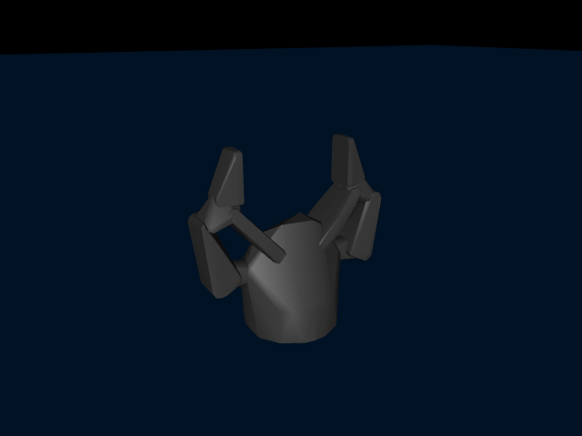
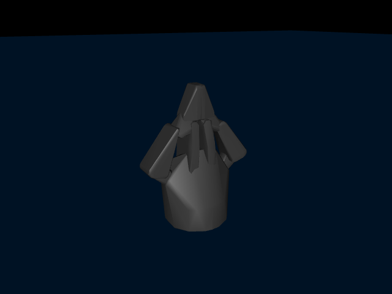
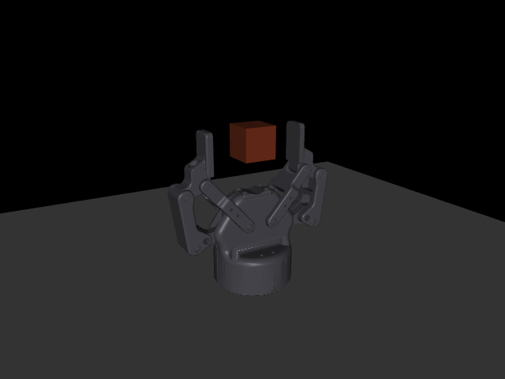
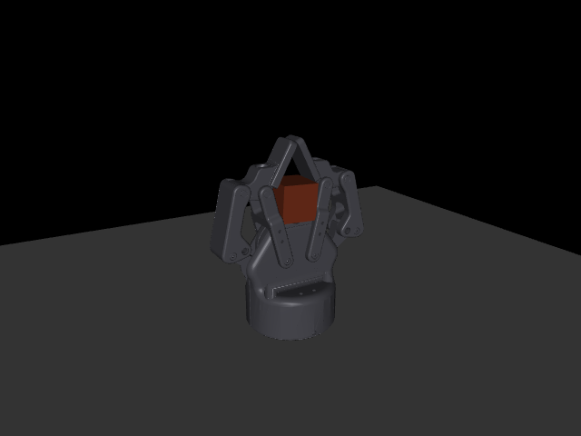

# 77 — Native USD import: Isaac assets into a bundle, through Newton

Research date: **2026-09-24**. The question: can Isaac Sim's assets (`robotiq/isaacsim_assets`) be
used in the Studio directly, unchanged; and then: how USD becomes easily
importable in the app, natively, through Newton and Warp.

Four readers against primary sources, one per field, plus a hands-on
experiment on the box with the actual asset: OpenUSD and the asset's
own schemas; Newton's USD importer and its MuJoCo bridge; MuJoCo's own
USD import status; every USD-to-MJCF converter that exists. Findings
first, then the decision, then the plan.

Symbols used below, defined once: **USD** is Pixar's Universal Scene
Description, a layered scene file format; **UsdPhysics** is its
standard physics schema (rigid bodies, joints, masses, collisions);
**MJCF** is MuJoCo's XML model format, what every bundle in `robots/`
holds; **Newton** is NVIDIA's Warp-based physics engine
(newton-physics/newton, Apache-2.0) whose MuJoCo solver is mujoco_warp,
the same GPU MuJoCo our `gpu` extra pins; a **variant set** is USD's
switch that selects one of several authored versions of a prim; a
**loop closure** is a joint that closes a kinematic loop (the 2F-85's
five-bar finger linkage) and cannot live in a tree.

## 0. The answer in five lines

1. **Not "without changing anything".** Neither MuJoCo wheel on the box
   (3.11.0, 3.12.0) can decode USD: the importer is a C++ decoder
   plugin that only exists in a from-source build with `MUJOCO_WITH_USD`
   (§3). The Studio loads what MuJoCo decodes, so a USD file at the
   door is refused today with "could not decode content".
2. **Newton reads the asset natively and correctly, and writes MJCF.**
   Measured on the box: `ModelBuilder.add_usd` on the 2F-85's
   Newton_compliant variant gives 11 bodies, 8 hinges, 2 loop closures
   and 1 mimic; `SolverMuJoCo(save_to_mjcf=…)` writes an MJCF that
   compiles in OUR mujoco 3.11.0 with every joint limit and every mass
   equal to the USD layer (19 of 19), and the gripper closes to its
   0.8 rad target with the loops holding (§4).
3. **The one asset there is the one Menagerie has**, authored by
   Robotiq with MuJoCo's own `mjc:` schema in its Newton variant (§2).
   The USD path earns its keep the day Robotiq or anyone publishes a
   USD asset Menagerie lacks, and the day a customer brings an Isaac
   asset of their own robot to the Studio.
4. **The least-code path is additive** (the rule: use what exists): Newton is the
   reader and the MJCF writer; ours is the bundle writer around it
   (names, mesh files, provenance, sensors, the record) and the test
   that the bundle says what the USD said. About three days (§6).
5. **Newton as a runtime engine is a different, bigger decision** than
   Newton as an importer; §7 names what it would take and why it waits.

## 1. OpenUSD from Python: what exists and under what licence

- **usd-core 26.8** (PyPI, Pixar; the "Tomorrow Open Source Technology"
  licence, Apache-2.0-derived) ships wheels for Linux x86_64 and
  aarch64, macOS and Windows for Python 3.9-3.13, and includes
  `pxr.UsdPhysics`. It composes references, sublayers, payloads and
  variant sets; it is the reader every converter below uses. Installed
  in a scratch venv on the box and used for every number here.
- **Newton 1.6.0** (PyPI `newton`, Apache-2.0; `warp-lang>=1.16`,
  Python 3.10-3.13, CUDA 12/13 or Warp's CPU backend). Its `importers`
  extra pins `usd-core>=25.5,<26.5` plus `newton-usd-schemas>=0.5.0`
  (the Newton/MuJoCo USD schema plugin, needed to read `mjc:` and
  `newton:` attributes); its `sim` extra pins `mujoco-warp~=3.11.0`
  and `mujoco~=3.11.0` — **the same pins as our `gpu` and `sim`
  extras today**, so Newton fits the locked engine without moving it.
  Measured gotcha: the scratch venv first resolved mujoco-warp 3.14 and
  Newton's contact kernel refused to compile against it ("couldn't
  find function overload for contact_force_fn"); pinning 3.11.0 fixed
  it. The pin is real.
- **MuJoCo's own Python** (`mujoco[usd]`) adds only `usd-core` and a
  render-frames-to-USD *exporter* for Omniverse and Blender; it writes
  no physics and reads no USD.

## 2. The asset (robotiq/isaacsim_assets, read at the tip 6d992b6, 2026-09-23)

One gripper: `grippers/Robotiq_2F_85/Robotiq_2F_85.usda` with parts,
payloads, materials and a `newton/` folder. Licence in the package:
**Creative Commons Attribution 4.0** (the repo itself declares none at
the top level). Two variant sets:

| Variant set | Choices | What changes |
|---|---|---|
| Fingertip | Standard, Tactile_TSF85 | the tip mesh |
| Physics | **Newton_compliant**, Physx_compliant, Physx_parallel_grip, None | the whole joint tree and its schemas |

- **Newton_compliant** is authored with MuJoCo's schema: `MjcJointAPI`
  (armature 0.3 on the driver, damping 0.1 and 0.5, `solreflimit`,
  `solimplimit`, `springref` 2.62 and stiffness 2 on the spring links),
  `MjcEqualityConnectAPI` on two `PhysicsSphericalJoint` loop closures
  marked `excludeFromArticulation`, one `newton:mimicJoint`
  (right driver follows the finger joint), `MjcMaterialAPI` /
  `NewtonMaterialAPI`, and `convexHull` collision on the visual meshes.
  Masses per link (0.777 kg base, 0.020-0.026 kg links); diagonal
  inertia 0.001 on most links is a deliberate placeholder in the file,
  the fingertips carry real inertia. Drive on `finger_joint`: stiffness
  1432, damping 158, max force 15, range 0-0.8 rad.
- **Physx_parallel_grip** collapses the linkage: 6 hinges and 5
  `PhysxMimicJointAPI` couplings, no loop. **Physx_compliant** keeps
  the loop with PhysX-only compliance. **None** has no joints at all
  (Newton refuses to bridge it: "must have at least one joint").
- Runtime tuning Robotiq recommends for MuJoCo (impratio 10, an eq
  solref) is NOT in the USD; it lives in their example scripts. A
  bundle writer must carry it as a declared option, never invent it.
- Against Menagerie's `robotiq_2f85` (BSD-2, from the ROS-Industrial
  URDF): the same five-bar with the same joint ranges, but Menagerie
  closes the loop with two `connect` equalities plus a split tendon and
  an affine actuator on the tendon; its masses are the URDF's
  (0.009-0.022 kg per link) and its armatures 0.001-0.005. The Isaac
  layer is Robotiq's own numbers; which is closer to the real gripper
  nobody has measured — that is a bench question, not a format one.

## 3. Can MuJoCo read USD? Yes, but not in a wheel

- The importer is `plugin/usd_decoder` in the MuJoCo tree, registered
  as a decoder plugin for `.usd|.usda|.usdc|.usdz`, built only under
  `MUJOCO_WITH_USD` (default OFF; the release wheels are built OFF).
  Both wheels on the box lack it: no `usd`/`pxr` strings in
  libmujoco, no plugin file, "could not decode content" on any USD
  path. Installing usd-core changes nothing (the importer is C++).
- What it reads when built: `UsdPhysics` rigid bodies, collisions
  (Mesh/Cube/Sphere/Capsule/Cylinder/Plane), masses, materials,
  filtered pairs, Revolute/Prismatic/Spherical/Fixed joints,
  articulation roots, the Newton 0.4.0 schema (`NewtonJointAPI`,
  `NewtonMassAPI`, `NewtonMimicAPI` → joint equality, …) and MuJoCo's
  own `MjcPhysics` actuators, tendons and keyframes. It does NOT read
  `UsdPhysicsDriveAPI` at all ("closer to a runtime construct") nor
  PhysX mimic joints. Direction of travel is clear: 3.5.0 moved USD
  out of experimental into the plugin, 3.7.0 documented it, 3.12.0
  upgraded to the Newton schema. Every page still says "experimental
  and subject to frequent change".
- mujoco_warp consumes a compiled `MjModel`; mjlab's FAQ: "No, mjlab
  expects MJCF; convert USD or URDF assets". So the whole GPU stack
  below the Studio is MJCF-in, which is where our bundles already are.

## 4. Newton as the importer: measured on the box

The experiment (scratch venv: usd-core 26.8, newton 1.6.0, warp 1.17.0,
mujoco 3.11.0, mujoco-warp 3.11.0):

```
stage = Usd.Stage.Open(asset); select Physics=Newton_compliant
b = newton.ModelBuilder(); SolverMuJoCo.register_custom_attributes(b)
b.add_usd(stage, schema_resolvers=[Mjc, Physx, Newton], collapse_fixed_joints=False)
model = b.finalize(); SolverMuJoCo(model, save_to_mjcf="2f85.xml", use_mujoco_cpu=True)
```

| Step | Result |
|---|---|
| Newton model | 11 bodies, 13 joints (8 revolute, 2 ball loop closures, 3 fixed), 22 shapes, 14 DoFs; 1 mimic (right driver ← finger joint, coefficients 0, 1); 2 `mujoco:equality_constraint` rows from `MjcEqualityConnectAPI` |
| MJCF written | 46 KB; compiles in mujoco 3.11.0 (the project venv) to 12 bodies, 8 hinges, 3 equalities (2 connect + 1 joint), 1 actuator, 12 geoms, 11 meshes |
| Joint limits vs USD | 8/8 equal (radians, 1e-5) |
| Masses vs USD | 11/11 equal (1e-4 relative) |
| Joint tuning carried | armature 0.3, damping 0.1/0.5, springref 2.62, stiffness 2, `solreflimit`/`solimplimit`, `actuatorfrcrange` ±15 on the driver |
| Actuator | `general biastype=affine gainprm=1432 biasprm="0 -1432 -158"` = a position servo kp 1432 kv 158; **no `ctrlrange`** (0-0.8 must be added by the writer) |
| Closing the gripper | ctrl ramped to 0.8 over 1 s; after 2 s finger 0.8003 rad, right driver 0.8077 rad, max equality violation 7.5 mm, joint speeds 1e-5: the loops hold, the mimic holds |
| Materials | the `materials/materials.usd` sublayer fetched empty twice (0 bytes: a LFS/raw quirk); a third fetch gave the real 16 KB layer; a 0-byte sublayer is a composition error that refuses the whole import — the door must check sublayer sizes and say which one |
| Other variants | Physx_parallel_grip → 6 hinges, 5 joint equalities, 1 actuator (kp 172); Physx_compliant → 4 connect + 1 joint equality, 3 actuators; None → refused |

What the written MJCF is NOT yet, and what our writer owes (each a
named item in §6):

- **Names are prim paths**: bodies `_Robotiq_2F_85_Robotiq_2F_85_left_outer_knuckle`, geoms and meshes with slashes. A bundle wants leaf names, unique.
- **Meshes are inline** `vertex="…" face="…"` arrays, 64-vertex convex hulls (Newton's default `mesh_maxhullvert`), because the asset applies collision to its visual meshes with `convexHull` approximation and the solver writes collision shapes only. The 31k-vertex base and 1-2k-vertex links exist in the USD; the writer should export them as OBJ files under `assets/` for the visual group, keep hulls for collision, and reference files, as every bundle does.
- **The root is a mocap body** (fixed root): right for a standalone gripper, wrong for attaching to an arm; the writer offers `--free` / `--attach`.
- **Body frames are world-aligned at the root** (child bodies at the origin, joints carrying absolute positions, geoms rotated by a quaternion): valid MJCF, unlike Menagerie's nested frames; harmless, but a reader diffing against Menagerie should know.
- **No sensors, no keyframe, no ctrlrange**: our harness observes sensors by contract; the writer adds the jointpos/jointvel block and a `home` key from the USD's joint state, exactly as `robots/so101-nominal/so101.xml` wraps Menagerie.
- **Mimic compliance dropped**: the USD's `naturalFrequency`/`dampingRatio` on the mimic becomes a plain `mjEQ_JOINT` with default solref. *Carried since 2026-09-25 where the USD authors it in MuJoCo's words: the Newton_compliant layer puts `mjc:solref` 0.005, 1 and `mjc:solimp` on the mimic joint, and the writer's `mimic_softness` sets them on the equality.*
- **`mujoco_warp` is a hard import of Newton's solver module**, even with `use_mujoco_cpu=True`: the first run failed inside a Warp kernel build. The import path therefore needs the `gpu` extra's package on the machine that imports; Warp's CPU backend ran `add_usd` without a visible CUDA driver, the solver step ran with one. Whether the solver step runs CPU-only is unmeasured (a Mac question).




The written MJCF with its inline vertex data elided is kept beside the
stills (`docs/figures/usd-import/2f85-newton-compliant-elided.xml`).
Hulls are what the stills show, because hulls are all the solver wrote.

### 4.1 Built: the bundle (2026-09-24)

Every item above is now the writer's (`trainnr/trainnr/robot/usd_import.py`)
and the bundle is checked in as `robots/robotiq-2f85-isaac/` (stamp
`robotiq-2f85-isaac@3ec025e4cd56` at first, `@e1bc2cbba31f` once the
importer audit landed on its record the same evening, and `@a2b73f6d43bc` once
the audit moved to `audit.json` outside the stamp (2026-09-25), and `@f8e77bf83c08`
since the mimic carries its authored softness (the same night); 3.0 MB,
deterministic: the scratch run and the library run gave the same stamp). Written on the box in
2.9 s once Warp's kernels are cached, through the pinned venv (newton
1.6.0, usd-core 26.3, newton-usd-schemas 0.5.0, warp 1.17.0, mujoco and
mujoco-warp 3.11.0), and pinned by `trainnr/tests/test_usd_import.py`:

| The bundle | Measured |
|---|---|
| Census | 11 links + world, 8 hinges, 3 equalities (2 connect, 1 mimic), 1 actuator, 16 sensors, 1 keyframe, 22 meshes (11 hulls + 11 visuals) |
| Joint ranges vs a fresh pxr read of the USD | 8 of 8 equal |
| Masses vs the USD | 11 of 11 equal |
| Drive | `finger_joint_drive`: kp 1432, kv 158, `ctrlrange` 0-0.8 from its joint, `actuatorfrcrange` ±15, armature 0.3 |
| Names | leaf names: `left_outer_knuckle`, `finger_joint`, `base_link_hull`, `base_link_visual` |
| Meshes | `assets/<body>_hull.obj` (≤ 64 vertices, group 3) and `assets/<body>_visual.obj` (the USD's own mesh: 31,109 vertices on the base, 756 on a knuckle, group 2, no contact); no inline vertex data |
| Closing from the `home` key | finger 0.8003 rad of 0.8, loops within 7.7 mm, at rest |
| On a bench with a 30 mm cube between the pads (`tools/show-2f85-isaac.py`) | finger stops at 0.794 rad on the block, 4 contacts, the block held 29 mm below where it sat (the fingertips curl in as the five-bar closes) — stills below, the Rerun recording under `runs/` |
| Physx_parallel_grip variant | 6 hinges, 5 joint equalities, 1 actuator |
| Record | `bundle.json` carries `provenance`: repository, commit 6d992b6, file, both variant selections, root, `mesh_maxhullvert`, grip options, licence CC-BY-4.0, Newton's own census, the reader's versions |

*Since the mimic carries its authored 0.005 s (2026-09-25): on the bench the finger stops at 0.756 rad (was 0.794), 4 contacts, the block held at the same 29 mm; the stills are re-rendered.*




What building it found, beyond §4's list:

- **pxr's schema registry is built once per process**, on first use.
  A stage opened through pxr before Newton's schema package
  (`newton_usd_schemas`) registered its plugin leaves `NewtonMimicAPI`
  unknown for the rest of the process, and every later import reads
  the asset's mimic as nothing — silently, with the same census (found
  by the test order: one class opened a stage plainly, the next lost
  an equality). The reader registers the plugin before touching pxr at
  every entry point and refuses a process already poisoned, naming the
  cause; a subprocess test pins the refusal.
- **Variant selections belong in the session layer.** Authored into
  the root layer they outlive the stage: pxr shares a file's layer
  between stages in one process.
- **Newton 1.6.0 on PyPI declares mujoco 3.12** (its `sim` extra:
  `mujoco-warp>=3.12,<3.13`) and warns at every bridge on 3.11.0; the
  bridge measured equal to the USD layer on 3.11.0, so the `usd` extra
  takes `newton[importers]` only and the `gpu` extra keeps supplying
  mujoco-warp. Newton needs warp-lang 1.17 and `mujoco-mjx[warp]`
  3.11.0 locks warp-lang 1.14: the `usd` and `mjx` extras are declared
  mutually exclusive in `trainnr/pyproject.toml` (uv's `conflicts`).
- **The solver step runs CPU-only.** Without a visible CUDA driver Warp
  reports only the cpu device and the bridge still writes the MJCF; the
  Mac question is answered for the solver, and open only for whether
  mujoco-warp installs there (the `gpu` extra excludes darwin).
- **Renaming is not enough**: excludes, equalities and actuator targets
  reference bodies and joints by name and must be re-pointed; Newton
  names a mesh geom `<prim path>_<shape index>`, which is how the
  writer finds the USD mesh behind each hull.
- **Newton's own solver defaults** (implicitfast, multiccd off, its
  tolerances) are reset to MuJoCo's; the stage declared none of them.
  The hulls' contact masks are Newton's encoding of the USD's collision
  filters and are kept as written, beside the twelve `<exclude>` pairs.

## 5. Every other converter, and why not

| Route | Direction | Licence | Mimic | Loop closure | Drive gains | Verdict |
|---|---|---|---|---|---|---|
| Isaac Lab `MjcfConverter`/`UrdfConverter` | to USD only, needs a running Kit | BSD-3 | — | — | — | wrong direction |
| Isaac Sim `isaacsim.asset.exporter.urdf` 2.2.6 | USD → URDF; wheel built from source, Python ≥3.12 | Apache-2.0 | kept as `<mimic>` | written as a non-standard `<loop_joint>` MuJoCo's URDF loader ignores | stiffness dropped on purpose | loop re-authored by hand: no |
| LightwheelAI/usd2mjcf | USD → MJCF | "Apache-2.0" repo with 2023 NVIDIA proprietary headers inside; 6 commits, July 2025 | lost | unhandled | lost | unusable for OSS |
| nvidia-srl-usd-to-urdf 1.0.3 | USD → URDF | no licence field, internal GitLab | | | | no |
| newton-physics/mujoco-usd-converter, urdf-usd-converter | to USD only | Apache-2.0 | | | | wrong direction |
| MuJoCo `usd_decoder` (+ Isaac's `physx_asset_to_mjc` to translate PhysX mimics to Newton's) | USD → MjSpec in-process | Apache-2.0 | kept | reads `excludeFromArticulation` | no DriveAPI | needs a from-source MuJoCo; the one to revisit when wheels ship it |
| **Newton `add_usd` + `SolverMuJoCo(save_to_mjcf)`** | USD → MjSpec → MJCF | Apache-2.0 | kept | kept (connect/weld synthesised) | kept as position actuators | **measured working, §4** |

## 6. Decision and plan

| Decision | Rejected | Why |
|---|---|---|
| Newton reads, Newton's MuJoCo bridge writes the MjSpec; **our module is the bundle writer around the MjSpec** and the test that the bundle matches the USD | our own UsdPhysics reader and MJCF writer from pxr | additive over libraries; Newton's importer is the one every USD-native engine will keep current (the Newton schema is MuJoCo's own since 3.12); the MjSpec is the seam we already own for variants and sensors |
| The USD door is a second **source kind** of the existing onboarding (`onboard_robot` in `trainnr/trainnr/mcp_actions.py` took an MJCF path until 2026-09-24): suffix → reader, a registry, not an if/elif | a separate "import USD" tool | one door, one record, one stamp; the Studio's onboarding card gains a file type, nothing else |
| `usd` extra = `newton[importers]` pinned to the release measured against our mujoco (1.6.0 today), mujoco-warp from the `gpu` extra | `newton[importers,sim]`; a loose floor | Newton's release declares mujoco 3.12 while the bridge measured right on 3.11.0; a floor would drag the engine (the 3.12 incident in `trainnr/pyproject.toml`) |
| Provenance in the bundle record: repository, commit, file, variant selections, licence, newton and usd-core versions, `mesh_maxhullvert` | a README line | the record is inside the stamp; a re-import from a moved tip changes the stamp by itself |
| The test compares the compiled bundle to a fresh pxr read of the USD: joint ranges, masses, inertias where real, drive gains, equality count, actuator force range | trusting Newton's return | the test is the product's word; it also catches the next Newton release silently changing a unit |
| Visual meshes as OBJ files under `assets/`, collision as hulls | inline vertex arrays | every bundle references files; a 31k-vertex base inline is a 3 MB XML nobody can diff |

Built on 2026-09-24 (§4.1), in one sitting on the box rather than three
days, as planned with these differences: the `usd` extra is
`newton[importers]` beside `gpu`, not `newton[importers,sim]` (§4.1,
the 3.12 declaration); the root is `fixed` or `free` (a fixed root
attaches under an arm as it is, so `--attach` is not a third kind); the
door's registry lives in `trainnr/trainnr/robot/onboarding.py`
(MJCF and USD as `@model_source`s by suffix, third formats through the
`trainnr.model_sources` entry-point group) and `onboard_robot` in
`trainnr/trainnr/mcp_server.py` takes `variants` and `root`; a
public asset is fetched at a pinned commit by
`trainnr/trainnr/robot/asset_fetch.py` (Git LFS aware, the
empty-file refusal) and `tools/import-usd.py --fetch`; the schema
registry refusal was not planned. The plan as written (historical;
§4.1 above is what shipped):

1. **Day 1 — the reader and the test first.** *trainnr/robot/usd_import.py*: open the stage, refuse a 0-byte sublayer by name, select variants from a mapping, `add_usd` with the three resolvers, bridge to an MjSpec through Newton's solver, and hand the spec back. The test writes the 2F-85 (Newton_compliant) and asserts the §4 table: 8 ranges, 11 masses, the actuator gains, 3 equalities, the closure sim (finger within 1 mrad of target, equality violation under 1 cm). Also the Physx_parallel_grip variant (6 hinges, 5 equalities) so the PhysX resolver is pinned too.
2. **Day 2 — the bundle writer and the door.** Leaf names, mesh files, `ctrlrange` from the driven joint's range, the sensor block, a `home` key, `--free`/`--attach` root, the record with provenance, README with the CC BY line and the runtime options Robotiq recommends as a declared `<option>`. The onboarding registry gains `.usd|.usda|.usdc|.usdz`; `onboard_robot` in the Studio's MCP surface names the variant selections in its arguments; a missing `newton` refuses with the install line per OS.
3. **Day 3 — seen and written.** The imported gripper on a task in the Studio (closing on a block, both viewers, stills), the census against the record, docs/07, a docs/33 row, tools/README rows, this document's §4 replaced by the bundle's numbers.

The same evening, every door gained the audit: the compiled bundle against the
source as authored, per body (mass, centre of mass, the full inertia
tensor), per joint (type, range, armature, damping, friction loss,
stiffness, force range) and per element class, with the reader's
explanations for the documented conversions and MuJoCo's loader losses
at the running build; an unexplained change is refused by name. The
2F-85 audits at 7 explained, 0 unexplained: every mass, centre of mass,
inertia tensor and joint parameter equals the USD layer, which is the
§4 test generalised to every format (`trainnr/trainnr/robot/import_audit.py`,
`trainnr/tests/test_import_audit.py`, `tools/audit-bundle.py`). The
URDF door came with it (`trainnr/trainnr/robot/urdf_import.py`).

Risks, each with its fallback: Newton's next release moves the mujoco
pin before we do (the extra pins Newton; the import is offline work,
a scratch venv at the older release still imports); the solver step
needs mujoco_warp on a Mac (the step itself runs CPU-only, measured;
whether the package installs on darwin is not; fallback: import on the
box, commit the bundle, the bundle runs everywhere); inline hulls at 64
vertices are coarser than Menagerie's collision boxes (a declared
`mesh_maxhullvert`, and the bundle writer can keep the USD's own
collision meshes when an asset authors them separately); the mimic's
compliance was lost (Newton's bridge wrote MuJoCo's default solref); since
2026-09-25 the writer's `mimic_softness` sets the USD's authored `mjc:solref`
and `mjc:solimp` on the joint equality (0.005 s on the 2F-85, not the
default 0.02 s); a PhysX-only natural frequency is still not converted.

## 7. Newton and Warp as a runtime, not just an importer

Newton's MuJoCo solver IS mujoco_warp, the engine our `gpu`/`mjx`
extras already run; a bundle imported through Newton runs on it
unchanged: the identified `mjModel` runs on every instrument. Newton's own solvers (XPBD, VBD,
Featherstone, the implicit MPM) are a third instrument: a new backend
behind `physics/registry.py`'s seam, a new stamp qualifier, a
CPU-vs-Newton gauntlet like the MJX one, and the same
metrology-before-belief rule. That is a week, not a day, and it is
worth it when a task needs what mujoco_warp lacks (deformables, MPM
sand, cloth), not for importing a gripper. [76](76-physics-on-gaussians-2026-09.md) already names where
Newton attaches gaussians to bodies; the import path above is the
first piece of that road and costs nothing it would not need anyway.

## 8. Sources

Primary, read at the code on 2026-09-24: newton-physics/newton main
(*import_usd.py*, *solver_mujoco.py*, *builder.py*, docs
*usd_parsing.rst*, *solvers/mujoco.rst*, its *pyproject.toml*); MuJoCo
main (`CMakeLists.txt`, `plugin/usd_decoder/usd_decoder.cc`,
`doc/OpenUSD/*.rst`, `doc/changelog.rst`, `python/mujoco/usd/`);
mujoco_warp *io.py*; mjlab `faq.rst`, `entity.py`; Menagerie
`robotiq_2f85/2f85.xml` + README; robotiq/isaacsim_assets at 6d992b6
(every layer, both variant sets, `PACKAGE-LICENSES/LICENSE`); Isaac
Lab `converters/`; Isaac Sim `isaacsim.asset.exporter.urdf`
(*joint_reader.py*, *urdf_writer.py*) and
*physx_asset_to_mjc.py*; LightwheelAI/usd2mjcf; PyPI metadata for
usd-core 26.8, newton 1.6.0, nvidia-srl-usd-to-urdf 1.0.3,
mujoco-usd-converter 0.5.0. Hands-on: the scratch venv on the box,
the numbers in §4, the stills and the elided MJCF under
`docs/figures/usd-import/`.
